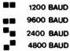
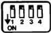

# F-CODE PROGRAMMING

# GENERAL INTRODUCTION

The VP415 player is designed to allow control of all functions from an external computer. Connection to a computer is via the RS232-C serial interface or the SCSI interface on the rear of the VP415.

The interface allows two-way communication between player and computer. Some commands sent to the player are followed by corresponding acknowledgements back to the computer.

# RS232-C INTERFACE CONNECTION

This is a serial computer interface, in accordance with international communication standards. Communication is full duplex, with a selectable baud rate.

The player is fitted with a 25-pole female D-connector with the following pin connections:

PIN SIGNAL

2 (TxD) transmitted data from player to computer
3 (RxD) received data from computer to player
5 (CTS) clear to send:- a signal from computer to player indicating the computer is ready to receive data
7 (GND) logic ground
9 \(+12\mathrm{V} / 100\mathrm{mA}\)
10 -12V/10mA
20 (DTR) data terminal ready: a signal from player to computer indicating the player is ready to receive data

# DTR (DATA TERMINAL READY) PIN 20

Whenever the player is in a condition to receive data from the computer it signals this to the computer, by setting the DTR line to a high level (> +3V).

Conversely, when the player is busy processing data it is unable to receive data and indicates this to the computer by setting the DTR line to a negative level (< -3 V).

It is important to ensure that the data output of the computer is accurately controlled by the DTR line so as to prevent partial loss of data.

# CTS (CLEAR TO SEND) PIN 5

On the serial interface of many computers there is a control line which may be used to tell the player when the computer is ready to receive data. Whenever the player wishes to transmit data back to the computer it first checks the status of the CTS line. If the CTS line is greater than +3 Volts the player assumes that the computer is ready to receive data, which is therefore transmitted.

If the CTS line is less than -3 Volts, the player delays transmission indefinitely until the correct CTS status is seen.

If the computer cannot control the CTS line, it is recommended that the 'Transmission delay on')1 command is sent to the player. This results in a transmission rate of 50 characters per second, giving the computer more time to execute the characters. In this case the CTS line (pin 5) should be kept active (e.g. by leaving the connection open).

# DATA FORMAT

Data format is 8 data bits and 1 stop bit (parity ignored).

Data sent to the player should comprise a string of characters plus carriage return (CR).

Each byte sent to the player is checked for validity. ASCII codes lower than 32, and all other bytes of the string, are rejected. ASCII codes higher than 127 are accepted. In this case, the MSB (most-significant bit) is always read as having a value of zero.

For ASCII values greater than 127 the player effectively subtracts 128 from the ASCII value. A computer which transmits only seven data bits per ASCII code may therefore be used. In this case at least two stop bits must be sent.

The player actions the commands after receiving (CR).

# BAUD RATE SETTING (RS232-C only) (Fig. 9)

Data transmission speed may be set to 1200/2400/4800/9600 baud according to the positions of the two baud rate dip switches (numbers 1 and 2) at the rear of the player.

Fig. 9: Baud rate dip switches.

When altering the positions of these dip switches, it is useful to first switch on the player and disc status display using the DISPLAY button on the remote control handset. The baud rate setting is then displayed on the screen.

# COMMANDS TO THE PLAYER

The F-code commands that are sent to the player to carry out particular functions are listed in Tables 1 and 2. Functional explanations of these commands are given in Section 6 'F-CODE COMMANDS'.

Table 3 lists acknowledgements sent from the player to the computer on receipt of certain commands.

# PLAYER REGISTERS

There are two picture number registers in the player; each can hold a five-digit number from 1 to 79999. Normally a disc can contain up to around 54 000 pictures (or frames) so numbers beyond this are not used. There is also a time code register which can store a time code of the form mm:ss in the range 00:00 to 59:59.

# Picture number stop register

This register is automatically cleared to zero when the player reaches the picture number stored and enters the still mode.

# Picture number information register

When the player passes the number stored, an acknowledgement is sent back to the computer and the register is automatically cleared. The playing mode does not change.

# Time code information register

When the player passes the time code stored, an acknowledgement is sent back to the computer and the register is automatically cleared. The playing mode does not change.

21