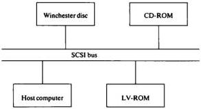

# SCSI OPERATION

## INTRODUCTION

The VP415 contains a microprocessor to access the data on a LaserVision disc and make it available to an industry standard SCSI (Small Computer System) Interface. This interface is used to connect the LaserVision player (the target) to a host computer (the initiator), allowing the host to read data from the disc, as well as providing the usual player control functions. The software running in the microprocessor in the player is called LV-DOS, and it is with LV-DOS that the host computer communicates via the SCSI interface.

A LaserVision disc currently has a storage capacity of 324 Mbytes. It is subdivided into a number of volumes which are managed by LV-DOS. The following diagram shows how a disc might be structured:

|  System table for LV-DOS  |
| --- |
|  Volume directory  |
|  Volume 'JIM'  |
|  Volume 'HENRY'  |
|  300 Mbytes  |

The system table contains information for internal use by LV-DOS and the volume directory contains an entry for each volume on the disc. An entry for a volume contains the volume name, its whereabouts on the disc, and some other control information.

The volumes themselves contain applications developers want to put in them. LV-DOS does not manipulate this data and therefore does not care what format it is in.

Blocks on the disc are not interleaved; consecutive logical blocks are in consecutive physical order, with an interleave value of 1.

Detection and correction of errors are carried out fully by the resident LV-DOS firmware such that data transferred to the initiator is error free.

Currently the pre-mastering system must supply all of the data to be mastered onto the disc (including the system table and volume directory).

## VOLUMES

The LaserVision disc has a high storage capacity, with the ability to store 54 000 pictures and 324 Mbytes of data on each side. To divide the total capacity and to enable the storage of more than one independent application of interactive LaserVision on one side of the disc, the concept of volumes has been adopted. This concept is totally transparent to the host computer since communication between the host computer and the LaserVision player refers to logical pictures and logical blocks. The translation from logical to physical pictures and data blocks is carried out by LV-DOS.

After having received the Start-unit command from the host computer (the initiator), LV-DOS reads information from the disc about the physical location of data and pictures of a specific volume. Once Start-unit is completed, the volumes are automatically opened, provided the relevant digital data can be read from the disc.

Volumes on disc are accessible as logic units. The SCSI command format allows only 8 logic units to be specified in a command. Currently, LV-DOS supports up to 7 volumes (excluding the directory volume) on a disc.

Logic unit numbers 0 - 6 will be assigned to the volumes in the order they are specified in the volume directory. If there are less than seven volumes on a disc, the unused logic units are closed by definition. Logic unit 7 is intended for absolute F-code read/write (I/O) and for access to the volume directory.

## THE SCSI INTERFACE

### General

The SCSI interface is usually used to connect a microcomputer to one or more floppy and/or Winchester disc drives. It is a bussed system of a very general nature and makes few assumptions about the pieces of equipment being connected. It is therefore well-suited to the requirements of LV-DOS, and allows the transport of both player control commands and disc data over the same physical link.

The SCSI standard provides a number of ways of communicating between the host computer and its peripherals. However, only the information necessary to use the SCSI interface in conjunction with the VP415 is covered here. For full details of the SCSI standard, refer to the ANSI standard X3T9.2.

Consider a system consisting of a single initiator (the host computer) and a number of targets (of which the LaserVision player is one):

When the host computer wants the player to do something, it must first gain control of the SCSI bus. This is the arbitration phase, and is only necessary to allow for the possible extension of the system to multiple initiators in the future. If the arbitration phase fails, some other device has control of the bus, and the host computer must wait until it is free and retry.

The host computer must then gain the attention of the target with which it wishes to communicate (i.e. the player). This it does in the selection phase, in which it outputs the SCSI address of the player (each device on the bus has a unique address in the range 0 - 7) and waits for a response. Should the selection phase fail, a "No response from player" error must be returned to the higher level software. The SCSI address of the player is set by means of the SCSI ADDRESS dip switches at the rear of the player. See SCSI address setting, under 'Special issues' later in this section.

Assuming that the arbitration phase is successful, the host computer must then tell the player what it wants to do. This is in the form of a command phase, in which the host computer sends a command descriptor block containing the command that it wishes the player to carry out and any additional information required (e.g. the block number to be read).

The command phase is followed, where appropriate, by a data in or data out phase in which the requested information is transferred from the player to the host computer (e.g. when reading a disc block) or vice versa. On a read, there may be a delay of several seconds before this data is available, depending on how long it takes to execute the command in question. Note that both parties must usually know in advance how much data is to be transferred.

37