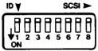

# FAST READ

Syntax: R1

First code: R (82D = 52H)

Response: None

Function: Fast Read mode, without picture restore after search.
Video switched off after search.

This is the power-on default state.

# SPECIAL ISSUES

# SCSI address setting (Fig. 10)

Each device connected to the SCSI bus must have its own unique address. This is in the range 0 - 7. If the address is not that expected by the host computer, the VP415 will not be recognised. The factory setting is address 0.

Fig. 10: SCSI address dip switches.

The SCSI bus address of the VP415 may be altered by changing the positions of the SCSI ADDRESS dip switches situated at the rear of the player. A switch in the up position is OFF. Switches 1 - 4 and switch 8 should be OFF. Switches 5 - 7 determine the SCSI address as follows:

|  address | switch 5 | switch 6 | switch 7  |
| --- | --- | --- | --- |
|  0 | OFF | OFF | OFF  |
|  1 | OFF | OFF | ON  |
|  2 | OFF | ON | OFF  |
|  3 | OFF | ON | ON  |
|  4 | ON | OFF | OFF  |
|  5 | ON | OFF | ON  |
|  6 | ON | ON | OFF  |
|  7 | ON | ON | ON  |

# Condition after Start-unit

Successful execution of the Start-unit command always brings the system to the same condition regardless of the conditions present immediately before.

# Initiator powered off

If an initiator, connected to the SCSI bus is not powered up, it is possible that the reset line will be pulled active low and the LV-DOS control will be in its reset condition. As such the LV-DOS controller will not take control of the player which will subsequently behave as if there is no controller at all.

# Loss of sync

Any action that affects the sync signal from the initiator to which the player is genlocked e.g. a change of video mode, will cause the player to genlock by changing the disc speed. During a speed change it is possible that the tolerances for reading digital data are exceeded, in which case the system may retry to read data, or even register a media error.

# Retries

If necessary, LV-DOS will make a number of retries. However it is very unlikely that an unsuccessful command will be successful on a retry from the host, and it is recommended that the initiator does not issue retries if a command fails.

# Two computers trying to take control

The RS232-C serial interface of the player also enables an external system to control the player. The system can only 'listen' to one channel

at a time, and if two systems are simultaneously trying to control the player, it is possible that the SCSI initiator may lose control.

Any subsequent command, with the exception of mode select - F-codes, will then be ignored. Initiator control of the player may be resumed by issuing a Start-unit command to the LV-DOS controller. The command may return a 'media error' or 'unit not ready' sense key, but in either case the SCSI initiator now has control of the player.

# Changing disc while under initiator control

To change the disc, issue the Stop-unit command followed by the Eject command. Poll the player status by sending the Player status command ?P and read the reply code until the reply code acknowledges that the disc-tray is closed again. Then issue the Start-unit command to log on the disc. You may verify that the disc is logged on with the Test unit ready command. This is not necessary however if the Start-unit returned no error. Verify the identity of the disc and be sure that all the player modes are set according to your application.

41