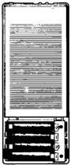
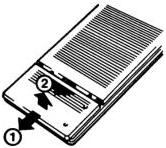

# INSTALLATION

# SITING THE PLAYER

Stand the player on a firm level surface, ensuring that the ventilation slots on the top and sides of the player are not obstructed. Do not stand a monitor directly on top of the player if this obstructs these ventilation slots; in this case, a properly designed rack should be used to support the monitor. Never stand the player directly on any electronic equipment that gives off a substantial amount of heat, or near to any heat source. Avoid any position where the player is subjected to direct sunlight for long periods.

# CONNECTING THE PLAYER TO THE MAINS

The VP415 is designed to operate from a 50/60 Hz a.c. mains supply with any voltage between 220 and 240 V. If your local mains supply does not fall into this category, contact your nearest Philips Organisation.

If necessary, fit a mains plug to the mains lead as described below.

Important note for U.K. users

WARNING: THIS APPARATUS MUST BE EARTHED

The wires in the mains lead are coloured in accordance with the following code:
Green-and-yellow: Earth

Blue: Neutral

Brown: Live.

These colours may not correspond with the colour markings identifying the terminals in your plug, so proceed as follows: Connect the Green-and-yellow wire to the terminal marked E or 1/2, or coloured Green or Green-and-yellow; Connect the Brown wire to the terminal marked L, or coloured Red; Connect the Blue wire to the terminal marked N, or coloured Black.

Insert the mains plug into a wall socket. If the player is not to be used for a long period of time, remove the mains plug from the wall socket.

# CONNECTING THE PLAYER TO A MONITOR

The VP415 has outputs suitable for both RGB monitors and CVBS monitors. Various connection possibilities are described below. Also refer to Fig. 2 - 'Connection and adaptor cables'.

Note: Some monitors have a 'time-constant' switch for use with a VCR; this should be set to the 'normal' (i.e. non-VCR) position for LaserVision use.

# Euroconnector to Euroconnector

This is a direct connection, ensuring the highest quality picture and, if the monitor is equipped for it, stereo sound.

It is also possible to use a TV receiver if it is fitted with a Euroconnector socket.

Connect the cable supplied between the A/V EUROCONNECTOR socket on the rear of the player and the corresponding socket on the monitor.

This connection carries both RGB and CVBS signals. Optimum picture quality is obtained if the RGB signals are used. Therefore if the monitor accepts both RGB and CVBS signals, ensure that it is switched to RGB input.

If no Euroconnector socket is available:

1. Euroconnector-to-DIN AV (audio/video) - CVBS only

If the monitor is fitted with a 6-pole DIN AV (Audio-Video) socket, the Euroconnector-to-DIN AV adaptor cable SBC 1012 (4822 321 20485, length 1.5 m) must be used. Connect the Euroconnector plug to the A/V EUROCONNECTOR socket of the player and the DIN AV plug to the monitor.

2. If the monitor is fitted with a coaxial BNC-type video input socket, there are two possibilities:

a. Euroconnector-to-BNC - CVBS only

Using Euroconnector-to-BNC adaptor cable SBC 1013 (4822 321 20484, length 1.5 m), connect the Euroconnector plug to the A/V EUROCONNECTOR socket of the player and one coaxial BNC plug to the video input of the monitor. Connect the 5-pole DIN Audio plug of this adaptor cable to the Audio input socket of your monitor or to an audio amplifier.

b. BNC-to-BNC (coaxial) - CVBS only

Using BNC-to-BNC connection cable SBC 1015 (4822 320 11003, length 1.5 m), connect between the CVBS OUT socket of the player and the video input of the monitor. The Audio signal must be taken from the AUDIO OUT sockets of the player using a connection cable SBC 044 (4822 321 20344, length 10 m).

# CONNECTION TO PERIPHERAL AUDIO EQUIPMENT

The AUDIO OUT sockets on the rear of the player can be connected through connection cable SBC 043 (4822 321 20308, length 2.5 m) or SBC 044 (4822 321 20344, length 10 m) to a linear input of the peripheral equipment. Either or both sound channels may be switched on or off by means of the AUDIO 1 and AUDIO 2 buttons on the remote control handset.

If a disc contains stereo sound, this will be reproduced stereophonically when both channels are in operation.

Note: If either audio channel is switched off, then the remaining audio signal is routed to both output channels. This avoids 'one-sided' sound from a dual-language disc.

# REMOTE CONTROL HANDSET (Figs. 1 and 3)

Normally, the VP415 operates by remote control from the infra-red remote control handset supplied. The control buttons on this handset have been grouped into logically-related sections.

The remote control handset controls all play functions, audio and memory controls and also accesses specified program parts.

The handset can be used in conjunction with the infra-red detector on the VP415 itself, or, when a Euroconnector connection is used, with the infra-red detector on the monitor (dependent on actual monitor model). In the latter case, the RC IR/EURO switch on the rear of the VP415 (see Fig. 1) must be set to EURO.

When using the handset, point it directly at the infra-red detector on the front of the player (or monitor). If this is not possible, or not convenient, the remote control cable supplied can be connected between the handset and the player (see 'Wired remote control' earlier in this section). The handset requires 4 X 1.5 volt batteries, type R03 or UM4, located in its base (See Fig. 3).

Fig. 3: Inserting batteries in remote control handset.

7