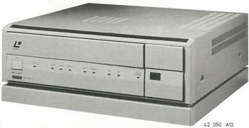
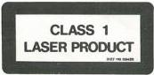

LaserVision ROM disc drive VP415/00/05/35

# Service
Service
Service

# Service Manual

The VP415 is a professional Video Disc Drive for use in computerized audiovisual systems, involving a high degree of interactivity.

The Drive is suitable for playback of pre-recorded optical video discs, according to the LaserVision system (PAL standard) and it has the capacity to handle LV-ROM (LaserVision Read Only Memory) interactive discs.

# Contents:

Chapter 1 Technical data

Controls, indicators, connections

Connector pinning

Chapter 2 Remarks

Warnings

Modification levels

Adjustments

Demounting instructions

Service hints

Service tools

List of used symbols

Connections of semiconductors

# Caution

"Use of controls or adjustments or performance of procedures other than those specified here in may result in hazardous radiation exposure".

Safety regulations require that the set be restored to its original condition and that parts which are identical with those specified be used.

The differences between /00, /05 and/35 are only related to the ornamental plate on the front panel and to the mainscord.

Version /00 = LV-ROM Disc Drive with Euro mainscord.

/05 = BBC Domesday version with GB

mainscord

/35 = /00 with GB mainscord

Chapter 3 Module- and connector lay-out

Signal listing

Wiring diagram

Blockdiagram Control routes

Blockdiagram AUDIO/VIDEO signal path

Blockdiagram Servo

Chapter 4 Survey of modules

Modules A to Z

- Circuit diagram

- PCB lay-out

- Adjustments

- Electrical parts

Remote control

Chapter 5 Exploded view drawings

List of mechanical parts

List of electrical parts

Chapter 6 Repair method

Chapter 7 Circuit description

Chapter 8 Service Information

Documentation Technique Service Dokumentation Documentazione di Servizio Huolte-Ohje Manual de Servicio Manual de Servicio

Subject to modification

4822 726 14282

Printed in The Netherlands

© Copyright reserved

Published by

Service Consumer Electronics

CS 7 814