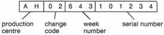
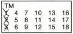

# MODIFICATION LEVELS

In the entire set various modification levels have been indicated.

# 1. Modification level of the set

The modification level of the set can be found at the rear of the cabinet.

a) Change code on the type number plate

Under the type number a letter and digit code is given which looks as follows :

The change code is preceded by the production centre.

b) Modification level on yellow sticker

On a yellow sticker a TM code is marked, indicating the modification level, in this case TM3.

# 2. Modification level of the module

In the circuit diagram: top right, under the name of the module (e.g. MOD LEVEL 3).

On the PCB: in the service printing at the component side

( e.g. X2345678901).

The modification level is marked then.

# 3. Modification level of the software in the EPROMs

On various modules EPROMs have been applied, that have been programmed (see survey below).

|  module | item number | name | program number  |
| --- | --- | --- | --- |
|  Drive Proc (R) | 7204 | DRIVE | 3104 103 6803.4  |
|  Control (S) | 7202 | CONTROL | 3104 103 6804.4  |
|  *CPU (W) | 7201 | SYNC | 3104 103 6808.0  |
|  *CPU (W) | 7224 | DESCR. | 3104 103 6807.0  |
|  *CPU (W) | 7247 | LV DOS #1 | 3104 103 6805.2  |
|  *CPU (W) | 7248 | LV DOS #2 | 3104 103 6806.2  |

*= only for VP415

The program number of the software has been applied on a sticker on the EPROM.

The modification level of the software is the last digit of the program number (behind the dot).

The modification level of the software in the Drive and Control EPROMs can also be retrieved by means of an external computer. To achieve this an F-code command "?=" should be sent to the disc drive (see the directions for use, chapter F-CODE COMMANDS : Revision level request).

The feedback of the disc drive is a 5-digit code of the software revision.

Digit 1 = 0

Digit 2 = major level drive

Digit 3 = minor level drive

Digit 4 = major level control

Digit 5 = minor level control

The modification level of the Drive software will then e.g. be 1.5 (digit 2 . digit 3) and of the Control software e.g. 1.4 (digit 4 . digit 5).

The relation with the modification level in the program number is as follows:

|   | mod. level progr. number | mod. level software revision  |
| --- | --- | --- |
|  Drive | 3104 103 6803.4 | 1.5  |
|  Control | 3104 103 6804.4 | 1.4  |

Each time a change takes place in the software, the modification level will by raised by one.

A survey of the modification levels of the set, the modules and the software can be found in the Service Information, chapter 8.

CS 7.820