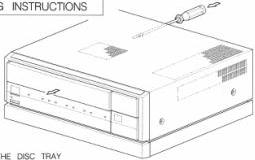
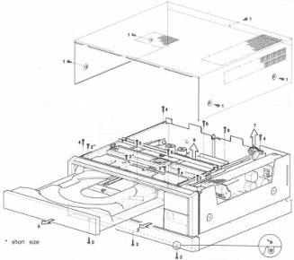
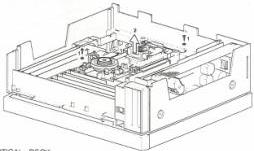
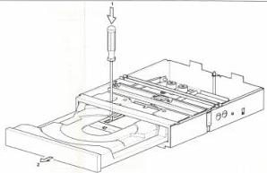
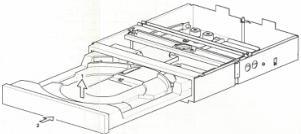
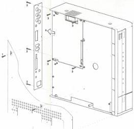
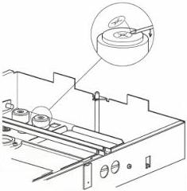
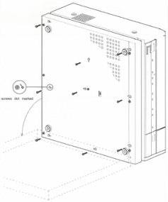

DEMOUNTING INSTRUCTIONS

PUSHING OUT THE DISC TRAY

DEMOUNTING UPPERCASET AND FRONTLOADER

Xcrews dot marked

DEMOUNTING OPTICAL DECK

DEMOUNTING DISC TRAY ASSY

MOUNTING DISC TRAY ASSY

DEMOUNTING ANALOG I/O MODULE U

REMOVING SPEEDNUT

ONLY FOR VP415:

DEMOUNTING SANDWICH PART

EVA.00317

T28/710

CS 7 823