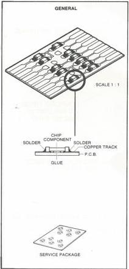
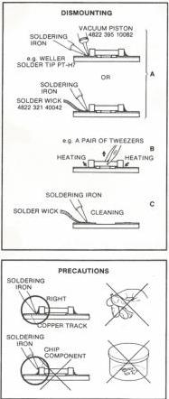
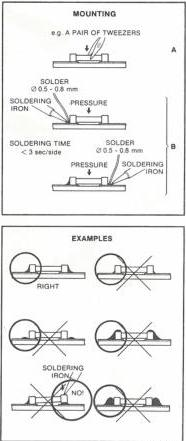

# SERVICE HINTS

# WARNING

# ESD

All ICs and many other semi-conductors are susceptible to electrostatic discharges (ESD).

Careless handling during repair can reduce life drastically.

When repairing, make sure that you are connected with the same potential as the mass of the set via a wrist wrap with resistance.

Keep components and tools also at this potential.

The photodiodes and the laser are more sensitive to electrostatic discharges than MOS IC's.

Careless handling during servicing may reduce life expectancy drastically.

For this reason care should be taken that during servicing the potentials of the tools and yourself are equal to that of the screening of the set

# Chip components (SMD)

Chip components have been applied in the set. For the insertion and removal of chip components see the figure below.

27 012C12

CS 7 824