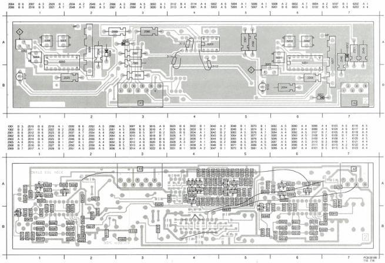

AUDIO PROC. MODULE

A

(MOD LEVEL 2)

# ADJUSTMENTS

Required

Test disc

Scope

Adjustment conditions

Load test disc

Normal play, picture no. 6200-6500 Audio 1,

6600-6900 Audio 2 (replay)

Audio modulation 1 kHz

# Adjustments

1) R3003, R3005 (Audio demo)

- Measure the output voltage on 1A1 and 3A1 (AUD2 and AUD1) with the scope.
- Adjust R3003 and R3005 until the output voltage is 1.6 Vpp.

Adjustment when item replaced:

replaced adjust

IC6201

IC6202

R3005

R3003

LIST OF ELECTRICAL PARTS MODULE A

|  Filters  |   |   |   |
| --- | --- | --- | --- |
|  5007 | 4822 242 71658 | SLC3251 |   |
|  5008 | 4822 242 71659 | SLC3252 |   |
|  Coils  |   |   |   |
|  5001 | 4822 156 20928 | 8 mH | 2008  |
|  5002 | 4822 156 11009 | 130 μH | 2009  |
|  5003 | 4822 156 11009 | 130 μH | 2010  |
|  5004 | 4822 156 20928 | 8 mH | 2011  |
|  5005 | 4822 156 11008 | 110 μH | 2012  |
|  5006 | 4822 156 11008 | 110 μH | 2013  |
|  Potentiometers  |   |   |   |
|  3003 | 4822 100 11087 | 2.2 kΩ | 2016  |
|  3005 | 4822 100 11087 | 2.2 kΩ | 2017  |
|   |  |  | 2018  |
|   |  |  | 2019  |
|   |  |  | 2020  |
|   |  |  | 2021  |
|   |  |  | 2022  |

|  4822 122 32808 | 1.2 nF |  | 2023 | 4822 122 32442 | 10 nF |  | 2057 | 5322 122 31647 | 1 nF |   |
| --- | --- | --- | --- | --- | --- | --- | --- | --- | --- | --- |
|  4822 122 32808 | 1.2 nF |  | 2024 | 4822 122 31759 | 22 nF |  | 2058 | 4822 122 31783 | 2.7 nF |   |
|  4822 122 32856 | 8.2 nF |  | 2025 | 4822 122 32482 | 22 pF |  | 2059 | 4822 122 31965 | 220 pF |   |
|  5322 124 21711 | 100 μF | 25 V | 2026 | 4822 122 31766 | 120 pF |  | 2060 | 4822 122 31774 | 56 pF |   |
|  4822 122 32597 | 6.8 nF |  | 2027 | 4822 122 31759 | 22 nF |  | 2061 | 4822 122 31767 | 150 pF |   |
|  4822 124 22189 | 6.8 μF | 63 V | 2028 | 4822 122 32442 | 10 nF |  | 2062 | 4822 122 32442 | 10 nF |   |
|  5322 124 21749 | 10 μF | 63 V | 2030 | 4822 122 31759 | 22 nF |  | 2064 | 4822 122 31783 | 2.7 nF |   |
|  5322 122 32839 | 100 nF |  | 2034 | 5322 124 21711 | 100 μF | 25 V | 2065 | 5322 124 10512 | 68 μF | 20% 16 V  |
|  4822 122 32442 | 10 nF |  | 2036 | 4822 122 31759 | 22 nF |  | 2066 | 5322 124 21749 | 10 μF | 63 V  |
|  4822 122 31759 | 22 nF |  | 2037 | 4822 122 33007 | 330 nF | 25 V | 2069 | 5322 124 21749 | 10 μF | 63 V  |
|  4822 122 31768 | 180 pF |  | 2039 | 4822 122 33007 | 330 nF | 25 V |  |  |  |   |
|  4822 122 32975 | 33 pF |  | 2046 | 4822 122 32927 | 220 nF |  |  |  |  |   |
|  4822 122 31759 | 22 nF |  | 2047 | 4822 122 32927 | 220 nF |  |  |  |  |   |
|  4822 122 32442 | 10 nF |  | 2048 | 5322 124 21711 | 100 μF | 25 V |  |  |  |   |
|  4822 122 32808 | 1.2 nF |  | 2049 | 5322 124 10512 | 68 μF | 20% 16 V |  |  |  |   |
|  4822 122 32808 | 1.2 nF |  | 2050 | 4822 122 32972 | 1 nF |  |  |  |  |   |
|  4822 122 32856 | 8.2 nF |  | 2051 | 4822 122 31783 | 2.7 nF |  |  |  |  |   |
|  5322 124 21711 | 100 μF | 25 V | 2052 | 4822 122 31965 | 220 pF |  |  |  |  |   |
|  4822 122 32597 | 6.8 nF |  | 2053 | 4822 122 31774 | 56 pF |  |  |  |  |   |
|  4822 124 22189 | 6.8 μF | 63 V | 2054 | 4822 122 31767 | 150 pF |  |  |  |  |   |
|  5322 124 21749 | 10 μF | 63 V | 2055 | 4822 122 32442 | 10 nF |  |  |  |  |   |
|  5322 122 32839 | 100 nF |  | 2056 | 4822 122 31783 | 2.7 nF |  |  |  |  |   |