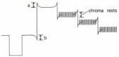
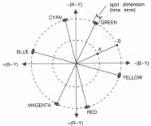
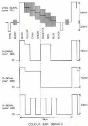
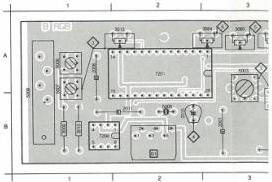
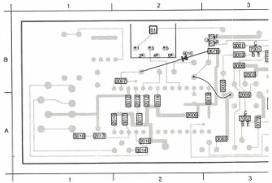

RGB MODULE

B

(MOD LEVEL 5)

# ADJUSTMENTS

# Required

Test disc

Scope (dual beam) with X-deflection via B-channel

Or vector scope, if available

# Adjustment conditions

Load test disc.

Still picture, colour pattern (picture no. 6200).

# Adjustments

1) L5002 and L5003 (notch filter)

- Using the scope, measure the luminance signal on 10B3, line triggered (see fig. B1)

LUMINANCE SIGNAL

MDA-30595
T28/711

Fig. B1

- Adjust L5002 until the chroma rests in the luminance signal have disappeared.
- Adjust L5003 until overshoot a and undershoot b have the same amplitude.

2) L5004 (Bandpass)

- Measure the chroma signal on 15-IC7201 with the scope.
- Adjust L5004 for minimum overshoots in the chroma signal.

3) R3015 and L5007 (Delay line)

- Measure with the scope the (R-Y) signal at 9B2 with the A-channel and the (B-Y) signal on 10B2 with the B-channel, both AC coupled.
- Switch the scope to X-deflection and adjust it until the vector diagram below appears (see Fig. B2).

VECTOR DIAGRAM COLOUR BAR

Fig. B2

MDA-30585
T28/711

The colour spots visible on the scope screen are lying at a certain distance B from origin O.

- Short-circuit pins 1-2 or 3-4 of delay line L5008. The spots in the vector diagram will lie closer to the origin now, at distance A from the origin. When the short-circuit is removed, the spots move outwards again (B).
- Adjust L5007 until the dimensions of the spots (in B) are minimal.
- Adjust R3015 until distance OB is twice distance OA in case of alternate short-circuiting of the delay line.

4) C2015 (Oscillator frequency)

- Connect the scope as described sub 3).
- Short-circuit pins 1-2 or 3-4 of delay line L5008.
- Adjust C2015 until the dimensions of the colour spots of the vector diagram are minimal.

5) R3080 (Luminance signal amplitude)

- Measure the G-signal on 3B3 (line freq.) with the scope. See fig. B3.

Fig. B3

MDA-30580
T28/711

- Adjust R3080 for an average amplitude of 700 mV ± 7 mV.

6) R3082, R3084 (colour difference signal amplitude)

- Using the scope, measure the R-signal on 2B3 and adjust R3082 to the same amplitude of yellow, magenta and red.
- Using the scope, measure the B-signal on 4B3 and adjust R3084 to the same amplitude of cyan, magenta and blue (see Fig. B3).

7) R3045 (black level)

- Measure output B-signal on 4B3 with the scope.
- Adjust R3045 for a black level of 0V ± 50 mV (see Fig. B3).

# Adjustment when item replaced

replaced

adjust

IC7201

R3015, R3082, R3084, C2015, L5006, L5007

IC7202

R3080

IC7203

R3055, R3080, R3082, R3084

R3080

R3207 )

R3082

R3305 ) on analog I/O module U

R3084

R3315 )

|   | 2008 A 1 | 2018 A 4 | 2028 B 5 | 2039 A 5 | 3010 B 1 | 3080 A 3 | 5001  |
| --- | --- | --- | --- | --- | --- | --- | --- |
|  2001 B 2 | 2011 B 2 | 2021 A 4 | 2028 B 5 | 2040 A 5 | 3015 A 2 | 3082 A 3 | 5002  |
|  2002 B 4 | 2015 B 2 | 2022 A 4 | 2028 A 5 | 2039 B 1 | 3045 A 7 | 3084 A 3 | 5003  |

|  2001 B 2 | 2009 A 2 | 2015 A 2 | 2024 A 4 | 2031 A 5 | 3002 A 3 | 3007 B 4 | 3013  |
| --- | --- | --- | --- | --- | --- | --- | --- |
|  2004 B 2 | 2012 A 2 | 2017 A 1 | 2025 A 4 | 2032 A 5 | 3003 B 3 | 3008 A 3 | 3014  |
|  2005 A 3 | 2012 A 2 | 2019 A 4 | 2027 A 5 | 2032 A 5 | 3004 B 3 | 3011 A 2 | 3016  |
|  2006 B 4 | 2013 A 2 | 2020 A 4 | 2029 A 5 | 2034 A 5 | 3005 B 4 | 3012 A 2 | 3017  |
|  2007 B 2 | 2014 A 2 | 2023 A 4 | 2030 A 5 | 2051 B 3 | 3006 B 3 |  | 3018  |

LIST OF ELECTRICAL PARTS MODULE B

Trimcapaci
2015

Crystals

|  5005 | 4822 242 70304 | 8.867238 MHz  |
| --- | --- | --- |

2001

Delay lines

|  5008 | 4822 320 40051 | DL711  |
| --- | --- | --- |

2002

Coils

|  5001 | 4822 156 10993 | 150 μH  |
| --- | --- | --- |
|  5002 | 4822 157 52873 | 5.5 μH  |
|  5003 | 4822 157 52875 | 66 μH  |
|  5004 | 4822 157 52874 | 12.5 μH  |
|  5006 | 4822 156 10995 | 10 μH  |
|  5007 | 5322 156 21341 | 10 μH  |

2012

Potentiometers

|  3015 | 4822 100 10359 | 220 Ω  |
| --- | --- | --- |
|  3045 | 5322 101 14066 | 10 kΩ  |
|  3080 | 5322 100 10117 | 2.2 kΩ  |
|  3082 | 5322 100 10117 | 2.2 kΩ  |
|  3084 | 5322 100 10117 | 2.2 kΩ  |

2013

2014

2015

2016

2017

2018