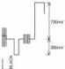
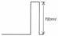
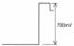
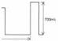
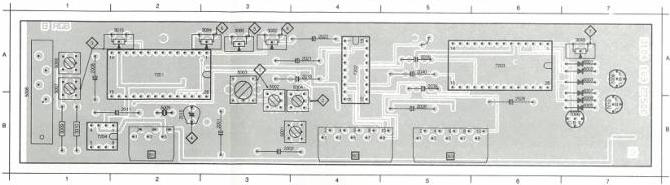
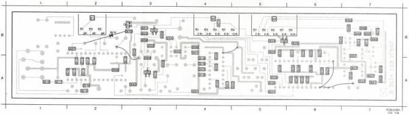

MODULE

DD LEVEL 5)

B

1 the scope screen are from origin O.

-4 of delay line L5008.
ram will lie closer to the
om the origin. When the
e spots move outwards

sions of the spots (in B)

DB is twice distance OA
cruiting of the delay line.

ibed sub 3).

4 of delay line L5008.
sions of the colour
are minimal.

tude)

IB3 (line freq.) with the

INALS

MDX 0098
726711

amplitude of 700 mV ±

signal amplitude)

a R-signal on 2B3 and
mplitude of yellow, ma-

a B-signal on 4B3 and
plitude of cyan, magen-

7) R3045 (black level)

- Measure output B-signal on 4B3 with the scope.
- Adjust R3045 for a black level of 0V ± 50 mV (see Fig. B3).

Adjustment when item replaced

|  replaced | adjust  |
| --- | --- |
|  IC7201 | R3015, R3082, R3084, C2015, L5006, L5007  |
|  IC7202 | R3080  |
|  IC7203 | R3055, R3080, R3082, R3084  |
|  R3080 | R3207 )  |
|  R3082 | R3305 ) on analog I/O module U  |
|  R3084 | R3315 )  |

|  2001 B 3 | 2011 B 2 | 2021 A 4 | 2028 B 5 | 2040 A 5 | 2015 B 1 | 2080 A 3 | 5091 B 3 | 5054 B 4 | 5037 A 1 | 5002 A 1 | 6007 A 7 | 7008 A 7 | 7202 A 4  |
| --- | --- | --- | --- | --- | --- | --- | --- | --- | --- | --- | --- | --- | --- |
|  2002 B 4 | 2019 B 2 | 2022 A 4 | 2038 B 5 | 2040 B 5 | 2015 A 2 | 2082 A 3 | 5092 B 3 | 5035 B 2 | 5008 A 1 | 5003 A 7 | 5009 B 7 | 7010 B 7 | 7203 A 6  |
|  |   |   |   |   |   |   |   |   |   |   |   |   |   |

|  2003 B 3 | 2006 A 2 | 2010 A 2 | 2024 A 4 | 2031 A 5 | 2002 A 3 | 2007 B 4 | 2013 A 3 | 2019 A 4 | 2025 A 6 | 2030 A 8 | 2035 A 6 | 2047 B 6 | 2057 A 7 | 2067 A 7 | 2071 B 4 | 6010 B 3  |
| --- | --- | --- | --- | --- | --- | --- | --- | --- | --- | --- | --- | --- | --- | --- | --- | --- |
|  2004 B 3 | 2010 A 2 | 2017 A 1 | 2025 A 4 | 2032 A 6 | 2002 B 3 | 2008 A 3 | 2014 A 2 | 2021 A 4 | 2025 B 5 | 2021 A 8 | 2028 A 6 | 2040 B 7 | 2050 B 7 | 2060 B 7 | 2070 B 3 | 7001 B 3  |
|  2005 A 2 | 2012 A 2 | 2019 A 4 | 2027 A 6 | 2033 A 6 | 2004 B 3 | 2011 A 2 | 2016 A 1 | 2022 A 5 | 2027 A 6 | 2032 A 5 | 2037 A 7 | 2040 B 7 | 2050 B 7 | 2060 B 7 | 2070 B 3 | 7002 A 3  |
|  2006 B 4 | 2013 A 2 | 2020 A 4 | 2035 A 5 | 2044 A 6 | 2005 B 4 | 2012 A 2 | 2017 A 2 | 2023 B 5 | 2028 A 6 | 2033 A 5 | 2043 A 7 | 2050 B 7 | 2060 A 7 | 2070 B 7 | 2081 A 4 | 7003 B 3  |
|  2007 B 2 | 2014 A 2 | 2023 A 4 | 2036 A 5 | 2051 B 3 | 2006 B 3 |  | 2018 A 4 | 2024 B 5 | 2029 A 6 | 2034 A 5 | 2044 A 7 | 2051 B 7 | 2061 A 7 | 2071 B 7 | 2083 A 3 | 7010 B 3  |

LIST OF ELECTRICAL PARTS MODULE B

Crystals

|  5005 | 4822 242 70304 | 8.867238 MHz  |
| --- | --- | --- |

Delay lines

|  5008 | 4822 320 40051 | DL711  |
| --- | --- | --- |

Coils

|  5001 | 4822 156 10993 | 150 μH  |
| --- | --- | --- |
|  5002 | 4822 157 52873 | 5.5 μH  |
|  5003 | 4822 157 52875 | 66 μH  |
|  5004 | 4822 157 52874 | 12.5 μH  |
|  5006 | 4822 156 10995 | 10 μH  |
|  5007 | 5322 156 21341 | 10 μH  |

Potentiometers

|  3015 | 4822 100 10359 | 220 Ω  |
| --- | --- | --- |
|  3045 | 5322 101 14066 | 10 kΩ  |
|  3080 | 5322 100 10117 | 2.2 kΩ  |
|  3082 | 5322 100 10117 | 2.2 kΩ  |
|  3084 | 5322 100 10117 | 2.2 kΩ  |

Trimcapacitors

|  2015 | 4822 125 50092 | 40 pF  |
| --- | --- | --- |

|  2001 | 4822 124 22027 | 47 μF | 25 V  |
| --- | --- | --- | --- |
|  2002 | 4822 124 22027 | 47 μF | 25 V  |
|  2003 | 4822 122 31974 | 820 pF |   |
|  2004 | 4822 122 31965 | 220 pF |   |
|  2005 | 4822 122 31966 | 27 pF |   |
|  2006 | 4822 122 31766 | 120 pF |   |
|  2007 | 4822 122 31783 | 2.7 nF |   |
|  2008 | 4822 124 22186 | 150 μF | 25 V  |
|  2009 | 4822 122 31759 | 22 nF |   |
|  2010 | 4822 122 31759 | 22 nF |   |
|  2011 | 4822 124 22188 | 3.3 μF | 63 V  |
|  2012 | 4822 122 31916 | 5.6 nF |   |
|  2013 | 4822 122 32183 | 56 nF |   |
|  2014 | 4822 121 42915 | 330 pF |   |
|  2015 | 4822 125 50092 | 40 pF | trimmer  |
|  2016 | 4822 122 32442 | 10 nF |   |
|  2017 | 4822 122 32442 | 10 nF |   |
|  2018 | 4822 121 41756 | 330 nF | 10% 63 V  |

|  2019 | 4822 122 33002 | 68 pF |   |
| --- | --- | --- | --- |
|  2020 | 4822 122 33002 | 68 pF |   |
|  2021 | 4822 121 41719 | 1 μF | 10% 100 V  |
|  2022 | 4822 121 41719 | 1 μF | 10% 100 V  |
|  2023 | 4822 121 42915 | 330 pF |   |
|  2024 | 4822 122 32974 | 100 pF |   |
|  2025 | 4822 122 32974 | 100 pF |   |
|  2026 | 4822 124 22186 | 150 μF | 25 V  |
|  2027 | 4822 122 31759 | 22 nF |   |
|  2028 | 5322 124 21643 | 22 μF | 40 V  |
|  2029 | 4822 122 33008 | 120 nF | 50 V  |
|  2030 | 4822 122 33008 | 120 nF | 50 V  |
|  2031 | 4822 122 33008 | 120 nF | 50 V  |
|  2032 | 4822 122 31759 | 22 nF |   |
|  2033 | 4822 122 31759 | 22 nF |   |
|  2034 | 4822 122 31759 | 22 nF |   |
|  2038 | 4822 121 41608 | 100 nF | 100 V  |
|  2039 | 4822 121 41608 | 100 nF | 100 V  |
|  2040 | 4822 121 41874 | 270 nF | 63 V  |

CS 7 838