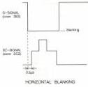
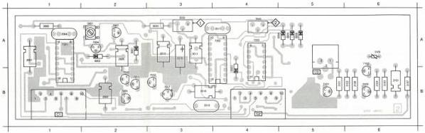
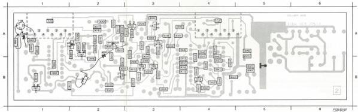

VIDEO PROC. MODULE

(MOD LEVEL 3)

C

# ADJUSTMENTS

# Required

Test disc

Voltmeter

Scope

# Adjustment conditions

Load test disc

Still picture, colour bar (picture no. 6200).

# Adjustments

1) R3035 (frequency)

- Measure the DC voltage on 18-IC7202.
- Adjust R3035 for a DC voltage of 5.5V ± 0.5 V.

2) R3045 (horizontal blanking)

- Search for a white picture (e.g. picture no. 7500).
- Measure sandcastle pulse SC on 3C2 with the scope (A-channel).
- Measure the G-signal on 3B3 with the scope (B-channel) and trigger on this signal.
- Adjust R3045 for a difference of 0.5μs between the SC and the G-signal (see Fig. C1).

Fig. C1

# Adjustment when item replaced

replaced

IC7202

IC7203

adjust

R3035, R3045

R3045

|  2001 A 1 | 2005 A 2 | 2017 A 4 | 2022 A 3 | 2005 A 1 | 6002 A 2 | 7000 B 2 | 7011 B 2 | 7001 A 1 | 2015 A 3 | 1102 B 0 | 2105 A 6 | 6004 A 5 | 7101 B 5  |
| --- | --- | --- | --- | --- | --- | --- | --- | --- | --- | --- | --- | --- | --- |
|  2002 B 2 | 2010 A 3 | 2016 B 3 | 2026 A 3 | 6001 A 2 | 6003 B 4 | 7007 A 2 | 7012 B 3 | 7202 A 4 | 2101 B 6 | 3103 B 0 | 2106 B 6 | 6005 A 5 | 7102 A 6  |
|  2004 A 1 | 2011 A 3 | 2019 B 3 | 2045 A 4 | 6001 A 2 | 7004 A 2 | 7010 B 2 | 7017 B 3 | 7202 A 4 | 3101 B 5 | 3104 B 0 | 2107 B 6 | 6006 A 5 | 7103 B 6  |

|  2003 A 1 | 2014 B 4 | 2024 B 4 | 2032 A 1 | 2008 A 2 | 2015 B 3 | 2021 B 2 | 2027 A 2 | 2034 B 3 | 2041 A 4 | 2049 B 4 | 2057 A 3 | 2063 A 2 | 2077 A 1 | 7008 B 3 | 7104 A 1  |
| --- | --- | --- | --- | --- | --- | --- | --- | --- | --- | --- | --- | --- | --- | --- | --- |
|  2007 B 2 | 2018 A 3 | 2025 A 5 | 2033 A 2 | 2009 A 2 | 2016 A 2 | 2022 B 2 | 2028 A 2 | 2036 A 4 | 2042 A 4 | 2050 B 4 | 2056 A 3 | 2064 A 3 | 2066 A 2 | 7009 B 3 |   |
|  2008 B 3 | 2020 B 3 | 2026 A 3 | 2034 A 2 | 2010 B 1 | 2017 A 2 | 2023 B 2 | 2029 A 2 | 2037 B 4 | 2043 B 4 | 2051 B 4 | 2058 A 2 | 2066 B 1 | 7011 A 2 | 7014 B 4 |   |
|  2009 B 3 | 2021 A 4 | 2027 B 5 | 2035 A 2 | 2011 B 1 | 2018 A 2 | 2024 A 3 | 2030 A 3 | 2038 A 3 | 2044 B 4 | 2052 B 4 | 2060 A 3 | 2067 B 1 | 7002 A 2 | 7015 A 3 |   |
|  2012 B 4 | 2022 B 4 | 2028 A 2 | 2036 B 2 | 2012 B 3 | 2019 B 2 | 2025 A 2 | 2031 A 2 | 2039 A 3 | 2046 B 4 | 2053 B 4 | 2061 A 3 | 2068 B 2 | 7003 B 1 | 7016 A 3 |   |
|  2013 B 4 | 2023 B 4 | 2031 A 1 | 2037 A 2 | 2013 B 3 | 2020 B 2 | 2026 A 2 | 2032 A 3 | 2040 A 3 | 2047 B 4 | 2059 A 3 | 2062 B 5 | 2069 A 1 | 7006 B 2 | 7018 A 3 |   |

LIST OF ELECTRICAL PARTS MODULE C

Cells

5001 4822 156 10992 117 μH

Potentiometers

3035 5322 101 10666 47 kΩ

3045 5322 101 10666 47 kΩ

NTC Resistors

3105 4822 116 30251 150 kΩ 0.5W

Fuse Resistors

3065 4822 111 10165 10 Ω

3108 4822 111 90357 33 Ω

NFR25 Resistors

3033 4822 111 30508 10 Ω

3107 4822 111 30593 3.3 Ω

|  2001 | 4822 124 22027 | 47 μF | 25 V | 2023 | 4822 122 32974 | 100 pF  |
| --- | --- | --- | --- | --- | --- | --- |
|  2002 | 4822 124 22027 | 47 μF | 25 V | 2024 | 4822 122 32974 | 100 pF  |
|  2003 | 4822 122 31759 | 22 nF |  | 2025 | 4822 122 31759 | 22 nF  |
|  2004 | 4822 121 42688 | 68 nF | 100 V | 2026 | 5322 122 32839 | 100 nF  |
|  2005 | 4822 124 22027 | 47 μF | 25 V | 2027 | 4822 122 31965 | 220 pF  |
|  2007 | 4822 122 31759 | 22 nF |  | 2028 | 4822 122 31316 | 100 pF  |
|  2008 | 4822 122 31769 | 18 pF |  | 2101 | 4822 124 22027 | 47 μF  |
|  2009 | 4822 122 31759 | 22 nF |  |  |  |   |
|  2010 | 5322 124 21749 | 10 μF | 63 V |  |  |   |
|  2011 | 5322 124 21711 | 100 μF | 25 V |  |  |   |
|  2012 | 4822 122 31759 | 22 nF |  |  |  |   |
|  2013 | 4822 122 32442 | 10 nF |  |  |  |   |
|  2014 | 5322 122 32839 | 100 nF |  |  |  |   |
|  2015 | 4822 121 51051 | 4.7 nF | 63 V |  |  |   |
|  2016 | 4822 122 32442 | 10 nF |  |  |  |   |
|  2017 | 4822 121 41876 | 220 nF | 20% 63 V |  |  |   |
|  2018 | 4822 124 22031 | 4.7 μF | 63 V |  |  |   |
|  2019 | 4822 121 41837 | 560 nF | 20% 100 V |  |  |   |
|  2020 | 5322 122 32839 | 100 nF |  |  |  |   |
|  2021 | 4822 122 31971 | 10 pF |  |  |  |   |
|  2022 | 4822 122 31759 | 22 nF |  |  |  |   |

25 V