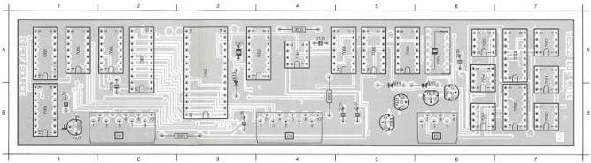
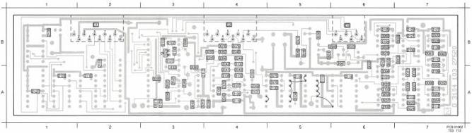

REF SOURCE MODULE

D

(MOD LEVEL 2)

2030 A 6 2130 A 4 2136 B 3 2033 A 4 6011 B 5 7018 B 6 7021 B 5 7051 A 7 7054 A 6 7057 B 6 7061 A 4 7064 A 2 7067 A 2
2101 B 5 2106 B 3 2001 B 5 5001 A 3 6010 B 5 7010 B 5 7022 B 1 7052 A 7 7054 A 5 7056 A 5 7062 A 3 7066 A 1
2102 B 5 2106 B 3 2002 B 4 5002 A 6 6015 A 3 7005 B 5 7009 B 1 7053 A 7 7056 B 7 7066 A 5 7060 A 3 7066 A 1 7068 B 1

2029 B 7 2028 A 7 2042 A 4 2048 B 4 2104 B 6 2110 B 7 2116 A 5 2122 B 3 2129 B 7 3030 B 5 3036 A 6 3062 A 7 3068 B 7 3078 B 4 3094 B 4 3106 A 4 3106 A 4 3130 A 3
2021 B 5 2027 A 7 2043 A 4 2046 A 4 2105 B 6 2111 A 7 2117 A 3 2124 A 2 2130 A 5 3051 B 5 3057 A 6 3063 B 7 3069 B 7 3079 B 4 3095 A 3 3101 A 4 3107 A 4 3123 B 3
2022 A 6 2028 B 7 2044 B 4 2100 A 5 2108 B 7 2112 A 7 2118 A 2 2125 A 5 3046 B 6 3052 A 7 3058 A 6 3064 A 7 3073 B 6 3090 A 5 3096 A 5 3102 A 4 3108 A 4
2023 B 6 2038 A 4 2045 B 4 2101 A 6 2107 B 7 2115 A 7 2119 A 4 2126 A 1 3047 A 6 3053 A 7 3059 B 6 3065 A 7 3075 A 5 3091 A 3 3097 A 3 3103 A 4 3130 B 3
2024 A 7 2046 A 4 2046 A 3 2102 A 6 2108 B 7 2114 A 6 2120 A 4 2127 A 1 3048 B 5 3054 A 6 3060 B 5 3066 A 7 3079 A 5 3092 B 4 3098 B 3 3104 A 5 3101 B 3
2025 A 7 2041 A 4 2047 A 3 2103 A 6 2109 A 7 2115 A 5 2121 B 7 2128 B 1 3049 B 5 3055 A 6 3061 B 7 3067 A 7 3077 A 3 3093 B 4 3099 A 3 3105 A 4 3132 B 3

LIST OF ELECTRICAL PARTS MODULE D

Crystals

|  5001 | 4822 242 70362 | 5 MHz  |
| --- | --- | --- |
|  5002 | 4822 242 71664 | 10 MHz  |

NFR25 Resistors

|  3001 | 4822 111 30483 | 1 Ω  |
| --- | --- | --- |
|  3002 | 4822 111 30483 | 1 Ω  |
|  3003 | 4822 111 30483 | 1 Ω  |

|  2020  |
| --- |
|  2021  |
|  2022  |
|  2023  |
|  2024  |
|  2025  |
|  2026  |
|  2027  |
|  2028  |
|  2030  |
|  2039  |
|  2040  |
|  2041  |
|  2042  |
|  2043  |
|  2044  |
|  2045  |
|  2046  |
|  2047  |
|  2048  |
|  2049  |

|  4822 121 42915 | 330 pF  |
| --- | --- |
|  4822 122 33012 | 150 nF  |
|  4822 122 31784 | 4.7 nF  |
|  4822 122 32542 | 47 nF  |
|  5322 122 32839 | 100 nF  |
|  4822 122 32976 | 470 pF  |
|  4822 122 32974 | 100 pF  |
|  4822 122 32972 | 1 nF  |
|  4822 122 32972 | 1 nF  |
|  4822 124 20942 | 1.5 μF  |
|  4822 122 33007 | 330 nF  |
|  4822 122 32972 | 1 nF  |
|  4822 122 32442 | 10 nF  |
|  5322 122 31848 | 33 nF  |
|  4822 122 32972 | 1 nF  |
|  4822 122 31644 | 2.2 nF  |
|  4822 122 33012 | 150 nF  |
|  4822 122 31766 | 120 pF  |
|  4822 122 32974 | 100 pF  |
|  4822 122 32442 | 10 nF  |
|  4822 122 33008 | 120 nF  |

|  50 V  |
| --- |
|  |
|  |
|  |
|  |
|  |
|  |
|  |
|  |
|  |
|  |
|  |
|  |
|  |
|  |
|  |
|  |
|  |
|  |
|  |
|  |
|  |
|  |
|  |
|  |
|  |
|  |
|  |
|  |
|  |
|  |
|  |
|  |
|  |
|  |

|  2100  |
| --- |
|  2101  |
|  2102  |
|  2103  |
|  2104  |
|  2105  |
|  2106  |
|  2107  |
|  2108  |
|  2109  |
|  2110  |
|  2111  |
|  2112  |
|  2113  |
|  2114  |
|  2115  |
|  2116  |
|  2117  |
|  2118  |
|  2119  |
|  2120  |

|  5322 122 32839 | 100 nF  |
| --- | --- |
|  5322 122 32839 | 100 nF  |
|  5322 122 32839 | 100 nF  |
|  5322 122 32839 | 100 nF  |
|  5322 122 32839 | 100 nF  |
|  5322 122 32839 | 100 nF  |

|  2121  |
| --- |
|  2122  |
|  2124  |
|  2125  |
|  2126  |
|  2127  |
|  2128  |
|  2129  |
|  2130  |
|  2131  |
|  2132  |
|  2133  |
|  2134  |
|  2135  |
|  2136  |

|  5322 122 32839 | 100 nF  |
| --- | --- |
|  5322 122 32839 | 100 nF  |
|  5322 122 32839 | 100 nF  |
|  5322 122 32839 | 100 nF  |
|  5322 122 32839 | 100 nF  |

|  6.3 V  |
| --- |
|  16 V  |
|  16 V  |
|  16 V  |
|  10 V  |
|  10 V  |

CS 7 840