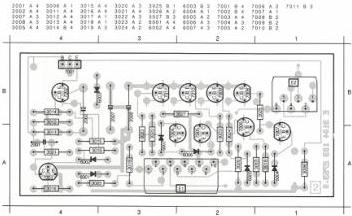
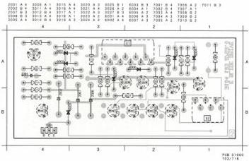

SLIDE DRIVE MODULE

E

(MOD LEVEL 3)

LIST OF ELECTRICAL PARTS MODULE E

NFR25 Resistors

3026 4822 111 30483 1 Ω

3027 4822 111 30483 1 Ω

|  2001 | 4822 122 30053 | 680 pF | 100 V  |
| --- | --- | --- | --- |
|  2002 | 4822 121 50959 | 3.9 nF | 63 V  |
|  2007 | 4822 124 22027 | 47 μF | 25 V  |
|  2008 | 4822 124 22027 | 47 μF | 25 V  |

CS 7 841