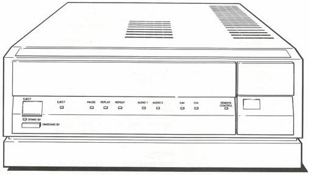
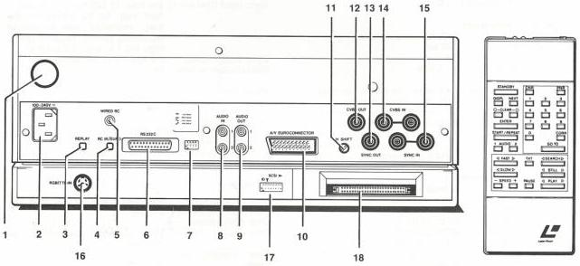

# CONTROLS, INDICATORS AND CONNECTIONS

# Front

EJECT button

STANDBY indicator

ON/STANDBY button

EJECT indicator

PAUSE indicator

REPLAY indicator

REPEAT indicator

AUDIO 1 indicator

AUDIO 2 indicator

CAV indicator

CLV indicator

REMOTE CONTROL indicator

# Rear

1 ON/OFF switch
2 MAINS lead socket
3 REPLAY on/of switch
4 RC IR/EURO switch
5 WIRED RC socket
6 RS232C socket
7 BAUD RATE dip switches
8 AUDIO IN (1&2) sockets
9 AUDIO OUT (1&2) sockets
10 A/V EUROCONNECTOR
11 H-SHIFT control [for Genlock]
12 CVBS OUT socket
13 SYNC OUT socket
14 CVBS IN socket
15 SYNC IN sockets
16 RGB (TTL) IN socket
17 SCSI address dip switches
18 SCSI socket

# Remote control functions

- Play forward/reverse
- Still frame/step forward/reverse
Audio 1/2 on/off
Picture number/time display on/off
Chapter number display on/off
Programme display on/off
Search forward/reverse (20 times normal speed)
- Goto (Picture or Chapter number)
Input correction
- Digits 0-9 entry
- Fast forward/reverse (3,10,20 x normal speed)
- Slow forward/reverse (1/100 to normal speed)
- Fast/slow rate \(+ / -\)
- Clear memory
- Enter
- Standby
- Pause
- Start/Repeat
- Next

CS 7 817