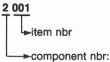
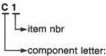

# REMARKS

# 1. Care of the disc drive

The disc drive requires no special maintenance.
It is, however, recommended to clean the objective
lens from time to time with a piece of wadding, dipped
in alcohol.

# 2. Set-up of the Service Manual

The set is composed of various modules (A through
Z). The circuit diagrams, PCB layouts and parts lists
have also been classified per module.

# a) Circuit diagrams

Of each module a functional circuit diagram has been
given, with the incoming signals drawn as much as
possible at the left-hand side and the outgoing
signals at the right-hand side. Each incoming and
outgoing signal has a unique name, the meaning of
which can be read in the Signal listing.

If a signal enters or leaves the module, this takes
place via a connector (e.g. 6B2 = pin 6 of connector
B2) and via a letter indication in the line. This
indication mentions to which module the line is
connected.

If the letter indication in the line is the same as the
module on which the signal is present, the signal
remains on the module mentioned and, naturally, no
connector is drawn.

# b) Oscillograms and voltages in the circuit diagrams

- The oscillograms in the diagrams have been
measured with a dual-beam scope with Delayed
Timebase PM3214. The set has been connected to
a monitor by means of a SCART cable

Video : still picture, picture number 5530
(EBU colour bar, 75% saturation)

Audio 1: normal play, picture numbers 6200 - 6500,
1 kHz modulation

Audio 2: normal play, picture numbers 6500 - 6900,
1 kHz modulation

- The DC voltages have been measured with a
Digital Multimeter PM2524, still picture, picture
number 5530, unless stated otherwise.

# c) PCB layouts

Most modules in the set have been equipped with
doublesided copper pattern and plated-through holes.
For each module a PCB layout is drawn, consisting of
a drawing of the component side and of the soldering
side (chip side) with corresponding copper pattern.

# d) Parts lists

For each module an electrical parts list is given,
stating the service code numbers of the specific
electrical components that have been applied on
the module.

The code numbers of the standard components
(ICs, transistors, diodes, standard resistors, etc.)
have been placed on a collective list in Chapter 5.

# e) Service code numbers of the modules

In this Service Manual service code numbers for
the modules have not been mentioned. Please
consult you parts supplier.

# 3. Repair on modules

To enable repair/adjustment on modules use can be
made of extension PCBs or extension cables. A
survey can be found sub Service Tools in this chapter.

# 4. Hidden switches

On Analog I/O module U two switches have been
applied, hidden for the user.

The function of these switches is :

SK1 : +11V or RC5 signal at pin 8 of the Euro
connector.
Factory adjustment is RC5 at pin 8 (switch
pressed out).

SK2 : ENCODED CVBS or NOT ENCODED CVBS
signal on CVBS OUT connector BNC3. The
factory adjustment is ENCODED (switch
pressed out).

Please consult the circuit diagram of Analog I/O
module U for more details on these switches.

# 5. The optical deck

The optical deck in the disc drive is composed of
various critical components and at the production
department adjusted by complicated alignment
equipment.

For the time being repair of the Deck Electronics and
of the Laser Detection Unit by a service technician is
not allowed.

If a failure analysis reveals that the Deck Electronics
or LDU are defective, the entire deck should be
submitted for repair to the production centre via the
Central Repair Procedure of the Concern Service
Centre. Please inquire at your parts supplier's for this
procedure.

Repairs on the slide drive assy and the Automatic Tilt
Control (ATC) assy are possible. See the List of
mechanical parts for the correct code numbers.

# 6. Coding of items

The coding of component items in the service printing
of the PCB's can differ from the coding of the items in
the circuit diagrams (except supply module T). On the
PCB's, a letter/number coding has been used (e.g. R1,
C1) and in the diagram a 4 number coding (e.g.
3001,2001). The table below shows the conversion
between both coding systems.

Circuit diagram

4 number coding

Service printing on PCB

letter/number coding

1 = Unit, battery

2 = capacitor

3 = resistor

5 = coil, trafo, cristal

6 = diode

7 = transistor, IC

= U

= C

= R

= S,L,K

= D

= T,TS,I,IC

CS 7 818