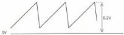

MOTOR + SEQUENCE MODULE F

(MOD. LEVEL 5)

# ADJUSTMENTS

Required

Test disc

Scope

VORMeter

Adjustment conditions

Rotating disc

Adjustment

1) R3029 (sawtooth signal)

- Measure the sawtooth signal on 3-IC7230-2A (see fig. F1).

SAWTOOTH SIGNAL

Fig. F1

MDA-00587
T26/711

- Adjust R3029 for a peak amplitude of 5.2V ± 0.1 V.

2) R3049 (current limiter)

- Measure the DC voltage on 7-IC7230 and adjust R3049 until this voltage is \(3.2\mathrm{V} \pm 0.1\mathrm{V}\).

Adjustment when item replaced

replaced

IC7230

adjust

R3029, R3049

LIST OF ELECTRICAL PARTS MODULE F

Potentiometers

|  3029 | 5322 101 10574 | 22 kΩ  |
| --- | --- | --- |
|  3049 | 4822 101 10755 | 1 MΩ  |

Fuse Resistors

|  3076 | 4822 111 30848 | 56 Ω  |
| --- | --- | --- |
|  3077 | 4822 111 30848 | 56 Ω  |
|  3086 | 4822 111 30848 | 56 Ω  |
|  3087 | 4822 111 30848 | 56 Ω  |
|  3096 | 4822 111 30848 | 56 Ω  |
|  3097 | 4822 111 30848 | 56 Ω  |
|  3108 | 5322 111 90376 | 4.7 Ω  |
|  3109 | 5322 111 90376 | 4.7 Ω  |
|  3110 | 5322 111 90376 | 4.7 Ω  |

|  2001  |
| --- |
|  2002  |
|  2003  |
|  2004  |
|  2010  |
|  2011  |
|  2012  |
|  2013  |
|  2014  |
|  2015  |
|  2020  |
|  2034  |
|  2035  |
|  2036  |
|  2037  |
|  2038  |
|  2039  |
|  2040  |
|  2041  |
|  2042  |
|  2043  |
|  2044  |

|  2001 | 4822 122 33007 | 330 nF | 25 V  |
| --- | --- | --- | --- |
|  2002 | 4822 122 33007 | 330 nF | 25 V  |
|  2003 | 4822 124 22027 | 47 μF | 25 V  |
|  2004 | 4822 121 41719 | 1 μF | 10% 100 V  |
|  2010 | 4822 122 31772 | 47 pF |   |
|  2011 | 4822 122 31772 | 47 pF |   |
|  2012 | 4822 122 31772 | 47 pF |   |
|  2013 | 4822 122 31772 | 47 pF |   |
|  2014 | 4822 122 31772 | 47 pF |   |
|  2015 | 4822 122 31772 | 47 pF |   |
|  2020 | 4822 124 22031 | 4.7 μF | 63 V  |
|  2034 | 4822 122 32442 | 10 nF |   |
|  2035 | 4822 122 32856 | 8.2 nF |   |
|  2036 | 4822 122 32566 | 3.9 nF |   |
|  2037 | 4822 122 32442 | 10 nF |   |
|  2038 | 4822 122 31644 | 2.2 nF |   |
|  2039 | 4822 122 32442 | 10 nF |   |
|  2040 | 4822 122 31969 | 3.3 nF |   |
|  2041 | 4822 122 32442 | 10 nF |   |
|  2042 | 4822 122 31969 | 3.3 nF |   |
|  2043 | 5322 124 21643 | 22 μF | 40 V  |
|  2044 | 4822 122 32974 | 100 pF |   |

|  2030 | 5322 122 31647 | 1 nF |  | 2113 | 5322 124 21711 | 100 μF | 25 V  |
| --- | --- | --- | --- | --- | --- | --- | --- |
|  2031 | 4822 122 32978 | 470 pF |  | 2114 | 5322 124 21711 | 100 μF | 25 V  |
|  2033 | 4822 122 32139 | 12 pF |  | 2115 | 4822 122 31759 | 22 nF |   |
|  2052 | 4822 122 31759 | 18 nF |  | 2116 | 4822 122 31759 | 22 nF |   |
|  2053 | 4822 124 22189 | 6.8 μF | 63 V | 2117 | 4822 122 31759 | 22 nF |   |
|  2054 | 4822 124 22028 | 1 μF | 63 V | 2118 | 4822 122 31759 | 22 nF |   |
|  2062 | 4822 122 33009 | 270 nF | 25 V | 2119 | 4822 122 31759 | 22 nF |   |
|  2063 | 4822 122 32542 | 47 nF |  | 2120 | 4822 122 31759 | 22 nF |   |
|  2064 | 5322 124 21749 | 10 μF | 63 V | 2121 | 4822 122 31759 | 22 nF |   |
|  2070 | 4822 122 31969 | 3.3 nF |  | 2122 | 4822 122 31759 | 22 nF |   |
|  2071 | 4822 122 31969 | 3.3 nF |  | 2123 | 4822 122 31759 | 22 nF |   |
|  2080 | 4822 122 31969 | 3.3 nF |  | 2124 | 4822 122 31759 | 22 nF |   |
|  2081 | 4822 122 31969 | 3.3 nF |  |  |  |  |   |
|  2090 | 4822 122 31969 | 3.3 nF |  |  |  |  |   |
|  2091 | 4822 122 31969 | 3.3 nF |  |  |  |  |   |
|  2092 | 4822 122 31759 | 22 nF |  |  |  |  |   |
|  2101 | 4822 122 33008 | 120 nF | 50 V |  |  |  |   |
|  2103 | 4822 122 33008 | 120 nF | 50 V |  |  |  |   |
|  2105 | 4822 122 33008 | 120 nF | 50 V |  |  |  |   |
|  2110 | 5322 124 21711 | 100 μF | 25 V |  |  |  |   |
|  2111 | 5322 124 21711 | 100 μF | 25 V |  |  |  |   |
|  2112 | 4822 124 22221 | 100 μF | 63 V |  |  |  |   |

CS 7 842