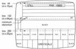
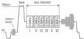
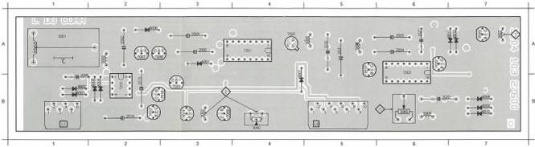
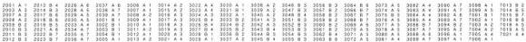
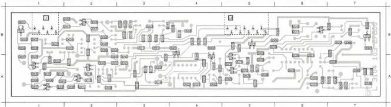

VIDEO DO CORR MODULE L

(MOD LEVEL 0)

2002 A 2 2006 B 1 2020 B 6 2007 A 6 3000 B 4 5003 B 3 5006 A 5 6002 B 1 6005 B 2 6008 B 7 6011 A 7 7006 A 3 7011 B 3 7020 A 4 7024 B 3 7203 A 6
2004 A 3 2015 B 2 2024 A 6 2031 A 5 3000 B 6 5004 B 6 5007 A 7 6003 B 1 6006 A 2 6009 B 7 6012 A 7 7006 B 3 7012 B 2 7022 A 6 7201 A 4
2005 A 3 2016 B 2 2025 A 6 2032 A 5 3002 A 2 5000 A 5 6001 A 5 6004 B 2 5007 A 4 5010 B 7 7007 A 2 7010 B 3 7017 A 5 7023 A 7 7202 B 2

# ADJUSTMENTS

# Required

Scope

Test disc

# Adjustment conditions

Load test disc.

Still picture, picture no. 10800.

# Adjustments

1) R3065, L5007 (Delay 64 µs)

- Picture no. 10800 is visible on the picture screen as shown in fig. L1.

DROP OUT SIGNALS

Fig. L1

MDA:00589
T28/711

- Adjust L5007 until drop-out A gives a white completion of the vertical lines at the right place and drop-out B gives minimum distortion at the place indicated.
- Adjust R3065 until drop-out B is invisible and drop-out C causes a black line without any white stripes or dots.

2) L5003, R3050 (MTF)

- Search for picture no. 1000 (blue).
- Using the scope, measure the CVBS OUT-signal on BNC3 (rear), 75Ω terminated, triggered line frequent.
- Switch SK2 on Analog I/O module U in pos. NOT ENCODED (pressed).
- Adjust L5003 for min. amplitude of the chroma signal.
- Measure the CVBS OUT-signal (NOT ENCODED) on BNC3 with the scope and search the multi-burst signal in the VITS (line 20) by means of the delayed time base (see fig. L2).

VITS SIGNALS LINE 20

Fig. L2

MDA:00589
T28/711

- Adjust R3050 until the amplitude of MBI = MBIV.

# Adjustment when item replaced

replaced

Components in CLOCK GEN.

IC7203

adjust

L5007

R3065, R3050

LIST OF ELECTRICAL PARTS MODULE L

Delay lines

|  5001 | 4822 320 40081 | DL470NS  |
| --- | --- | --- |

Coils

|  5002 | 4822 157 52869 | 34 µH  |
| --- | --- | --- |
|  5003 | 4822 156 11003 | 12 µH  |
|  5004 | 4822 156 11007 | 212 µH  |
|  5005 | 4822 156 11007 | 212 µH  |
|  5006 | 4822 156 21324 | 100 µH  |
|  5007 | 4822 156 10997 | 1.7 µH  |

Potentiometers

|  3050 | 4822 100 11087 | 2.2 kΩ  |
| --- | --- | --- |
|  3065 | 4822 100 20151 | 1 kΩ  |

|  2001 | 4822 122 32082 | 4.7 µF |  | 2023 | 4822 122 31759 | 22 nF |   |
| --- | --- | --- | --- | --- | --- | --- | --- |
|  2002 | 4822 124 22027 | 47 µF | 25 V | 2024 | 4822 124 22031 | 4.7 µF | 63 V  |
|  2003 | 4822 122 31759 | 22 nF |  | 2025 | 4822 124 22028 | 1 µF | 63 V  |
|  2004 | 5322 124 21749 | 10 µF | 63 V | 2026 | 4822 122 31759 | 22 nF |   |
|  2005 | 5322 124 21749 | 10 µF | 63 V | 2027 | 4822 121 41608 | 100 nF | 100 V  |
|  2006 | 4822 121 41608 | 100 nF | 100 V | 2028 | 4822 122 32974 | 100 pF |   |
|  2007 | 4822 122 31759 | 22 nF |  | 2029 | 4822 122 32974 | 100 pF |   |
|  2008 | 4822 122 31759 | 22 nF |  | 2030 | 4822 122 31759 | 22 nF |   |
|  2009 | 4822 122 32975 | 470 pF |  | 2031 | 4822 124 22027 | 47 µF | 25 V  |
|  2010 | 4822 122 32974 | 100 pF |  | 2032 | 4822 121 41785 | 270 nF | 10% 100 V  |
|  2011 | 4822 122 31759 | 22 nF |  | 2033 | 4822 122 31759 | 22 nF |   |
|  2012 | 4822 122 31839 | 82 pF |  | 2034 | 4822 122 32482 | 22 pF |   |
|  2013 | 5322 122 31847 | 1 nF |  | 2035 | 4822 122 31759 | 22 nF |   |
|  2014 | 4822 122 31759 | 22 nF |  | 2036 | 4822 122 31759 | 22 nF |   |
|  2015 | 4822 124 22027 | 47 µF | 25 V | 2037 | 4822 122 31759 | 22 nF |   |
|  2016 | 4822 124 22029 | 2.2 µF | 63 V | 2038 | 4822 122 31839 | 82 pF |   |
|  2017 | 4822 122 32974 | 100 pF |  | 2039 | 4822 122 31759 | 22 nF |   |
|  2018 | 4822 122 32974 | 100 pF |  |  |  |  |   |
|  2019 | 4822 122 31759 | 22 nF |  |  |  |  |   |
|  2020 | 4822 121 41719 | 1 µF | 10% 100 V |  |  |  |   |
|  2021 | 4822 122 32442 | 10 nF |  |  |  |  |   |
|  2022 | 4822 122 32442 | 10 nF |  |  |  |  |   |

CS 7 848