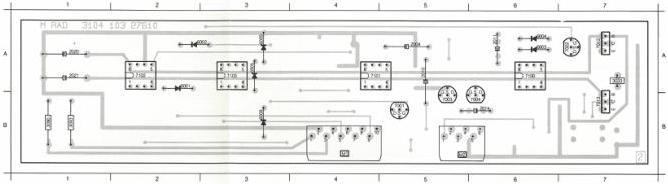
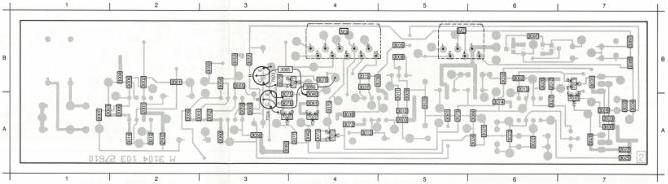

RADIAL MODULE

M

(MOD. LEVEL 1)

2004 A 5 2011 A 6 2020 A 1 3033 A 7 3093 B 1 6002 A 5 6034 A 6 6008 B 3 7001 B 5 7002 A 7 7003 B 5 7004 B 6 7015 A 7
2010 A 5 2014 B 6 2021 A 1 3090 B 1 6001 A 2 6003 A 5 6005 A 3 6009 A 3 7101 A 4 7102 A 2 7103 A 3 7012 A 7 7109 A 6

2001 A 2 2015 B 4 3003 A 1 3008 B 5 3013 A 2 3023 A 6 3024 A 7 3025 A 7 3038 A 4 3054 A 3 3059 A 5 3070 A 4 3075 A 4 3080 A 4 3085 B 3 7010 A 7 7022 A 4
2002 A 2 2022 A 7 3004 B 2 3009 A 5 3014 A 2 3024 A 6 3025 A 7 3034 A 7 3050 B 3 3053 B 3 3060 A 5 3071 A 4 3076 A 4 3081 A 4 3086 B 4 7011 A 7 7023 B 3
2003 A 5 2023 A 7 3005 A 2 3010 A 5 3020 A 5 3025 A 7 3026 A 7 3035 B 5 3051 A 2 3056 A 2 3061 A 5 3072 A 4 3077 A 4 3082 A 4 3087 B 7 7015 A 4 7024 A 3
2012 A 6 3001 B 2 3008 A 2 3011 A 5 3021 A 6 3028 A 6 3031 A 7 3036 B 4 3052 A 3 3057 B 5 3062 B 6 3073 A 5 3078 B 4 3083 A 3 3088 B 7 7020 A 4
2013 B 6 3002 A 2 3007 A 1 3012 A 4 3022 A 6 3027 A 6 3032 B 6 3037 B 4 3053 B 3 3058 A 5 3063 A 5 3074 A 6 3079 B 3 3084 A 6 3097 B 6 7021 A 4

PCB-2/009
102/115

LIST OF ELECTRICAL PARTS MODULE M

PTC Resistors

3033 4822 116 40026 5.6 Ω

NFR Resistors

3090 4822 111 30492 2.2 Ω

3093 4822 111 30492 2.2 Ω

|  2001 | 5322 122 31647 | 1 nF |   |
| --- | --- | --- | --- |
|  2002 | 5322 122 31647 | 1 nF |   |
|  2003 | 4822 122 31768 | 180 pF |   |
|  2004 | 4822 121 50538 | 6.8 nF | 63 V  |
|  2010 | 4822 121 50538 | 6.8 nF | 63 V  |
|  2011 | 4822 121 41874 | 270 nF | 63 V  |
|  2012 | 4822 122 31644 | 2.2 nF |   |
|  2013 | 4822 122 32975 | 33 pF |   |
|  2014 | 4822 121 41876 | 220 nF | 20% 63 V  |
|  2015 | 5322 122 31848 | 33 nF |   |
|  2020 | 4822 124 22027 | 47 μF | 25 V  |
|  2021 | 4822 124 22027 | 47 μF | 25 V  |
|  2022 | 5322 122 31848 | 33 nF |   |
|  2023 | 5322 122 31848 | 33 nF |   |

CS 7 849