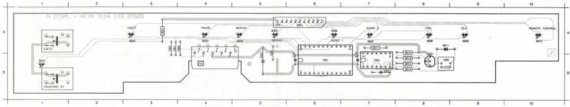
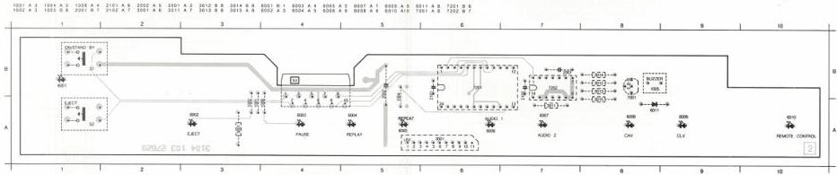

DISPLAY + KEYB. MODULE

N

(MOD. LEVEL 1)

PCB/2020
TOS/F16

LIST OF ELECTRICAL PARTS MODULE N

|  2001 | 4822 121 41608 | 100 nF | 100 V  |
| --- | --- | --- | --- |
|  2002 | 4822 124 22027 | 47 μF | 25 V  |
|  2101 | 4822 122 30103 | 22 nF | 63 V  |
|  2102 | 4822 122 30103 | 22 nF | 63 V  |

Buzzer

|  1005 | 4822 280 10151 | Buzzer SD120901 | 2102 | 4822 122 30103 | 22 nF | 63 V  |
| --- | --- | --- | --- | --- | --- | --- |

LEDs

6001 4822 130 80111 TLSR5101

6002_6010 4822 130 80113 TLSG5101

Resistor networks

3002 4822 116 90249 9x 270 Ω