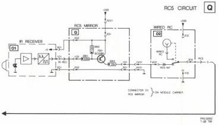
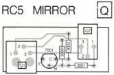
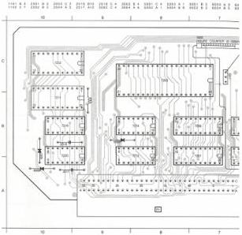
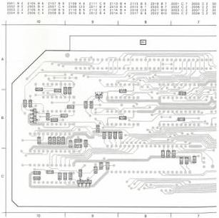

PCB.01036

719

# LIST OF ELECTRICAL PARTS MODULE R

Eproms (programmed)

7204 4822 209 51257 TMS 27128 drive

Crystals

5001 4822 242 71663 12 MHz

Coils

5002 4822 158 10101 5.3 μH

5003 4822 158 10101 5.3 μH

5004 4822 157 51316 120 μH

Hours counter

3065 4822 344 40081 Hours counter

|  2001 | 4822 124 22027 | 47 μF | 25 V  |
| --- | --- | --- | --- |
|  2002 | 4822 124 22027 | 47 μF | 25 V  |
|  2003 | 4822 124 22027 | 47 μF | 25 V  |
|  2004 | 4822 124 22029 | 2.2 μF | 63 V  |
|  2005 | 4822 122 31644 | 2.2 nF |   |
|  2006 | 4822 122 32975 | 33 pF |   |
|  2007 | 4822 122 32975 | 33 pF |   |
|  2008 | 4822 122 31972 | 39 pF |   |
|  2009 | 4822 122 32504 | 15 pF |   |
|  2010 | 4822 122 32482 | 22 pF |   |
|  2011 | 4822 122 31759 | 22 nF |   |
|  2012 | 4822 122 31759 | 22 nF |   |
|  2013 | 4822 122 31759 | 22 nF |   |
|  2014 | 4822 122 31759 | 22 nF |   |
|  2015 | 4822 122 31759 | 22 nF |   |
|  2016 | 5322 121 54072 | 820 pF | 250 V  |
|  2017 | 5322 121 54072 | 820 pF | 250 V  |
|  2018 | 4822 124 22187 | 15 pF | 63 V  |
|  2101 | 4822 122 31759 | 22 nF |   |
|  2102 | 4822 122 31759 | 22 nF |   |
|  2103 | 4822 122 31759 | 22 nF |   |
|  2104 | 4822 122 31759 | 22 nF |   |
|  2105 | 4822 122 31759 | 22 nF |   |
|  2106 | 4822 122 31759 | 22 nF |   |
|  2107 | 4822 122 31759 | 22 nF |   |
|  2108 | 4822 122 31759 | 22 nF |   |
|  2109 | 4822 122 31759 | 22 nF |   |
|  2110 | 4822 122 31759 | 22 nF |   |
|  2111 | 4822 122 31759 | 22 nF |   |
|  2112 | 4822 122 31759 | 22 nF |   |
|  2113 | 4822 122 31759 | 22 nF |   |
|  2114 | 4822 122 31759 | 22 nF |   |
|  2115 | 4822 122 31759 | 22 nF |   |
|  2116 | 4822 122 31759 | 22 nF |   |
|  2117 | 4822 122 31759 | 22 nF |   |
|  2118 | 4822 122 31759 | 22 nF |   |
|  2119 | 4822 122 31759 | 22 nF |   |
|  2120 | 4822 122 31759 | 22 nF |   |
|  2121 | 4822 122 31759 | 22 nF |   |
|  2122 | 4822 122 31759 | 22 nF |   |

CS 7 851