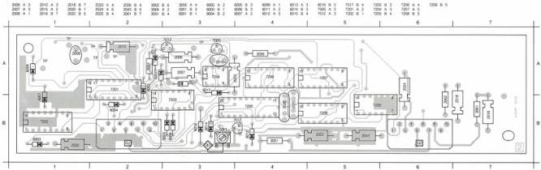
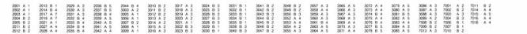
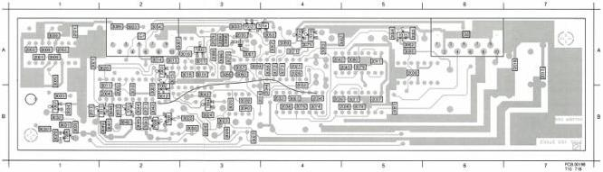

GEN LOCK MODULE

(MOD LEVEL 3)

G

# ADJUSTMENTS

Required

Test disc

Voltmeter

Adjustment conditions

Rotating disc

Adjustments

1) L5001 (VCO)

- Measure the DC voltage on 4G2 and adjust L5001 until this voltage is 0V ± 2V.
Note: In cold state of the set, adjust for + 2V.

Adjustment when item replaced

replaced

IC7205

adjust

L5001

LIST OF ELECTRICAL PARTS MODULE G

|  Coils  |   |   |
| --- | --- | --- |
|  5001 | 4822 156 11004 | 26.5 μH  |

Fuse Resistors

|  3001 | 4822 111 30846 | 6.8 Ω  |
| --- | --- | --- |
|  3002 | 5322 111 90376 | 4.7 Ω  |
|  3004 | 5322 111 90376 | 4.7 Ω  |
|  3051 | 5322 111 90376 | 4.7 Ω  |

NFR25 Resistors

|  3056 | 4822 111 30513 | 15 Ω  |
| --- | --- | --- |

|  2001 | 4822 122 31644 | 2.2 nF |  | 2024 | 5322 124 21643 | 22 μF | 40 V  |
| --- | --- | --- | --- | --- | --- | --- | --- |
|  2002 | 4822 122 32442 | 10 nF |  | 2025 | 4822 121 41608 | 100 nF | 100 V  |
|  2003 | 4822 122 31644 | 2.2 nF |  | 2026 | 4822 121 41608 | 100 nF | 100 V  |
|  2004 | 4822 122 31759 | 22 nF |  | 2027 | 4822 122 32974 | 100 pF |   |
|  2005 | 4822 122 32442 | 10 nF |  | 2028 | 4822 122 32976 | 470 pF |   |
|  2006 | 4822 124 22029 | 2.2 μF | 63 V | 2029 | 4822 122 31759 | 22 nF |   |
|  2007 | 5322 124 21643 | 22 μF | 40 V | 2030 | 4822 122 31771 | 390 pF |   |
|  2008 | 4822 124 21255 | 2.2 μF | 25 V | 2031 | 5322 122 32104 | 33 pF |   |
|  2010 | 5322 124 21976 | 10 μF | 25 V | 2032 | 4822 122 31784 | 4.7 nF |   |
|  2011 | 4822 122 32976 | 470 pF |  | 2033 | 4822 122 32976 | 470 pF |   |
|  2012 | 4822 122 32541 | 27 nF |  | 2059 | 5322 124 14081 | 6.8 μF | 25 V  |
|  2013 | 4822 122 31782 | 15 nF |  | 2060 | 4822 122 31759 | 22 nF |   |
|  2014 | 5322 122 31647 | 1 nF |  | 2061 | 4822 122 31965 | 220 pF |   |
|  2015 | 5322 124 21749 | 10 μF | 63 V | 2062 | 5322 124 21643 | 22 μF | 40 V  |
|  2016 | 4822 124 22027 | 47 μF | 25 V | 2063 | 4822 122 31759 | 22 nF |   |
|  2017 | 4822 122 31759 | 22 nF |  | 2064 | 4822 122 31759 | 22 nF |   |
|  2018 | 5322 124 21643 | 22 μF | 40 V | 2065 | 5322 124 21643 | 22 μF | 40 V  |
|  2019 | 4822 122 31759 | 22 nF |  | 2066 | 4822 122 31759 | 22 nF |   |
|  2020 | 4822 124 22027 | 47 μF | 25 V | 2067 | 4822 122 31774 | 56 pF |   |
|  2021 | 4822 122 31759 | 22 nF |  | 2068 | 4822 122 31759 | 22 nF |   |
|  2022 | 5322 124 21643 | 22 μF | 40 V | 2069 | 4822 122 31072 | 47 pF |   |
|  2023 | 5322 124 21711 | 100 μF | 25 V | 2070 | 4822 124 22231 | 470 μF |   |

CS 7 843