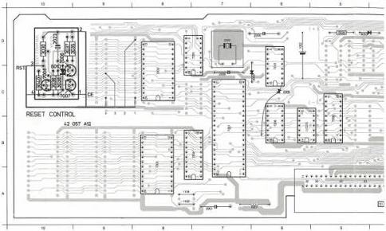
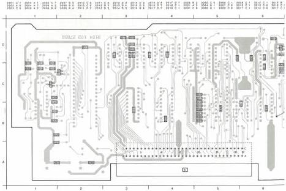

CONTROL MODULE

S

(MOD. LEVEL 3)

LIST OF ELECTRICAL PARTS MODULE 5

|  Eproms (programmed)  |   |   |
| --- | --- | --- |
|  7202 | 4822 209 51256 | TMS 27512_control  |

Batteries

|  1002 | 4822 138 10032 | Battery 2.4 V  |
| --- | --- | --- |

Crystals

|  5101 | 4822 242 70917 | 11.059 MHz  |
| --- | --- | --- |
|  5102 | 4822 242 70668 | 4 MHz  |

Coils

|  5001 | 4822 158 10101 | 5.3 μH  |
| --- | --- | --- |
|  5002 | 4822 158 10101 | 5.3 μH  |
|  5003 | 4822 158 10101 | 5.3 μH  |

NFR25 Resistors

|  3028 | 4822 111 30483 | 1 Ω  |
| --- | --- | --- |

|  2001 | 4822 124 22027 | 47 μF | 25 V  |
| --- | --- | --- | --- |
|  2002 | 5322 124 21749 | 10 μF | 63 V  |
|  2003 | 5322 124 21749 | 10 μF | 63 V  |
|  2004 | 4822 122 31759 | 22 nF |   |
|  2005 | 4822 122 31759 | 22 nF |   |
|  2006 | 4822 122 31759 | 22 nF |   |
|  2007 | 4822 124 22027 | 47 μF | 25 V  |
|  2008 | 4822 124 22029 | 2.2 μF | 63 V  |
|  2009 | 4822 124 22027 | 47 μF | 25 V  |
|  2010 | 4822 122 31759 | 22 nF |   |
|  2011 | 4822 122 31644 | 2.2 nF |   |
|  2012 | 4822 122 31966 | 27 pF |   |
|  2013 | 4822 122 31966 | 27 pF |   |
|  2014 | 4822 122 32976 | 470 pF |   |
|  2015 | 4822 122 32976 | 470 pF |   |
|  2016 | 4822 122 32975 | 33 pF |   |
|  2017 | 4822 122 32975 | 33 pF |   |
|  2018 | 4822 122 33009 | 270 nF | 25 V  |
|  2019 | 4822 122 31644 | 2.2 nF |   |
|  2020 | 4822 122 32482 | 22 pF |   |
|  2021 | 4822 122 32482 | 22 pF |   |
|  2023 | 4822 124 22028 | 1 μF | 63 V  |
|  2101 | 4822 122 31759 | 22 nF |   |
|  2102 | 4822 122 31759 | 22 nF |   |
|  2103 | 4822 122 31759 | 22 nF |   |
|  2104 | 4822 122 31759 | 22 nF |   |
|  2105 | 4822 122 31759 | 22 nF |   |
|  2106 | 4822 122 31759 | 22 nF |   |
|  2107 | 4822 122 31759 | 22 nF |   |
|  2108 | 4822 122 31759 | 22 nF |   |
|  2109 | 4822 122 31759 | 22 nF |   |
|  2110 | 4822 122 31759 | 22 nF |   |
|  2111 | 4822 122 31759 | 22 nF |   |
|  2112 | 4822 122 31759 | 22 nF |   |
|  2113 | 4822 122 31759 | 22 nF |   |
|  2114 | 4822 122 31759 | 22 nF |   |
|  2115 | 4822 122 31759 | 22 nF |   |
|  2116 | 4822 122 31759 | 22 nF |   |
|  2117 | 4822 122 31759 | 22 nF |   |

1002 Q 6 1104 A 8 2001 A 7 2003 A 3 2008 Q 7 2009 Q 7 3001 B 3 3003 C 3 3001 A 7 3003 A 3 3001 Q 1 3003 Q 3 3009 Q 8 7201 B 7 7203 C 8 7205 Q 7 7201
1102 A 8 1104 C 1 2002 A 2 2007 Q 2 2009 C 7 2008 Q 5 3002 B 3 3004 C 3 3002 A 2 3102 A 1 3002 C 6 3004 C 1 7006 D 3 7202 A 8 7204 B 7 7206 B 8 7208

