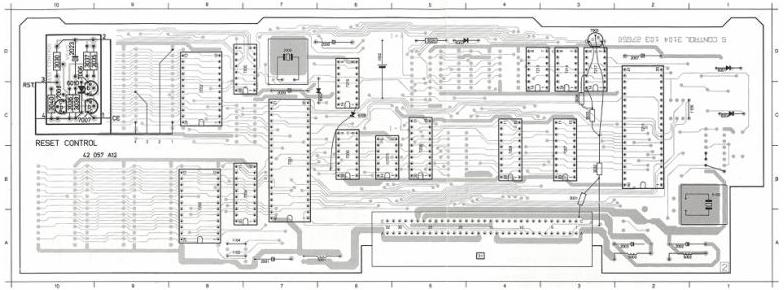
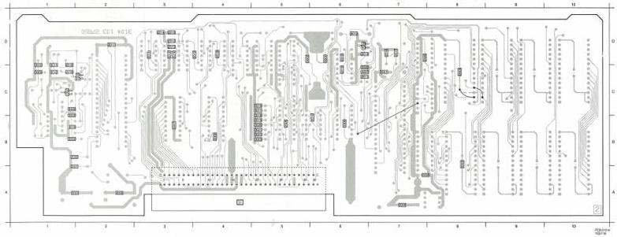

MODULE

S

(MOD. LEVEL 3)

SHEET

27512_control

7.4 V

9 MHz

2

4

4

4

|  47 μF | 25 V  |
| --- | --- |
|  10 μF | 63 V  |
|  10 μF | 63 V  |
|  22 nF |   |
|  22 nF |   |
|  22 nF |   |
|  47 μF | 25 V  |
|  2.2 μF | 63 V  |
|  47 μF | 25 V  |
|  22 nF |   |
|  2.2 nF |   |
|  27 pF |   |
|  27 pF |   |
|  470 pF |   |
|  470 pF |   |
|  33 pF |   |
|  33 pF |   |
|  270 nF | 25 V  |
|  2.2 nF |   |
|  22 pF |   |
|  22 pF |   |
|  1 μF | 63 V  |
|  22 nF |   |
|  22 nF |   |
|  22 nF |   |
|  22 nF |   |
|  22 nF |   |
|  22 nF |   |
|  22 nF |   |
|  22 nF |   |
|  22 nF |   |
|  22 nF |   |
|  22 nF |   |
|  22 nF |   |
|  22 nF |   |
|  22 nF |   |
|  22 nF |   |

1002 D 5 1104 A 8 2001 A 7 2003 A 5 2009 D 7 2009 D 7 3001 B 2 3003 C 3 3001 A 7 3003 A 2 3001 D 1 6002 D 5 6009 C 8 7201 B 7 7203 C 6 7206 D 1 7207 B 3 7209 B 4 7211 C 2 7214 D 3 7217 D 2
1102 A 8 1104 C 1 2002 A 2 2007 D 2 2009 C 7 2009 D 3 3002 B 2 3004 C 3 3002 A 2 3102 B 1 6002 C 6 6004 C 1 7005 D 3 7203 A 8 7204 B 7 7206 B 6 7209 B 5 7210 C 6 7213 D 2 7215 B 5

2001 C 1 2004 A 7 2005 C 1 2007 B 2 2010 C 4 2011 C 6 2012 D 3 2014 D 5 2016 D 4 2017 D 7 2020 B 2 2022 C 4 2028 C 1 2030 C 1 2012 C 1 2014 B 1 2016 B 5 2021 B 4 7002 C 1
2002 C 6 2002 A 7 2002 B 2 2008 B 5 2010 C 2 2012 D 3 2013 C 1 2013 D 2 2014 D 5 2016 D 1 2014 C 1 2017 C 2 2017 D 1 2014 D 6 2018 B 5 2019 B 5 2020 B 4 7002 C 1
2005 C 6 2005 A 2 2008 B 6 2009 D 4 2011 D 2 2012 D 5 2014 D 3 2015 B 6 2017 D 7 2019 C 1 2021 C 6 2020 B 1 2026 C 6 2011 C 1 2014 D 6 2017 C 5 2020 B 5 2023 B 5 7004 D 6

CS 7 852