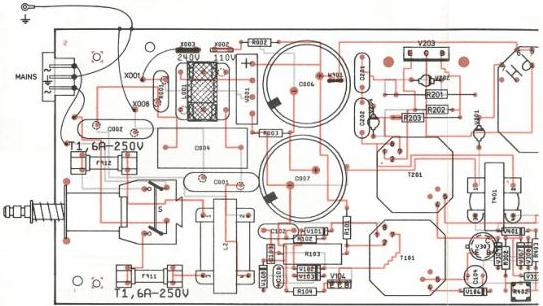

# SUPPLY MODULE

1

(MOD LEVEL 1)

# ADJUSTMENTS

Required

Test disc

Voltmeter

Adjustment conditions

Rotating disc

# Adjustments

1) R503 (DC Voltage)

-Measure the DC voltage on 3T2 (+5)

-Adjust R503 for 5.2V (±0.1V)

# LIST OF ELECTRICAL PARTS MODULE T

Fuses

F911 4822 253 30024 1.6 A

F912 4822 253 30024 1.6 A

F913 4822 253 10048 3.15 A

Circuits

D501 5322 209 82349 Hybride circuit SMPS

Diodes

V001 4822 130 50438 Rectifier KBU8-K

Transformers

T101 5322 146 40322 aux trafo

T201 5322 142 60363 impuls trafo

T401 4822 142 70056 current trafo

T901 5322 146 30531 power trafo

Coils

L001 4822 157 52981 350 µH

L002 4822 158 30208 Mains choke

L701 4822 157 52979 Triple choke

Potentiometers

R402 4822 101 10793 5 kΩ

R503 4822 101 10792 1 kΩ

NTC Resistors

R001 5322 116 40077 7 Ω

PTC Resistors

R801 4822 116 40032 2.3 Ω - 5 Ω

Wire wound Resistors

R201 4822 112 41107 1 kΩ

NFR25 Resistors

R101 4822 111 30544 220 Ω

R202 4822 111 30526 47 Ω

R301 4822 111 30499 4.7 Ω

R701 4822 111 30526 47 Ω

R702 4822 111 30526 47 Ω

R706 4822 111 30526 47 Ω

VR25 Resistors

R901 5322 116 64132 1 MΩ

PR37 Resistors

R703 5322 116 55063 39 Ω

R704 5322 116 54909 1 kΩ

R707 5322 116 54909 1 kΩ

PR52 Resistors

R203 5322 116 51093 15 Ω

VR68 Resistors

R103 5322 116 53075 220 kΩ

C001 4822 122 33042 3.3 nF

C002 4822 122 33042 3.3 nF

C004 5322 121 41721 470 nF 10% 275 V

C006 5322 124 21798 220 µF 10% 200 V

C007 5322 124 21798 220 µF 10% 200 V

C101 4822 124 10367 4.7 µF 25 V

C102 4822 121 40483 10 nF 10% 400 V

C103 4822 122 31125 4.7 nF 100 V

C104 4822 124 40744 68 µF 40 V

C201 5322 121 44286 1 nF 10% 630 V

C202 5322 121 44286 1 nF 10% 630 V

C301 4822 121 40516 22 nF 10% 250 V

C501 5322 121 40308 22 nF 10% 400 V

C502 4822 121 40232 220 nF 10% 100 V

C503 4822 121 40232 220 nF 10% 100 V

C504 4822 122 30103 22 nF 63 V

C506 4822 124 21314 10 µF 16 V

C701 4822 121 40337 4.7 nF 10% 630 V

C702 4822 121 40338 2.2 nF 10% 630 V

C703 4822 124 40723 2.2 mF 16 V

C704 4822 124 40723 2.2 mF 16 V

C706 4822 121 40338 2.2 nF 10% 630 V

C707 4822 124 40723 2.2 mF 16 V

C801 5322 124 14081 6.8 µF 25 V

C802 5322 124 14081 6.8 µF 25 V

CS 7 853