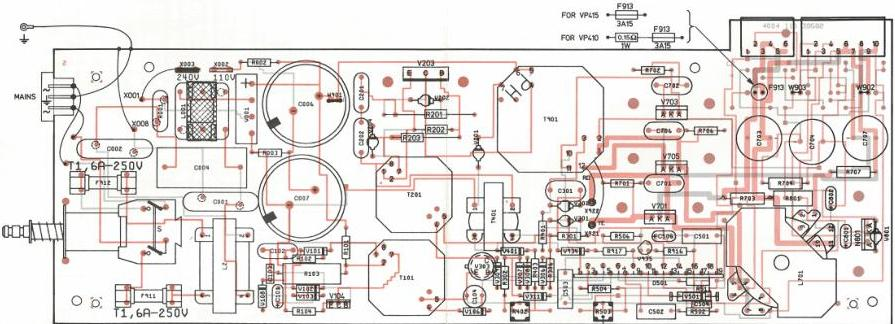

42 025 D12

|  C001 | 4822 122 33042 | 3.3 nF |   |
| --- | --- | --- | --- |
|  C002 | 4822 122 33042 | 3.3 nF |   |
|  C004 | 5322 121 41721 | 470 nF | 10% 275 V  |
|  C006 | 5322 124 21798 | 220 μF | 10% 200 V  |
|  C007 | 5322 124 21798 | 220 μF | 10% 200 V  |
|  C101 | 4822 124 10367 | 4.7 μF | 25 V  |
|  C102 | 4822 121 40483 | 10 nF | 10% 400 V  |
|  C103 | 4822 122 31125 | 4.7 nF | 100 V  |
|  C104 | 4822 124 40744 | 68 μF | 40 V  |
|  C201 | 5322 121 44286 | 1 nF | 10% 630 V  |
|  C202 | 5322 121 44286 | 1 nF | 10% 630 V  |
|  C301 | 4822 121 40516 | 22 nF | 10% 250 V  |
|  C501 | 5322 121 40308 | 22 nF | 10% 400 V  |
|  C502 | 4822 121 40232 | 220 nF | 10% 100 V  |
|  C503 | 4822 121 40232 | 220 nF | 10% 100 V  |
|  C504 | 4822 122 30103 | 22 nF | 63 V  |
|  C506 | 4822 124 21314 | 10 μF | 16 V  |
|  C701 | 4822 121 40337 | 4.7 nF | 10% 630 V  |
|  C702 | 4822 121 40338 | 2.2 nF | 10% 630 V  |
|  C703 | 4822 124 40723 | 2.2 mF | 16 V  |
|  C704 | 4822 124 40723 | 2.2 mF | 16 V  |
|  C706 | 4822 121 40338 | 2.2 nF | 10% 630 V  |
|  C707 | 4822 124 40723 | 2.2 mF | 16 V  |
|  C801 | 5322 124 14081 | 6.8 μF | 25 V  |
|  C802 | 5322 124 14081 | 6.8 μF | 25 V  |