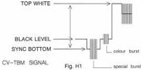
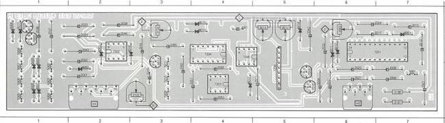
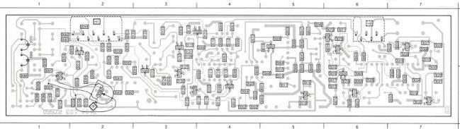

ETBC-B MODULE

H

(MOD. LEVEL 5)

# ADJUSTMENTS

# Required

Test disc

Scope

DC supply

# Adjustment conditions

Load test disc.

Still picture, colour bar (picture no. 6200).

# Adjustments

1) R3012, R3013 (CCD pass-through, limiter freq. sweep)

- Using the scope, measure signal CV-DOC on 2H2 (A channel) and CV-TBC on 2H1 (B channel).
- Short-circuit C2003 (9-IC7206 to ground).
- Display the first lines of the video signal on the scope by means of the DTB.
- Adjust R3012 for a delay of 70 μsec ± 1 μsec between the two signals.
- Remove the short-circuit of C2003.
- Connect with the DC supply a variable voltage to junction R3001, R3002, C2001 (TANG-ER).
- Measure the delay of the CV-DOC and CV-TBC signals as a function of the DC voltage presented:

0V : 46 μsec ± 1.5 μsec

+3V : 70 μsec ± 1 μsec

+6V : 91 μsec ± 1.5 μsec

Correct deviations by adjusting R3013.

2) R3063 (CCD adjust)

- Search for pict. no. 470 (white).
- Measure the CV-TBM signal on p.1-IC7201 with the scope.
- Adjust R3063 for a black level amplitude of 3.2Vpp.
- The CV-TBM signal on 7H1 is shown in fig. H1.

3) R3087 (Video adjust)

- Measure the CVBS OUT-signal on BNC3 (rear) with the scope (75 Ω terminated).
- Press switch SK2 on analog I/O module U (pos. NOT ENCODED).
- Adjust R3087 for a CVBS amplitude (top white-sync bottom) of 1 Vpp.
- Switch SK2 back into the earlier position.

4) R3134 (video time errors)

- Search picture no. 1000 (blue picture) and adjust R3134 for minimum dark bars.
- Search picture no 1800 (yellow picture) and adjust R3134 for minimum red stripes.
- Repeat these two adjustments if necessary.

5) R3122 (audio time errors)

- Switch the player into the normal play mode with sound modulation.
- Measure the AC signal on E-TS7029 and adjust R3122 for minimum AC.

# Adjustment when item replaced

replaced

IC7201

IC7206

adjust

R3063, R3087

R3012, R3013

|  2001 A 4 | 2013 A 7 | 2022 A 2 | 2027 B 6 | 2033 A 2 | 2036 A 2 | 2045 A 3 | 2050 B 3 | 3013 A 5 | 3137 B 7 | 5003 B 1 | 5007 B 1 | 5011 B 3 | 6005 A 1 | 6009 A 1 | 6013 A 3 | 6017 B 4 | 7022 A 1 | 7263 B 4  |
| --- | --- | --- | --- | --- | --- | --- | --- | --- | --- | --- | --- | --- | --- | --- | --- | --- | --- | --- |
|  2006 B 7 | 2015 A 7 | 2023 B 6 | 2028 A 2 | 2034 B 6 | 2040 A 2 | 2043 B 4 | 2042 B 3 | 2062 B 5 | 3138 B 7 | 5004 B 1 | 5008 A 1 | 5001 A 7 | 5006 B 1 | 5010 A 1 | 5014 A 4 | 6016 A 5 | 7021 A 1 | 7264 A 4  |
|  2007 B 7 | 2017 A 7 | 2024 B 1 | 2031 B 6 | 2036 B 1 | 2042 B 2 | 2051 B 4 | 2065 B 4 | 2082 B 4 | 3152 B 3 | 5001 B 1 | 5005 B 1 | 5009 B 3 | 5002 B 2 | 5007 B 1 | 5011 B 3 | 6016 A 4 | 7019 B 3 | 7201 A 7  |
|  2011 B 5 | 2021 B 2 | 2026 B 7 | 2032 A 6 | 2037 A 1 | 2043 A 2 | 2057 B 4 | 2012 A 5 | 3134 A 3 | 5002 B 1 | 5006 B 1 | 5010 B 3 | 5003 A 2 | 5008 A 1 | 5012 A 6 | 6016 A 2 | 7019 B 5 | 7202 A 2 | 7266 B 5  |

|  2002 A 4 | 2016 A 7 | 2046 B 5 | 2060 A 4 | 3001 A 4 | 3010 A 5 | 3025 A 7 | 3045 B 5 | 3060 A 2 | 3070 A 6 | 3078 A 6 | 3087 A 2 | 3101 A 2 | 3112 B 4 | 3121 B 4 | 3131 B 3 | 7017 B 2 | 7028 A 5  |   |
| --- | --- | --- | --- | --- | --- | --- | --- | --- | --- | --- | --- | --- | --- | --- | --- | --- | --- | --- |
|  2003 B 5 | 2018 B 7 | 2047 B 5 | 2061 B 2 | 2063 A 4 | 3011 A 5 | 3030 A 7 | 3047 B 5 | 3061 B 2 | 3071 B 6 | 3080 B 6 | 3086 A 1 | 3102 B 2 | 3113 A 4 | 3123 B 3 | 3132 A 3 | 7018 B 6 | 7030 A 5 |   |
|  2004 B 5 | 2019 B 5 | 2048 B 4 | 2062 B 3 | 2063 A 5 | 3014 B 5 | 3031 A 7 | 3048 B 5 | 3062 A 2 | 3072 A 6 | 3081 A 2 | 3086 A 1 | 3103 A 1 | 3114 A 4 | 3124 A 3 | 3132 B 3 | 7019 A 6 | 7031 B 3 |   |
|  2005 B 5 | 2020 B 4 | 2050 B 4 | 2064 A 3 | 2064 A 4 | 3015 A 5 | 3032 A 7 | 3050 B 2 | 3064 B 6 | 3070 B 6 | 3082 A 2 | 3090 A 1 | 3104 A 2 | 3115 B 3 | 3125 A 3 | 3138 A 1 | 7020 B 6 |  |   |
|  2006 A 5 | 2021 A 7 | 2051 B 4 | 2066 A 2 | 2065 A 4 | 3016 B 7 | 3033 A 7 | 3051 A 2 | 3065 A 6 | 3070 B 6 | 3083 A 2 | 3091 A 1 | 3105 A 2 | 3116 B 3 | 3126 A 3 | 3140 A 1 | 7021 A 6 |  |   |
|  2008 B 7 | 2028 A 6 | 2052 A 4 | 2067 A 1 | 2066 A 5 | 3025 B 7 | 3034 A 7 | 3052 B 2 | 3066 A 7 | 3075 A 6 | 3084 A 2 | 3092 B 1 | 3106 A 4 | 3117 A 4 | 3127 A 3 | 7001 B 5 | 7024 A 1 |  |   |
|  2010 B 7 | 2030 B 2 | 2054 B 4 | 2068 B 5 | 2067 A 5 | 3026 B 7 | 3035 A 7 | 3053 A 2 | 3067 A 6 | 3076 A 6 | 3085 A 1 | 3092 B 1 | 3109 A 4 | 3118 A 4 | 3128 A 3 | 7002 A 5 | 7026 B 4 |  |   |
|  2012 B 4 | 2055 A 2 | 2059 B 4 | 2069 B 1 | 2068 A 4 | 3027 B 1 | 3044 A 5 | 3054 A 1 | 3066 A 6 | 3077 A 6 | 3086 A 1 | 3094 A 5 | 3110 B 4 | 3119 A 4 | 3128 B 3 | 7013 B 7 | 7027 A 4 |  |   |
|  2014 A 5 | 2044 B 2 | 2058 B 4 | 2070 B 1 | 2059 B 5 | 3028 B 7 | 3045 B 5 | 3055 B 2 | 3066 A 6 | 3078 B 6 |  | 3095 B 2 | 3111 A 4 | 3120 B 3 | 3130 A 3 | 7014 A 7 | 7028 A 3 |  |   |

LIST OF ELECTRICAL PARTS MODULE H

Cells

|  5001 | 4822 156 11002 | 7.7 μH  |
| --- | --- | --- |
|  5002 | 4822 156 10998 | 3 μH  |
|  5003 | 4822 156 11001 | 6 μH  |
|  5004 | 4822 156 11001 | 6 μH  |
|  5005 | 4822 156 11001 | 6 μH  |
|  5006 | 4822 156 11001 | 6 μH  |
|  5007 | 4822 156 11001 | 6 μH  |
|  5008 | 4822 156 10998 | 3 μH  |
|  5009 | 4822 156 11004 | 26.5 μH  |
|  5010 | 4822 156 11006 | 54 μH  |
|  5011 | 4822 156 11004 | 26.5 μH  |

Potentiometers

|  3012 | 5322 101 10627 | 10 kΩ  |
| --- | --- | --- |
|  3013 | 5322 101 10628 | 22 kΩ  |
|  3063 | 4822 100 20151 | 1 kΩ  |
|  3087 | 4822 100 10254 | 1 kΩ  |
|  3122 | 5322 101 10628 | 22 kΩ  |
|  3134 | 5322 101 10628 | 22 kΩ  |

Fuse Resistors

|  3137 | 4822 111 10165 | 10Ω  |
| --- | --- | --- |
|  3138 | 4822 111 10165 | 10Ω  |

|  2001 | 4822 121 41874 | 270 nF | 63 V | 2028 | 4822 122 32442 | 10 nF | PCB 3/1/64  |
| --- | --- | --- | --- | --- | --- | --- | --- |
|  2002 | 4822 122 32541 | 27 nF |  | 2029 | 4822 124 22027 | 47 μF | 25 V  |
|  2003 | 4822 122 31916 | 5.6 nF |  | 2030 | 5322 122 31647 | 1 nF |   |
|  2004 | 4822 122 31971 | 10 pF |  | 2031 | 5322 124 21643 | 22 μF | 40 V  |
|  2005 | 4822 122 31758 | 22 nF |  | 2032 | 4822 124 22027 | 47 μF | 25 V  |
|  2006 | 5322 124 21643 | 22 μF | 40 V | 2033 | 4822 124 22027 | 47 μF | 25 V  |
|  2007 | 4822 124 22027 | 47 μF | 25 V | 2034 | 5322 124 21643 | 22 μF | 40 V  |
|  2008 | 4822 122 31758 | 22 nF |  | 2035 | 4822 122 31759 | 22 nF |   |
|  2009 | 4822 122 31767 | 150 pF |  | 2036 | 5322 124 21643 | 22 μF | 40 V  |
|  2010 | 4822 122 31767 | 150 pF |  | 2037 | 4822 124 22027 | 47 μF | 25 V  |
|  2011 | 4822 124 22027 | 47 μF | 25 V | 2038 | 4822 124 22027 | 47 μF | 25 V  |
|  2012 | 5322 122 32839 | 100 nF |  | 2040 | 4822 124 22027 | 47 μF | 25 V  |
|  2013 | 4822 121 41719 | 1 μF | 10% 100 V | 2042 | 4822 124 22027 | 47 μF | 25 V  |
|  2014 | 5322 122 32839 | 100 nF |  | 2043 | 4822 124 22027 | 47 μF | 25 V  |
|  2015 | 5322 124 21749 | 10 μF | 63 V | 2044 | 4822 122 31759 | 22 nF |   |
|  2016 | 4822 122 32442 | 10 nF |  | 2045 | 5322 124 21749 | 10 μF | 63 V  |
|  2017 | 4822 124 22188 | 3.3 μF | 63 V | 2046 | 4822 122 31759 | 22 nF |   |
|  2018 | 4822 122 32442 | 10 nF |  | 2047 | 4822 122 31759 | 22 nF |   |
|  2019 | 5322 122 32839 | 100 nF |  | 2050 | 4822 122 32142 | 270 pF |   |
|  2020 | 5322 122 32839 | 100 nF |  | 2051 | 4822 122 31759 | 22 nF |   |
|  2021 | 5322 124 21643 | 22 μF | 40 V | 2052 | 4822 122 31759 | 22 nF |   |
|  2022 | 5322 124 21643 | 22 μF | 40 V | 2053 | 4822 124 22028 | 1 μF | 63 V  |
|  2023 | 4822 124 22188 | 3.3 μF | 63 V | 2054 | 5322 122 32839 | 130 nF |   |
|  2024 | 5322 124 21749 | 10 μF | 63 V | 2055 | 5322 124 21643 | 22 μF | 40 V  |
|  2025 | 4822 122 32442 | 10 nF |  | 2057 | 4822 122 31759 | 22 nF |   |
|  2026 | 5322 124 21749 | 10 μF | 63 V | 2057 | 5322 124 21643 | 22 μF | 40 V  |
|  2027 | 5322 124 21749 | 10 μF | 63 V | 2058 | 4822 122 31759 | 22 nF |   |

CS 7 844