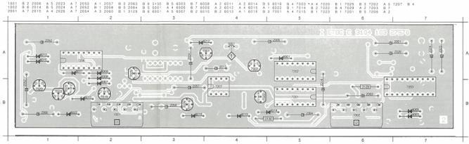
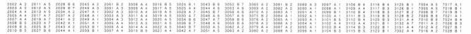
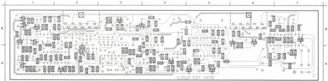
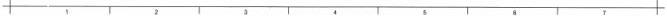

ETBC

C MODULE

1

(MOD LEVEL 6)

# ADJUSTMENTS

Required

Test disc

Scope

Adjustment conditions

Load test disc.

Still picture, colour bar (picture no. 6200).

# Adjustment

1) L5001 (Special burst separator)

- Measure the signal on B-TS7029 with the scope (line- frequent).
- Adjust L5001 for maximum amplitude of the special burst signal.

LIST OF ELECTRICAL PARTS MODULE I

Coils

5001 4822 156 11003 12 μH

NFR25 Resistors

3129 4822 111 30513 15 Ω

3130 4822 111 30513 15 Ω

2001
2002
2003
2004
2005
2006
2007
2008
2009
2010
2011
2012
2013
2014
2015
2017
2019
2020
2023
2024
2025
2026

|  5322 124 21643 | 22 μF | 40 V  |
| --- | --- | --- |
|  4822 122 31759 | 22 nF |   |
|  4822 122 32974 | 100 pF |   |
|  4822 122 31783 | 2.7 nF |   |
|  4822 122 31767 | 150 pF |   |
|  5322 124 21643 | 22 μF | 40 V  |
|  4822 122 31759 | 22 nF |   |
|  4822 122 31759 | 22 nF |   |
|  4822 122 31969 | 3.3 nF |   |
|  4822 122 31969 | 3.3 nF |   |
|  4822 122 31759 | 22 nF |   |
|  4822 122 31781 | 1.5 nF |   |
|  4822 122 31781 | 1.5 nF |   |
|  4822 124 22027 | 47 μF | 25 V  |
|  4822 121 41608 | 100 nF | 100 V  |
|  4822 122 31783 | 2.7 nF |   |
|  4822 122 32976 | 470 pF |   |
|  4822 122 32974 | 100 pF |   |
|  4822 121 41545 | 33 nF | 250 V  |
|  4822 121 41874 | 270 nF | 63 V  |
|  4822 122 31774 | 56 pF |   |
|  5322 124 21643 | 22 μF | 40 V  |

|  2027 | 4822 122 32504 | 15 pF  |
| --- | --- | --- |
|  2028 | 4822 122 31774 | 56 pF  |
|  2029 | 4822 122 31784 | 4.7 nF  |
|  2034 | 4822 122 31759 | 22 nF  |
|  2037 | 5322 122 31647 | 1 nF  |
|  2041 | 4822 122 31759 | 22 nF  |
|  2042 | 4822 122 31775 | 680 pF  |
|  2043 | 4822 122 32482 | 22 pF  |
|  2044 | 4822 122 31772 | 47 pF  |
|  2045 | 4822 122 32542 | 47 nF  |
|  2046 | 4822 122 31774 | 56 pF  |
|  2048 | 4822 122 32142 | 270 pF  |
|  2049 | 5322 122 31647 | 1 nF  |
|  2050 | 4822 124 22031 | 4.7 μF  |
|  2051 | 4822 122 31759 | 22 nF  |
|  2052 | 4822 121 51051 | 4.7 nF  |
|  2053 | 4822 122 32891 | 68 nF  |
|  2054 | 4822 124 22031 | 4.7 μF  |
|  2057 | 4822 124 22031 | 4.7 μF  |
|  2058 | 4822 121 41757 | 470 nF10%  |
|  2059 | 4822 121 42915 | 330 pF  |
|  2060 | 5322 124 21643 | 22 μF  |

|  2061 | 4822 122 32153 | 1.8 nF  |
| --- | --- | --- |
|  2063 | 5322 124 21711 | 100 μF  |
|  2064 | 5322 124 21711 | 100 μF  |

CS 7.845