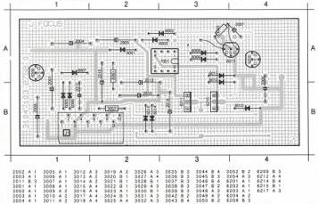
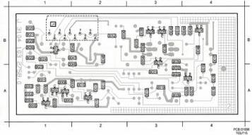

FOCUS MODULE

J

(MOD. LEVEL 2)

|  2001 A 1 | 2007 A 1 | 2014 B 2 | 3007 B 2 | 3003 A 3 | 6009 A 3 | 6012 B 4 | 6203 A 4 | 7001 A 3  |
| --- | --- | --- | --- | --- | --- | --- | --- | --- |
|  2004 A 1 | 2008 B 1 | 2015 B 2 | 3000 B 2 | 6005 B 1 | 6009 A 3 | 6013 A 3 | 6206 A 3 |   |
|  2005 A 2 | 2012 B 1 | 2016 A 2 | 6001 A 2 | 6006 B 1 | 6010 A 3 | 6014 B 2 | 6210 B 3 |   |
|  2006 A 4 | 2013 A 2 | 3033 A 3 | 6002 A 3 | 6007 A 1 | 6011 A 4 | 6015 B 2 | 6211 B 3 |   |

LIST OF ELECTRICAL PARTS MODULE J

NFR25 Resistors

3057 4822 111 30492 2.2 Ω

3060 4822 111 30492 2.2 Ω

|  2001 | 4822 122 33011 | 470 nF | 16 V  |
| --- | --- | --- | --- |
|  2002 | 4822 122 32442 | 10 nF |   |
|  2003 | 4822 122 31783 | 2.7 nF |   |
|  2004 | 5322 124 21643 | 22 μF | 40 V  |
|  2005 | 5322 124 21643 | 22 μF | 40 V  |
|  2006 | 4822 121 42527 | 180 nF | 63 V  |
|  2007 | 4822 124 21314 | 10 μF | 10 V  |
|  2008 | 4822 121 50841 | 2.2 nF | 160 V  |
|  2011 | 4822 122 32442 | 10 nF |   |
|  2012 | 4822 121 41876 | 220 nF | 20% 63 V  |
|  2013 | 4822 124 22031 | 4.7 μF | 63 V  |
|  2014 | 4822 124 22188 | 3.3 μF | 63 V  |
|  2015 | 4822 124 22027 | 47 μF | 25 V  |
|  2016 | 4822 124 22027 | 47 μF | 25 V  |

CS 7 846