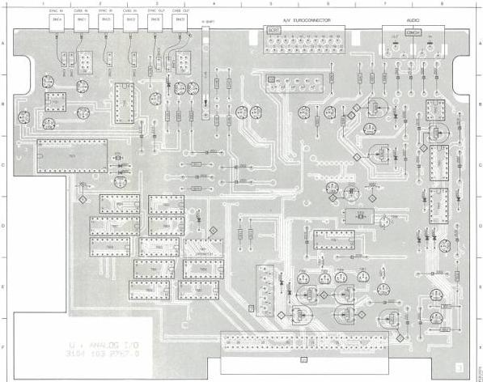

5) L5601 (Eye-height restorer)

- Measure the AC signal on pin 12-IC7551 (+MP4). Use a FET probe 1:10 or a probe with a capacitance < 3 pF
- Adjust L5601 for maximum amplitude of the AC signal.

6) S601 (Delay control)

- Switch S601 to be adjusted for a delay of approx 130 nsec, that means pins 1-16 of S601 interconnected (LSB bit P0=1), see diagram Uc.

7) R3530 (Beep amplitude)

- Interconnect pins 12 and 14 of IC 7553.
- Measure the BEEP signal on cinch output AUD-1OUT and adjust R3530 until the beep signal is 300 mVpp ± 50 mV.

Adjustment when item replaced:

|  replaced | adjust  |
| --- | --- |
|  IC7351 | R3305,R3315  |
|  RGB module | R3305,R3315  |

|  2001 | 4822 124 22027 | 47 μF | 25 V  |
| --- | --- | --- | --- |
|  2002 | 4822 124 22027 | 47 μF | 25 V  |
|  2003 | 4822 124 22027 | 47 μF | 25 V  |
|  2005 | 4822 124 22027 | 47 μF | 25 V  |
|  2006 | 4822 122 31965 | 220 pF |   |
|  2007 | 4822 122 32975 | 33 pF |   |
|  2101 | 4822 122 33011 | 470 nF | 16 V  |
|  2102 | 4822 122 31759 | 22 nF |   |
|  2103 | 4822 122 31767 | 150 pF |   |
|  2104 | 4822 122 31759 | 22 nF |   |
|  2105 | 4822 122 33011 | 470 nF | 16 V  |
|  2106 | 4822 122 31759 | 22 nF |   |
|  2107 | 4822 122 31767 | 150 pF |   |
|  2108 | 4822 122 31759 | 22 nF |   |
|  2109 | 4822 122 31759 | 22 nF |   |
|  2110 | 4822 124 22027 | 47 μF | 25 V  |
|  2111 | 4822 124 22027 | 47 μF | 25 V  |
|  2112 | 4822 122 33011 | 470 nF | 16 V  |
|  2113 | 4822 122 33011 | 470 nF | 16 V  |
|  2114 | 4822 122 33007 | 330 nF | 25 V  |
|  2201 | 4822 124 22029 | 2.2 μF | 63 V  |
|  2202 | 4822 124 22027 | 47 μF | 25 V  |
|  2203 | 5322 124 21749 | 10 μF | 63 V  |
|  2204 | 4822 122 33011 | 470 nF | 16 V  |
|  2205 | 4822 122 31759 | 22 nF |   |
|  2206 | 4822 122 31839 | 82 pF |   |
|  2207 | 4822 124 22027 | 47 μF | 25 V  |
|  2208 | 4822 124 22027 | 47 μF | 25 V  |
|  2301 | 4822 122 33011 | 470 nF | 16 V  |
|  2302 | 4822 122 33011 | 470 nF | 16 V  |
|  2304 | 4822 122 33011 | 470 nF | 16 V  |
|  2305 | 4822 122 33011 | 470 nF | 16 V  |
|  2307 | 4822 122 32975 | 33 pF |   |
|  2308 | 4822 122 31759 | 22 nF |   |
|  2309 | 4822 122 31767 | 150 pF |   |
|  2310 | 4822 122 31767 | 150 pF |   |
|  2311 | 4822 122 31759 | 22 nF |   |
|  2312 | 4822 122 31839 | 82 pF |   |
|  2313 | 4822 124 22027 | 47 μF | 25 V  |
|  2314 | 5322 122 31848 | 33 nF |   |
|  2315 | 4822 125 50062 | 10 pF | trimmer  |
|  2316 | 4822 122 32482 | 22 pF |   |
|  2318 | 4822 124 22027 | 47 μF | 25 V  |

2319
2323
2324
2325
2501
2502
2503
2504
2505
2506
2507
2508
2509
2510
2511
2512

|  2001 | C | 4 | 2211 | A | 7 | 2315 | C | 4 | 2500 | A | 8 | 2601 | C | 4 | 3315 | C | 4 | 3146 | A | 4 | 3250 | C | 4 | 2204 | A | 8 | 5221 | C | 1 | 5001 | B | 3 | 6201 | C | 8 | 6600 | C | 4 | 7103 | A | 3 | 7151 | B | 1 | 7215 | B | 8 | 7300 | C | 4 | 7600 | C | 2 | 7938 | A | 4 | 8401 |   |
| --- | --- | --- | --- | --- | --- | --- | --- | --- | --- | --- | --- | --- | --- | --- | --- | --- | --- | --- | --- | --- | --- | --- | --- | --- | --- | --- | --- | --- | --- | --- | --- | --- | --- | --- | --- | --- | --- | --- | --- | --- | --- | --- | --- | --- | --- | --- | --- | --- | --- | --- | --- | --- | --- | --- | --- | --- | --- | --- |
|  2002 | C | 4 | 2314 | C | 4 | 2319 | C | 4 | 2310 | A | 1 | 2302 | C | 4 | 2311 | C | 4 | 2148 | B | 4 | 3247 | B | 4 | 2304 | C | 4 | 2302 | C | 4 | 2301 | C | 4 | 2312 | C | 4 | 2302 | C | 4 | 2301 | C | 4 | 2301 | C | 4 | 2301 | C | 4 | 2301 | C | 4 | 2301 | C | 4 | 2301 | C | 4 | 2301 | C  |
|  2003 | C | 4 | 2224 | C | 4 | 2321 | C | 4 | 2314 | B | 3 | 2324 | C | 4 | 2313 | C | 4 | 2114 | B | 4 | 3248 | B | 4 | 2314 | C | 4 | 2314 | B | 4 | 2314 | C | 4 | 2312 | C | 4 | 2312 | C | 4 | 2312 | C | 4 | 2312 | C | 4 | 2312 | C | 4 | 2312 | C | 4 | 2312 | C | 4 | 2312 | C | 4 | 2312  |   |
|  2004 | C | 4 | 2224 | C | 4 | 2321 | C | 4 | 2314 | B | 3 | 2324 | C | 4 | 2313 | C | 4 | 2114 | B | 4 | 3248 | B | 4 | 2314 | C | 4 | 2314 | B | 4 | 2314 | C | 4 | 2312 | C | 4 | 2312 | C | 4 | 2312 | C | 4 | 2312 | C | 4 | 2312 | C | 4 | 2312 | C | 4 | 2312 | C | 4 | 2312 | C | 4 | 2312  |   |
|  2005 | C | 4 | 2224 | C | 4 | 2321 | C | 4 | 2314 | B | 3 | 2324 | C | 4 | 2313 | C | 4 | 2114 | B | 4 | 3248 | B | 4 | 2314 | C | 4 | 2314 | B | 4 | 2314 | C | 4 | 2312 | C | 4 | 2312 | C | 4 | 2312 | C | 4 | 2312 | C | 4 | 2312 | C | 4 | 2312 | C | 4 | 2312 | C | 4 | 2312 | C | 4 | 2312  |   |
|  2006 | C | 4 | 2224 | C | 4 | 2321 | C | 4 | 2314 | B | 3 | 2324 | C | 4 | 2313 | C | 4 | 2114 | B | 4 | 3248 | B | 4 | 2314 | C | 4 | 2314 | B | 4 | 2314 | C | 4 | 2312 | C | 4 | 2312 | C | 4 | 2312 | C | 4 | 2312 | C | 4 | 2312 | C | 4 | 2312 | C | 4 | 2312 | C | 4 | 2312 | C | 4 | 2312  |   |

|  5322 122 31848 | 33 nF |  | 2513 | 5322 122 32839 | 100 nF |  | 2613 | 4822 122 31773 | 560 pF  |
| --- | --- | --- | --- | --- | --- | --- | --- | --- | --- |
|  5322 122 31848 | 33 nF |  | 2514 | 4822 124 22027 | 47 μF | 25 V | 2614 | 4822 122 32975 | 470 pF  |
|  4822 122 32442 | 10 nF |  | 2515 | 4822 124 22027 | 47 μF | 25 V | 2615 | 4822 122 32442 | 10 nF  |
|  4822 122 31759 | 22 nF |  | 2516 | 4822 124 22027 | 47 μF | 25 V | 2616 | 5322 122 31848 | 33 nF  |
|  4822 124 22028 | 1 μF | 63 V | 2601 | 4822 122 33011 | 470 nF | 16 V | 2617 | 5322 122 31848 | 33 nF  |
|  4822 124 22028 | 1 μF | 63 V | 2602 | 4822 122 32891 | 68 nF |  | 2618 | 5322 122 31848 | 33 nF  |
|  4822 124 22028 | 1 μF | 63 V | 2603 | 4822 122 31966 | 27 pF |  | 2619 | 5322 122 31848 | 33 nF  |
|  4822 124 22028 | 1 μF | 63 V | 2604 | 4822 122 31759 | 22 nF |  | 2620 | 5322 122 31848 | 33 nF  |
|  4822 122 31969 | 3.3 nF |  | 2605 | 4822 124 22187 | 15 μF | 63 V | 2621 | 5322 122 31848 | 33 nF  |
|  4822 122 31969 | 3.3 nF |  | 2606 | 4822 122 32442 | 10 nF |  | 2622 | 5322 122 31848 | 33 nF  |
|  4822 122 32975 | 33 pF |  | 2607 | 4822 122 32504 | 15 pF |  | 2623 | 5322 122 31848 | 33 nF  |
|  4822 122 32975 | 33 pF |  | 2608 | 5322 122 31647 | 1 nF |  | 2624 | 5322 122 31848 | 33 nF  |
|  4822 124 22188 | 3.3 μF | 63 V | 2609 | 4822 122 32975 | 33 pF |  | 2625 | 5322 122 31848 | 33 nF  |
|  4822 124 22188 | 3.3 μF | 63 V | 2610 | 4822 122 31759 | 22 nF |  | 2627 | 4822 122 32504 | 15 pF  |
|  4822 122 33009 | 270 nF | 25 V | 2611 | 4822 122 32142 | 270 pF |  |  |  |   |
|  5322 122 32839 | 100 nF |  | 2612 | 4822 122 32974 | 100 pF |  |  |  |   |

CS 7 856