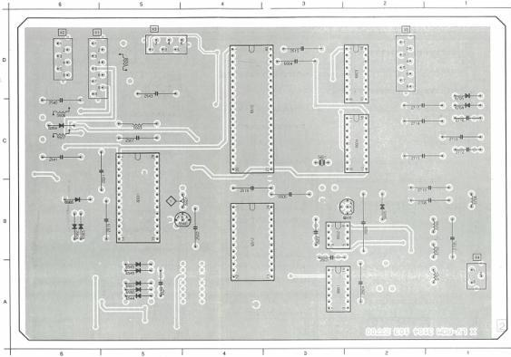
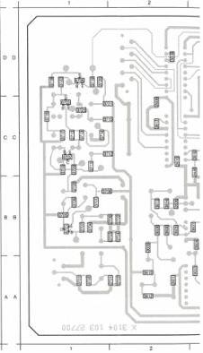

LV ROM DEC MODULE

(MOD. LEVEL 3)

|  2501 | B | 5 | 2515 | B | 5 | 2541 | C | 6 | 2604 | A | 2 | 2710 | B | 2 | 2710 | C | 1 | 5583 | C | 6 | 5587 | C | 6 | 5782 | A | 1 | 6510 | C | 4 | 6545 | A | 5 | 5583 | B | 6 | 6601 | A | 5 | 9505 | B | 2  |
| --- | --- | --- | --- | --- | --- | --- | --- | --- | --- | --- | --- | --- | --- | --- | --- | --- | --- | --- | --- | --- | --- | --- | --- | --- | --- | --- | --- | --- | --- | --- | --- | --- | --- | --- | --- | --- | --- | --- | --- | --- | --- |
|  2502 | B | 4 | 2519 | B | 4 | 2543 | C | 5 | 2605 | B | 2 | 2711 | C | 2 | 2710 | C | 1 | 5584 | D | 5 | 5588 | D | 5 | 5759 | B | 1 | 6510 | B | 4 | 6545 | A | 5 | 6583 | B | 6 | 6602 | B | 2 | 6609 | B | 2  |
|  2503 | C | 5 | 2527 | A | 5 | 2608 | B | 3 | 2705 | B | 2 | 2702 | C | 1 | 2711 | C | 2 | 5585 | B | 3 | 5601 | C | 3 | 5784 | B | 1 | 6540 | B | 5 | 6551 | A | 5 | 6565 | C | 3 | 6603 | D | 2 | 6704 | C | 1  |
|  2510 | D | 3 | 2545 | C | 6 | 2603 | A | 3 | 2708 | B | 2 | 2714 | C | 2 | 6601 | B | 4 | 5586 | C | 6 | 5701 | A | 1 | 6581 | B | 5 | 6544 | A | 5 | 6551 | A | 5 | 6565 | B | 6 | 6604 | C | 2 | 6705 | C | 1  |

|  2503 | B | 5 | 2525 | A | 5 | 2545 | B | 6 | 2701 | A | 2 | 3602 | B | 5 | 3510 | B | 4 | 3  |
| --- | --- | --- | --- | --- | --- | --- | --- | --- | --- | --- | --- | --- | --- | --- | --- | --- | --- | --- |
|  2505 | B | 5 | 2521 | A | 5 | 2546 | B | 6 | 2702 | A | 2 | 3603 | B | 5 | 3511 | B | 4 | 3  |
|  2506 | B | 4 | 2523 | A | 5 | 2601 | A | 2 | 2702 | B | 2 | 3604 | B | 5 | 3512 | B | 4 | 3  |
|  2508 | B | 5 | 2523 | A | 5 | 2608 | B | 2 | 2704 | B | 2 | 3605 | B | 5 | 3514 | D | 4 | 3  |
|  2509 | B | 5 | 2525 | A | 5 | 2607 | B | 2 | 2706 | B | 2 | 3606 | B | 5 | 3515 | B | 4 | 3  |
|  2511 | C | 5 | 2538 | B | 5 | 2608 | B | 3 | 2707 | B | 1 | 3607 | B | 4 | 3516 | B | 3 | 3  |
|  2512 | A | 5 | 2538 | D | 2 | 2609 | C | 2 | 2709 | B | 1 | 3608 | B | 4 | 3520 | A | 3 | 3  |
|  2514 | B | 5 | 2542 | C | 6 | 2610 | C | 2 | 2713 | C | 1 | 3609 | B | 5 | 3521 | A | 3 | 3  |

# ADJUSTMENTS

# Required

Frequency counter

# Adjustment conditions

Stand-by position of the set

# Adjustments

1) L5501 (Demod. freq.)

- Short-circuit pin 6-IC6501 to ground.
- Measure with the frequency counter on 22-IC6501 (clock)
- Adjust L5501 for a frequency of 4.32 MHz ± 1 kHz. (the voltage on junction R3510/R3511 should than be 5 V ± 0.1 V).
- Remove the short circuit of pin 6.

LIST OF ELECTRICAL PARTS MODULE X

Crystals

|  5601 | 4822 242 71461 | 4.2336 MHz  |
| --- | --- | --- |

Coils

|  5501 | 4822 156 21155 | 7.95 μH  |
| --- | --- | --- |
|  5503 | 4822 156 20966 | 47 μH  |
|  5504 | 4822 156 20966 | 47 μH  |
|  5505 | 4822 156 20966 | 47 μH  |
|  5506 | 4822 158 10101 | 5.3 μH  |
|  5507 | 4822 158 10101 | 5.3 μH  |
|  5508 | 4822 158 10101 | 5.3 μH  |
|  5701 | 4822 156 21026 | 34 μH  |
|  5702 | 4822 156 11005 | 42.5 μH  |
|  5703 | 4822 156 11005 | 42.5 μH  |
|  5704 | 4822 156 21113 | 52 μH  |

NPR25 Resistors

|  3549 | 4822 111 30492 | 2.2 Ω  |
| --- | --- | --- |

|  2501 | 4822 121 51099 | 22 nF | 63 V | 2542 | 4822 122 31759 | 22 nF |  | 2709  |
| --- | --- | --- | --- | --- | --- | --- | --- | --- |
|  2502 | 4822 121 51099 | 22 nF | 63 V | 2543 | 5322 124 21643 | 22 μF | 40 V | 2710  |
|  2505 | 4822 122 31644 | 2.2 nF |  | 2545 | 4822 122 31759 | 22 nF |  | 2711  |
|  2506 | 4822 122 31644 | 2.2 nF |  | 2546 | 4822 122 31759 | 22 nF |  | 2712  |
|  2507 | 5322 124 21643 | 22 μF | 40 V | 2601 | 4822 122 31759 | 22 nF |  | 2713  |
|  2508 | 4822 122 31974 | 820 pF |  | 2602 | 4822 121 41608 | 100 nF | 100 V | 2714  |
|  2511 | 4822 122 31759 | 22 nF |  | 2603 | 4822 121 41608 | 100 nF | 100 V | 2715  |
|  2512 | 4822 122 31759 | 22 nF |  | 2604 | 5322 124 21643 | 22 μF | 40 V | 2716  |
|  2513 | 5322 124 21643 | 22 μF | 40 V | 2605 | 4822 121 41936 | 2.2 μF | 10% 100 V | 2717  |
|  2514 | 4822 122 31759 | 22 nF |  | 2606 | 4822 122 31759 | 22 nF |  |   |
|  2515 | 4822 124 22028 | 1 μF | 63 V | 2607 | 4822 122 31965 | 220 pF |  |   |
|  2519 | 5322 124 21643 | 22 μF | 40 V | 2608 | 4822 122 33002 | 68 pF |  |   |
|  2520 | 4822 122 32976 | 470 pF |  | 2609 | 4822 122 31759 | 22 nF |  |   |
|  2521 | 4822 122 32976 | 470 pF |  | 2610 | 4822 122 31759 | 22 nF |  |   |
|  2522 | 4822 122 32442 | 10 nF |  | 2701 | 4822 121 42915 | 330 pF |  |   |
|  2523 | 4822 122 31759 | 22 nF |  | 2702 | 4822 122 31974 | 820 pF |  |   |
|  2525 | 4822 122 31644 | 2.2 nF |  | 2703 | 4822 122 31974 | 820 pF |  |   |
|  2527 | 4822 121 41608 | 100 nF | 100 V | 2704 | 4822 122 33002 | 68 pF |  |   |
|  2538 | 4822 122 31759 | 22 nF |  | 2705 | 4822 121 50632 | 1.5 nF | 250 V |   |
|  2539 | 4822 122 31759 | 22 nF |  | 2706 | 4822 122 31768 | 160 pF |  |   |
|  2540 | 5322 124 21643 | 22 μF | 40 V | 2707 | 4822 122 32442 | 10 nF |  |   |
|  2541 | 5322 124 21643 | 22 μF | 40 V | 2708 | 5322 124 21643 | 22 μF | 40 V |   |

|  4822 122 32482 | 22 pF |   |
| --- | --- | --- |
|  5322 124 21643 | 22 μF | 40 V  |
|  5322 124 21643 | 22 μF | 40 V  |
|  4822 121 41608 | 100 nF | 100 V  |
|  4822 122 31974 | 820 pF |   |
|  5322 124 21643 | 22 μF | 40 V  |
|  5322 124 21643 | 22 μF | 40 V  |
|  4822 121 41608 | 100 nF | 100 V  |
|  5322 124 21643 | 22 μF | 40 V  |

CS 7 859