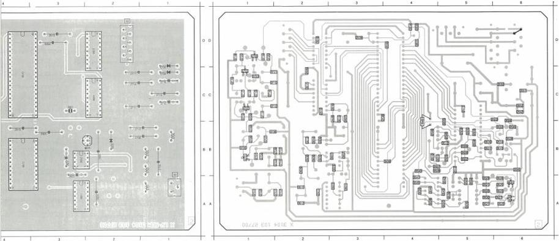

5597 C 6 5702 A 1 8510 C 4 8545 A 5 8562 B 6 8601 A 3 8605 B 2
5598 D 5 5703 B 1 8512 B 4 8546 A 5 8551 B 6 8602 B 2 8608 B 2
5601 C 3 5704 B 5 8549 B 5 8550 A 5 8551 C 6 8602 C 2 8704 C 1
5701 A 1 8501 B 5 8544 A 5 8551 A 5 8583 B 6 8601 C 2 8705 C 1

2583 B 5 2520 A 5 2545 B 6 2761 A 2 3550 B 5 3515 B 4 3523 A 6 3533 D 4 3541 A 4 3552 C 6 3607 B 3 3616 C 3 3706 B 1 3714 C 1 3722 D 1 6702 C 1
2585 B 5 2521 A 5 2546 B 6 2762 A 2 3550 B 5 3511 B 4 3525 A 6 3534 A 5 3542 A 5 3555 D 4 3608 B 2 3617 C 2 3707 B 1 3715 C 2 3725 C 1 6703 C 1
2588 B 4 2522 B 5 2561 A 2 3750 B 5 3504 B 5 3512 B 6 3527 A 6 3535 A 5 3542 A 5 3601 A 3 3609 A 2 3618 D 2 3706 B 1 3716 C 1 3831 D 4 6706 D 1
2589 B 3 2523 A 5 2606 B 2 2764 B 2 3555 B 5 3514 D 4 3528 B 6 3536 A 5 3544 A 4 3602 B 3 3610 A 2 3701 A 1 3709 B 1 3717 C 1 3835 B 6
2589 B 5 2525 A 5 2601 B 5 2765 B 2 3556 B 4 3515 B 6 3529 A 6 3537 A 5 3545 A 4 3603 A 3 3612 A 2 3702 C 1 3710 B 1 3718 D 1 3838 B 4
2611 C 5 2538 B 5 2666 B 2 2767 B 1 3557 B 4 3516 B 5 3535 A 5 3538 A 4 3549 B 4 3604 B 3 3613 B 2 3702 B 2 3711 B 1 3716 D 1 6530 A 6
2612 A 5 2538 D 3 2669 C 2 2769 B 1 3566 B 4 3520 A 6 3531 B 5 3538 A 4 3550 C 6 3605 B 2 3614 B 2 3704 B 1 3712 C 2 3720 D 1 6531 A 6
2614 B 6 2542 C 5 2610 C 2 2713 C 1 3509 B 5 3521 A 5 3532 B 6 3546 B 4 3551 C 6 3606 B 2 3615 B 3 3705 B 1 3713 C 1 3721 C 2 6701 B 1

PCB (H2O)
105/16

|  2542 | 4822 122 31759 | 22 nF |  | 2709 | 4822 122 32482 | 22 μF |   |
| --- | --- | --- | --- | --- | --- | --- | --- |
|  2543 | 5322 124 21643 | 22 μF | 40 V | 2710 | 5322 124 21643 | 22 μF | 40 V  |
|  2545 | 4822 122 31759 | 22 nF |  | 2711 | 5322 124 21643 | 22 μF | 40 V  |
|  2546 | 4822 122 31759 | 22 nF |  | 2712 | 4822 121 41608 | 100 nF | 100 V  |
|  2601 | 4822 122 31759 | 22 nF |  | 2713 | 4822 122 31974 | 820 pF |   |
|  2602 | 4822 121 41608 | 100 nF | 100 V | 2714 | 5322 124 21643 | 22 μF | 40 V  |
|  2603 | 4822 121 41608 | 100 nF | 100 V | 2715 | 5322 124 21643 | 22 μF | 40 V  |
|  2604 | 5322 124 21643 | 22 μF | 40 V | 2716 | 4822 121 41608 | 100 nF | 100 V  |
|  2605 | 4822 121 41936 | 2.2 μF | 10% 100 V | 2717 | 5322 124 21643 | 22 μF | 40 V  |
|  2606 | 4822 122 31759 | 22 nF |  |  |  |  |   |
|  2607 | 4822 122 31965 | 220 pF |  |  |  |  |   |
|  2608 | 4822 122 33002 | 68 pF |  |  |  |  |   |
|  2609 | 4822 122 31759 | 22 nF |  |  |  |  |   |
|  2610 | 4822 122 31759 | 22 nF |  |  |  |  |   |
|  2701 | 4822 121 42915 | 330 pF |  |  |  |  |   |
|  2702 | 4822 122 31974 | 820 pF |  |  |  |  |   |
|  2703 | 4822 122 31974 | 820 pF |  |  |  |  |   |
|  2704 | 4822 122 33002 | 68 pF |  |  |  |  |   |
|  2705 | 4822 121 50632 | 1.5 nF | 250 V |  |  |  |   |
|  2706 | 4822 122 31788 | 180 pF |  |  |  |  |   |
|  2707 | 4822 122 32442 | 10 nF |  |  |  |  |   |
|  2708 | 5322 124 21643 | 22 μF | 40 V |  |  |  |   |