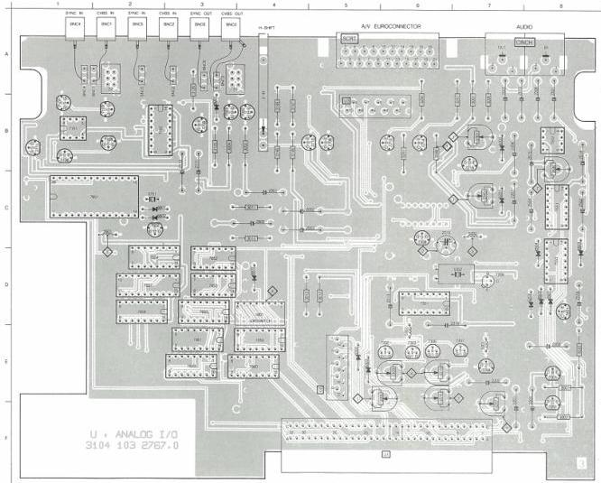
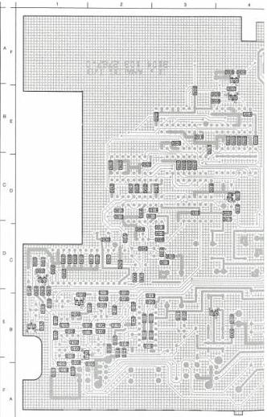

ANALOG I/O MODULE

U

(MOD. LEVEL 3)

2001 C 4 2201 E 7 2315 C 6 2509 A 6 3001 E 8 3010 C 4 3145 B 4 3245 C 7 3393 E 6 5201 E 7 6001 B 5 6001 E 8 6003 D 4 7100 B 3 7101 B 1 7210 B 6 7209 C 6 7601 C 2 7650 E 4 BNC1 A 2
2002 C 4 2202 E 7 2316 D 7 2410 A 7 3002 E 8 3011 C 4 3146 B 4 3247 B 7 3399 E 6 5202 E 7 6201 C 3 6002 D 8 7091 F 7 7100 B 1 7101 B 2 7210 B 6 7209 D 2 7601 D 2 7650 D 2 BNC2 A 2
2003 C 5 2203 E 8 2501 A 6 2514 B 8 3003 B 4 3012 D 4 3147 B 4 3248 B 6 2315 E 6 5301 E 6 6202 D 7 6203 E 8 7052 B 4 7100 B 2 7207 D 8 7302 E 6 7501 D 6 7601 D 2 7650 D 2 BNC2 A 2
2004 E 6 2507 D 7 2502 C 6 2515 B 8 3004 B 3 3012 D 5 3148 B 4 3250 B 6 2315 E 6 5302 D 7 6203 D 6 6504 C 6 7003 B 3 7100 B 5 7204 E 7 7203 E 6 7501 C 6 7601 D 3 7650 D 3 BNC4 A 1
2105 B 3 2308 B 7 2503 A 7 2516 D 6 2508 B 7 3125 B 2 3149 A 4 3251 B 6 2530 B 6 5601 C 2 6302 A 5 6601 C 2 7101 B 1 7110 B 5 7206 D 7 7206 E 6 7502 B 6 7604 D 2 7665 E 4 BNC5 A 2
2117 B 3 2313 D 6 2504 C 6 2505 C 4 3007 B 7 3126 A 3 3207 E 7 3263 B 7 3533 E 6 5701 C 2 6303 E 6 6602 C 2 7103 B 2 7111 B 1 7214 B 6 7307 E 7 7502 D 6 7602 D 2 7661 E 3 BNC6 A 3

2006 E 6 2206 C 7 2325 D 6 2610 C 1 2627 C 2 3114 B 2 3135 B 1 3203 E 6 5220 E 7 3236
2007 E 5 2301 F 6 2505 C 6 2611 C 2 3005 B 4 3115 B 2 3136 B 2 3206 A 7 3221 D 7 3237
2101 A 1 2302 E 6 2508 C 6 2612 C 2 3008 E 5 3116 B 2 3137 B 2 3209 E 6 5222 D 7 3234
2102 B 1 2304 E 6 2507 B 6 2613 C 3 3009 B 5 3118 B 2 3138 B 2 3206 F 7 3235 D 7 3236
2103 B 1 2305 E 6 2508 B 6 2614 D 3 3014 E 5 3119 B 2 3139 B 2 3208 E 6 5224 D 7 3241
2104 B 2 2307 D 6 2513 C 6 2615 C 2 3101 A 7 3120 B 2 3140 B 2 3209 E 6 5225 D 7 3242
2105 B 1 2308 D 6 2512 C 6 2616 D 3 3105 B 4 3121 B 2 3141 B 2 3210 E 7 3243
2106 B 1 2309 D 6 2512 C 6 2617 D 3 3106 B 4 3121 B 2 3142 B 2 3210 E 7 3243
2108 B 1 2309 D 6 2512 C 6 2618 D 3 3106 B 4 3121 B 2 3143 B 2 3210 E 7 3243
2109 B 1 2310 D 6 2607 C 1 2619 E 3 3107 B 2 3144 B 4 3122 A 7 3213 E 7 3228 D 7 3246
2109 B 4 2312 D 6 2602 C 2 2620 E 4 3108 B 2 3137 D 5 3152 B 1 3213 E 7 3250 D 7 3245
2113 B 4 2316 D 6 2604 D 3 3021 D 3 3108 B 2 3128 D 5 3152 B 1 3213 E 7 3251 D 7 3252
2113 B 4 2317 D 6 2604 E 4 3012 D 3 3111 B 2 3130 B 1 3210 B 1 3213 E 7 3252 D 7 3252
2114 A 1 2319 D 6 2607 C 1 2625 E 3 3111 B 2 3131 B 1 3180 B 1 3210 B 1 3213 E 7 3253 D 7 3253
2204 E 7 2322 C 6 2608 C 1 2624 E 4 3112 B 2 3132 B 2 3201 D 7 3210 D 7 3234 E 7 3255
2205 A 7 2324 E 6 2609 E 1 2625 E 2 3112 B 2 3134 B 2 3202 E 6 3210 D 7 3255 D 7 3256

1 2 3 4 5 6 7 8