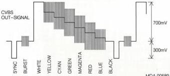
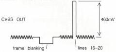

# ANALOG I/O MODULE

U

(MOD. LEVEL 3)

# ADJUSTMENTS

# Required

Test disc

Scope

# Adjustment conditions

Load test disc.

Still picture, picture no. 6200 (colour bar EBU test signal).

Disc drive may not be locked to an external video source.

# Adjustments

1) R3263, R3207, R3240, R3315, R3305 (CVBS amplitudes)

- Measure the CVBS OUT signal (ENCODED) on BNC3 (linefrequent) with the scope (see fig. U1). Terminate the signal with 75 Ω.

Fig. U1

- Adjust R3263 for a sync-amplitude of \(300\mathrm{mV}\) relative to black level.
- Adjust R3207 for a white amplitude of \(700\mathrm{mV}\) relative to black level.
- Adjust R3315 until the upper side of the chroma signal during the yellow bar lies at the same level as the white signal (700 mV).
- Adjust R3305 until the upper side of the chroma signal during the cyan bar lies at the same level as the white signal.
- Search for picture number 8200 (black) and switch off the index.
- Measure the CVBS OUT signal, frame frequent and display the lines 16-20 of the video signal. The VITS- and 24 bit code are displayed as TXT info (see Fig. U2).
- Adjust R3240 for an amplitude of \(460\mathrm{mV}\) \((\pm 20\mathrm{mV})\) of the signal in lines 16-20.

TXT AMPLITUDE

Fig. U2

MDA.00590

T28/711

2) C2315 (chroma subcarrier)

- Measure with the scope (channel A) the CVBS OUT-signal on BNC3 (ENCODED).
- Measure with the scope (channel B) the CVBS signal on E-TS7105 (NOT ENCODED).
- Switch the scope to A+B, adding the 2 signals.
- Adjust C2315 for minimum amplitude variations in the chroma signal.

3) L5202 (chroma notch)

- Measure the CVBS OUT signal (ENCODED) on BNC3 with the scope (line-frequent). Terminate the signal with \(75\Omega\)
- Adjust L5202 for maximum amplitude of the chroma signal.

4) R3309, R3319 (burst amplitude)

- Switch the drive into the STAND BY position.
- Measure the CVBS OUT signal (ENCODED) on BNC3 with the scope (line frequent).Terminate the signal with \(75\Omega\)
- Short circuit pins 10 and 12 of IC7351.
- Adjust R3309 for a burst amplitude of \(210\mathrm{mV}\) \((\pm 10\mathrm{mV})\)
- Remove short circuiting of pins 10 and 12.
- Short circuit pins 5 and 12 of IC7351.
- Adjust R3319 for a burst amplitude of \(210\mathrm{mV}\) \((\pm 10\mathrm{mV})\)
- Remove short circuit of pins 5 and 12. (The burst amplitude will increase to approx 300 mV).

LIST OF ELECTRICAL PARTS MODULE U

Crystals

|  5302 | 4822 242 70323 | 4.433619 MHz  |
| --- | --- | --- |
|  5602 | 4822 242 71417 | 13.875 MHz  |

Coils

|  5201 | 4822 156 21324 | 100 μH  |
| --- | --- | --- |
|  5202 | 4822 156 10996 | 15 μH  |
|  5301 | 4822 156 10996 | 15 μH  |
|  5601 | 4822 156 10996 | 15 μH  |

Potentiometers

|  3149 | 4822 101 90063 | 10 kΩ  |
| --- | --- | --- |
|  3207 | 4822 100 20151 | 1 kΩ  |
|  3240 | 5322 101 10691 | 4.7 kΩ  |
|  3263 | 5322 101 10691 | 4.7 kΩ  |
|  3305 | 4822 100 20151 | 1 kΩ  |
|  3309 | 5322 101 10691 | 4.7 kΩ  |
|  3315 | 4822 100 20151 | 1 kΩ  |
|  3319 | 5322 101 10691 | 4.7 kΩ  |
|  3530 | 5322 101 10627 | 10 kΩ  |

Fuse Resistors

|  3533 | 4822 111 30831 | 47 Ω  |
| --- | --- | --- |

NFR25 Resistors

|  3001 | 4822 111 30508 | 10 Ω  |
| --- | --- | --- |
|  3002 | 4822 111 30515 | 18 Ω  |
|  3003 | 4822 111 30511 | 12 Ω  |
|  3004 | 4822 111 30511 | 12 Ω  |
|  3010 | 4822 111 30483 | 1 Ω  |
|  3011 | 4822 111 30483 | 1 Ω  |
|  3012 | 4822 111 30483 | 1 Ω  |
|  3013 | 4822 111 30483 | 1 Ω  |

Trim Capacitors

|  2315 | 4822 125 50062 | 10 pF  |
| --- | --- | --- |