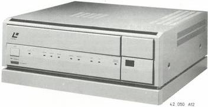

LaserVision ROM disc drive VP415/00/05/35

# Service
Service
Service

# Repair Method

Contents:

1. Introduction
2. Diagnostic Software

a. Set-up
b. Switching on the Diagnostic Software

1. Check mode
2. Self-test mode

c. Reproducing the error codes on the screen

1. Check mode
2. Self-test mode

d. Programme loop in the self-test mode
e. Meaning of the error codes

3. Faultfinding

a. Meaning of the symbols used
b. Test procedure

Published by

Service Consumer Electronics

CS 8 110