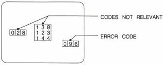
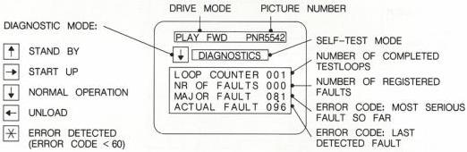

c. Reproducing the error codes on the screen

The error code is shown as video overlay on the screen
as follows:

1. Check mode

CHECK MODE

The error code is shown in the right-hand bottom corner of the screen.

This is the last detected fault.

2. Self-test mode

SELF-TEST MODE

By displaying the text DIAGNOSTICS, the screen indicates that the set is in self-test mode. It also shows the drive mode and the diagnostic mode. In the middle of the screen the position of the loop counter and the number of registered faults are given.

The error codes are divided into major and actual faults.

The code for a major fault shown on the screen will only be overwritten if the new code has priority (that is, a lower error code).

MDA.00615

T27/716

CS 8 112