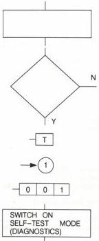

# 3. Faultfinding

# a. Meaning of the symbols used

The symbols used in the test procedure and in the fault-finding tree have the following meaning:

- action/operation to be carried out

- decision

- Check module T or the circuits on this module

- Go on to block 1 in the faultfinding tree

- Error code on the picture screen (no error = - - - )

- Switch on the drive by pressing STANDBY + EJECT and MAINS together.
Release buttons when display DIAGNOSTICS is visible

CS 8 115