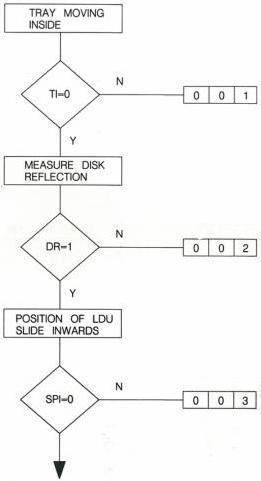

9

# ② ERROR CODE <60 (SELF TEST MODE)

AUTOMATIC GENERATED TEST LOOP;

A) START UP PROCEDURE

TRAY MEETS HINDRANCE

- CHECK THE MOVING OF
THE DISC TRAY INWARDS
THE DRIVE

- P R

NO DISC REFLECTION

- CHECK IF A DISK IS PRESENT IN THE TRAY
- CHECK ATC CIRCUIT IN OPTICAL DECK, MOD. Z

SPI NOT FOUND

- CHECK IF THE LDU SLIDE
IS IN THE INWARD POSITION

- E R

MDA.00618

T27/713

CS 8 118