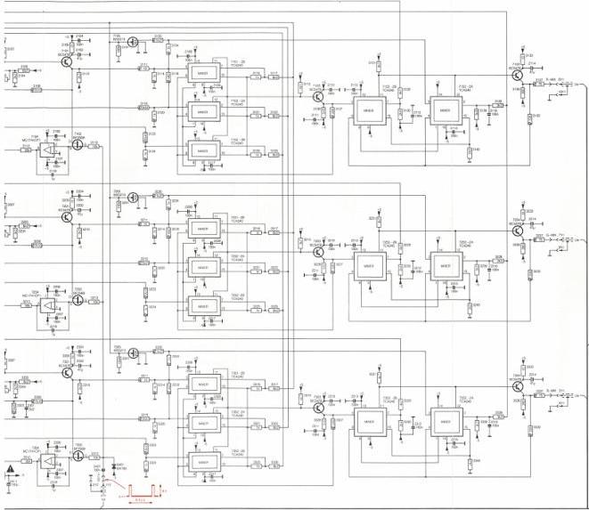
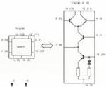
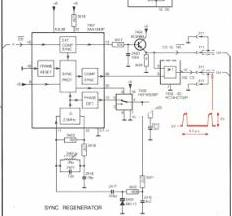

10 | 11 | 12 | 13 | 14 | 15 | 16 | 17 | 18 | 19 | 20 | 21 | 22 | 23 | 24 | 25 | 26 | 27 | 28 | 29 | 30 | 31

→CLAMP

SLOW MIXER

FAST MIXER

VIDEO MIX MODULE

(Hold level 4)

Y

|  MODE | HP3 | HP1 | HP0 |   |
| --- | --- | --- | --- | --- |
|  1 | 0 | 0 | 0 | 1/4 ONLY  |
|  2 | 0 | 0 | 0 | COMPUTER ONLY  |
|  3 | 0 | 1 | 0 | ENHANCED READY  |
|  4 | 0 | 1 | 1 | MAX 100/80/80  |
|  5 | 1 | 0 | 0 | HARD KEY RELIED  |

TYPE SCALE
1/2" = 1'-0"
1/2" = 1'-0"

10 | 11 | 12 | 13 | 14 | 15 | 16 | 17 | 18 | 19 | 20 | 21 | 22 | 23 | 24 | 25 | 26 | 27 | 28 | 29 | 30 | 31

●

●

●

●