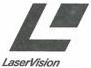
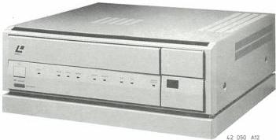

LaserVision ROM disc drive VP415/00/05/35

# Service
Service
Service

# Circuit Description

# CONTENTS

|   | page |  | page  |
| --- | --- | --- | --- |
|  Chapter 1. The LaserVision system | 1 | Chapter 3. Module description | 13  |
|  Introduction | 1 | A : Audio processing | 13  |
|  Encoding of the signals on the disc | 1 | B : RGB processing | 14  |
|  Focusing | 2 | C : Video processing | 15  |
|  Radial tracking | 3 | D : Reference source | 16  |
|  Time base correction | 3 | E : Slide drive | 17  |
|  Genlock | 3 | F : Motor + sequence | 17  |
|  The optical deck | 5 | G : Genlock | 18  |
|   |  | H : Electronic time base correction B | 19  |
|   |  | I : Electronic time base correction C | 20  |
|  Chapter 2. VP400 series | 7 | J : Focus drive | 22  |
|   |  | K : H.F. processing | 22  |
|  Introduction | 7 | L : Video drop-out correction | 23  |
|  Blockdiagram audio/video signal path | 7 | M : Radial drive | 24  |
|  Control routes + Start-up sequence | 9 | N : Display + keyboard | 24  |
|  S-bus | 9 | P : Front loader | 25  |
|  Blockdiagram servo | 11 | R : Drive processor | 25  |
|   |  | S : Control processor | 26  |
|   |  | T : Supply | 26  |
|   |  | Ua : Analog I/O, CVBS + audio part | 27  |
|   |  | Ub : Analog I/O, video part | 28  |
|   |  | Uc : Analog I/O, TXT part | 29  |
|   |  | W : Data grabber and CPU | 30  |
|   |  | X : LV-ROM decoder | 34  |
|   |  | Y : Video mixing | 36  |
|   |  | Z : Deck electronics | 37  |

Description des circuits Schaltungsbeschreibung Kredslabsbeskrivelse Kretsbeskrivelse Kretsbeskrivning Toimintaselostus Descrizione del circuito Description del circuito

Published by

Service Consumer Electronics

CS 7 874