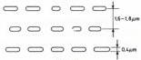
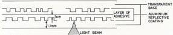
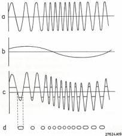
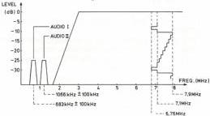

1

# CHAPTER 1 THE LASERVISION SYSTEM

# Introduction

In the LaserVision system the video and audio information are stored on a disc in encoded form.

The information on the disc is scanned optically on a LaserVision disc drive and then converted into a CVBS signal as well as RGB signals suitable for a standard colour television receiver with Euroconnector. The information is stored on the disc along a spiral track in the form of pits; the disc is scanned from the centre to the outside. The length of the pits and their spacing are determined by the stored information.

The pits are 0.4 µm wide and approximately 0.1 µm deep. The track-to-track spacing is 1.6 to 1.8 µm (refer to Fig. 1). The overall length of the track on a 30 cm disc is about 34 kilometres!

Fig. 1

The disc is made of a transparent plastic into which the pits are pressed. An extremely thin reflective layer of aluminium is added on top, followed by a protective coating that covers the whole. Two of these discs are glued together to form a double-sided disc. A cross section of the disc is shown in Fig. 2.

Fig. 2

A great advantage of the optical system is the contactless readout of the information on the disc, as a result of which wear of disc and read-out device is non-existent. A second advantage is the effective protection of the information on the disc against dust, fingerprints, etc. When taking a closer look at the beam path from the objective to the disc (refer to Fig. 3), we notice that at the place where the light cone enters the transparent base section the light cone's diameter is still fairly large.

Dust particles, etc. at this place exert very little influence; the light passes, as it were, around the dust particle. This highly effective protection of the information enables normal handling of the disc.

Fig. 3

Optical read-out of the information on the disc takes place as follows:

The light beam from a ALGaAs semiconductor laser is focused on the disc by a lens (objective). In the absence of a pit practically the full amount of light is reflected. The reflected light passes through the objective and is then separated from the light beam going to the disc. The reflected light now falls on a photodiode; the amount of current that starts flowing through the diode is proportional to the amount of light falling on it.

When the light beam hits a pit, practically no light will be reflected due to the properties of the laser light and the depth of the pit; consequently, the current passing through the photodiode will be reduced.

In this way it is possible to convert the information on the disc into an electrical signal that is suitable for further processing to a standard videosignal in the disc drive.

# Encoding of the signals on the disc

The videosignal is frequency modulated on a carrier (refer to Fig. 4a). Top sync level is situated at a frequency of 6.76 MHz, black level at a frequency of 7.1 MHz and white level at a frequency of 7.9 MHz. This results in a total frequency swing of 7.9 - 6.76 = 1.14 MHz.

Including this side bands the video FM signal encompasses a frequency range up to approximately 2.5 MHz at the lower side.

The two audio signals are equally frequency modulated on carriers of 683 kHz and 1066 kHz respectively. The frequency swing of the two channels is ± 100 kHz (refer to Fig. 4b).

Summing these three signals and next limiting them results in a pulse-width modulated signal (refer to Fig. 4c). The negative half periods of this signal determine the length of the pits, the positive half periods determine the spacing of the pits (refer to Fig. 4d).

Fig. 5 shows the entire frequency spectrum with associated recording levels of the video and audio RF signals.

Fig. 4

Fig. 5

27625A19A

The encoded RF signals may be stored on the disc in two different ways:

1. The disc rotates at a constant speed (1500 rpm = 25 rps). At each revolution of the disc a complete TV picture is reproduced. This implies that the length of the track corresponding to one picture gradually increases from the centre of the disc to the outside. The frame sync pulses are situated on a diagonal. This type of disc is referred to as CAV disc (Constant Angular Velocity disc). Special playing modes like 'still picture', 'slow motion', 'fast forward' and 'reverse' are feasible with this type of disc only, since the frame sync pulses and, consequently, the frame blanking are situated on a diagonal. This allows jumping from one track to the next one or to the preceding one during the frame blanking period.

The maximum playing time of a CAV disc is 36 minutes/ side.

CS 7 875