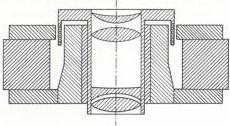
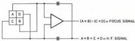
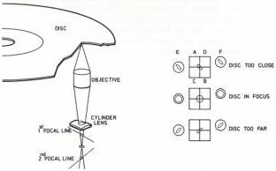

2

2. The track length of each frame on the disc is constant. This implies that the rotational speed of the disc decreases when scanning the disc from the inside to the outside, and that from 1500 rpm at the inside to 565 rpm at the outside of the disc. This type of disc is referred to as CLV disc (Constant Linear Velocity disc). No special playing modes can be realised with this type of disc, because the frame sync pulses and frame blanking are no longer on a diagonal, thus putting jumping from one track to the other out of the question.

The maximum playing time of a CLV disc is 54 minutes per side. The disc drive is suited for both types of discs.

In addition to the video and audio information, the disc contains a number of special codes, inserted in the frame blanking periods.

Test signals have been inserted during the lines 19, 20, 332, 333. Digital codes for various purposes have been inserted during the lines 16, 17, 18, 329, 330, 331.

These signals have the following functions:

# Lead-in tracks

A minimum of 900 tracks prior to the start of the actual programme contain a start code which sends the read-out objective to the beginning of the programme at nine times the normal speed.

# Lead-out tracks

A minimum of 600 tracks immediately after the end of the programme contain an end code which sends the read-out objective back to the beginning at 75 times normal speed. Video and audio signals are muted during the return period.

# Programme area

Here a distinction has to be made between CAV and CLV types of discs.

# CAV discs

1. Picture code consisting of a picture number by means of which each individual picture of a programme can be identified.

The number may be displayed on the monitor screen, if desired.

The picture number code is always present in the first field of each complete television frame. The second field may contain a stop code to switch the disc drive to STILL PICTURE mode.

2. Chapter code consisting of a chapter number by means of which a search action can be automatically stopped as soon as the start of the relevant chapter is reached. The chapter number may also be displayed on the monitor screen, if desired.

The presence of stop code and chapter code is optional and depends on the programme content.

# CLV discs

1. A normal play code is always present in CLV discs. This code disables the special modes of operation of the disc drive.
2. Instead of a picture number code a time code is present in LV discs. It contains a time coding with hour and minutes indication showing the time elapsed since the start of the programme. This time may be displayed on the monitor screen, if desired.

# Focusing

The objective used to read the information on the disc has a very small depth of focus, that is, maximum 1.5 µm. In view of tolerances in disc and in disc drive construction this accuracy can only be realised by means of a servo-control system that continuously verifies and corrects the focusing of the objective. For this purpose the objective is

mounted in a magnet so as to allow vertical motion. Around the objective and firmly attached to it, a coil has been mounted. By feeding a current through the coil, the objective will move more or less upwards, depending on the current intensity. Fig. 6 shows a cross-sectional view of the objective plus coil and magnet.

The system is very much similar to a loudspeaker system.

Fig. 6

27623A19

The objective is driven in the following way:

The light reflected by the disc is focused on the photodiodes by the objective. On its way to the diodes the reflected beam passes an astigmatic lens system, like a cylinder lens.

Unlike a spherical lens, an astigmatic lens does not have one single focal point, but two focal lines at some distance from each other and at right angles to each other. Between the focal lines a plane exists where a circular picture is formed. When the disc is out of focus with respect to the objective, that is too far from or too close to the objective, the astigmatism will modify the shape of the picture from the focused state (circular picture) to an elliptical picture. The direction of the ellipsis' axes is determined by the fact whether the disc is too far from or too close to the objective. The photodiode that converts the light variations into an RF signal is composed of four quadrants A, B, C and D (refer to Fig. 7). When the objective is in focus, all four quadrants receive equal amounts of light.

When the objective is out of focus, either A and B or C and D receive more light. The quadrants are interconnected crosswise. The sum of the signals over A, B, C and D receive more light. The quadrants are interconnected crosswise. The sum of the signals over A, B, C and D constitutes the RF signal. The difference signal (A+B) - (C+D) is the drive signal for the objective.

Fig. 7

27620C19A

CS 7 876