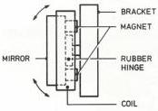
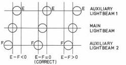

3

# Radial tracking

The information on the disc is contained in a spiral track that is read from the inside to the outside. This implies that objective – in order to be capable of following the track – has also to move from the centre of the disc to the outside. For this purpose the objective and all associated components which constitute the optical system are mounted on a slide, driven by a motor and moving radially under the disc.

The light has to follow the track on the disc with an accuracy of approximately 0.1 µm.

Tolerances in player and disc may cause a track wobble of 130 µm. It will be clear that the slide is incapable of following this wobble at a rotational speed of 25 rps.

To obtain the required accuracy a movable mirror has been inserted in the light path under the objective; this mirror allows to move the light spot radially over the disc.

A magnet is attached to the mirror. Around the mirror a coil is mounted. When a current flows through the coil, the intensity and the direction of this current determine to what extent the mirror will pivot to the left or to the right (refer to Fig. 8).

Driving of the mirror is obtained as follows:

In the optical system, apart from the main beam for track scanning, two further auxiliary light beams are formed whose impact is slightly displaced with respect to the track's centre line, in opposite directions.

The light spots formed on the disc by the two auxiliary light beams fall partly on the track and partly outside the left or right edge of the track. The objective focuses these light spots on two separate photodiodes situated at either side of the signal diodes (E and F in Fig. 7). When the track is followed correctly, the signals coming from each diode will be equal. When tracking is less optimal, it depends on the direction of deviation which diode output will exceed that of the other diode (Refer to Fig. 9).

The difference between both signals is – after amplification – used to drive the mirror. When the average voltage across the mirror coil is positive or negative, the slide motor will be controlled until the average voltage is again 0 (zero).

Fig. 8 27628A19A

Fig. 9

# TIME BASE CORRECTION

As known, a TV picture consists of lines that are written in an accurately laid down time (64 µsec for the PAL system). Deviations from this time cause a distorted picture and phase errors in the colour signal which may lead to dropping out of the colour.

The video signal of the disc drive should also meet this requirement of constancy of the time base to be able to give an undistorted picture with colour.

The presence of several tolerances (disc, centring, motor) results in variations in the line time of the video signal.

Now the maximum permissible deviation from the time base to give a stable picture with every TV receiver is 5 nsec. To reach this value it will first of all be necessary to keep the speed of the turntable motor as constant as possible. To achieve this the phase of the line sync pulses is compared with the phase of pulses with the line frequency coming from a crystal oscillator. The resultant control voltage is used to drive the turntable motor. It is clear, however, that variations in speed with a frequency of 25 Hz and higher cannot be corrected by this control.

For the correction of these errors use is made of a CCD (charge coupled device) which functions as a variable delay line for the great time errors (+/- 17µsec) and a variable LC delay line for fine control (+/- 50 nsec).

The CCD is driven by a signal which is obtained through comparison of the phase of crystal-controlled reference signal with the line frequency and line frequency pulses of the disc video signal.

Since the line sync pulses themselves are not suited for an accurate enough measurement of the time difference use is made of a signal having a frequency of 3.75 MHz (240x the line frequency) which has been laid down on the disc at the level of the peak sync pulses.

If the same zero crossing of the 3.75 MHz signal is used for every line sync pulse, the actual line time can be measured sufficiently accurately. The time base correction makes it possible to connect the disc drive to any TV set.

# GENLOCK

Genlock serves to synchronize the video signal of the disc drive with the video signal of another source. I.e. the line and frame pulses of both signals are in phase (sync lock). This is necessary to enable interference-free switching-over of both video signals. Locking is done by controlling the revolution speed of the disc and hence the phase of the line and frame pulses.

CS 7 877