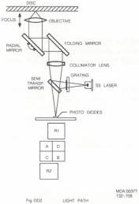
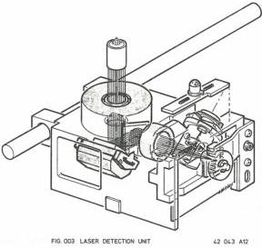

5

# THE OPTICAL DECK

The optical deck reads the information from the video disc by means of a laser beam. The modulated laser light is transferred into an electrical signal which is further processed in the electronics of the player.

The deck consists of a main chassis, containing the following parts (see Fig. OD1):

- The Laser detection Unit (LDU) to read the information from the video disc.
- The slide drive mechanism to move the LDU under the disc.
- The turntable motor to spin the disc.
- The tilt compartment which causes an angular (and vertical) move of the LDU under the disc.
- The tilt mechanism to drive the tilt compartment.
- The slide position indicator to indicate the starting position of the slide.
- The deck electronics where the signals from the LDU and tilt control are processed.

The Laser Detection Unit (LDU)

The LDU reads the information from the video disc and delivers electrical signals to be processed further. The principle of the unit has been drawn in Fig. OD2.

A Solid State laser emits a diverging laser beam. The power of the beam is 3mW and the emitted light has a wavelength of 780 nm. The laser is of the Aluminium Gallium Arsenide (AlGaAs) type.

Just in front of the laser, a grating plate has been situated, causing the laser beam to be split into a main beam and two auxiliary beams, to be used for radial tracking.

After the grating, the beam reflects partly on the surface of a semi transparent mirror. The reflected beam, still diverging, passes through a collimator lens causing the beam to proceed exactly parallel. A folding mirror projects the beam onto a radial mirror which is activated by the radial correction signal.

Eventually the objective focusses the beam on the surface of the video disc. The objective is driven in vertical direction by the focus correction signal.

The laser light that is reflected by the video disc, containing the disc-information, returns by the same path as described before, so via the objective, radial and folding mirror, through the collimator lens to the semi transparent mirror.

On this mirror, the laser light is partly reflected back into the laser, but enough light is going through the mirror to be detected on the photodiodes. These diodes consist of a quadrant diode and 2 auxiliary diodes R1 and R2.

The quadrant diode delivers the signals AB CD to compose the HF- and focus signal, diodes R1 and R2 deliver the radial tracking signals.

Fig. OD3 shows the detailed construction of the LDU.

CS 7 879