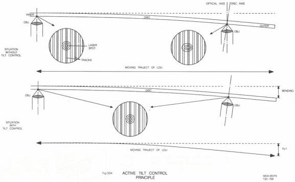
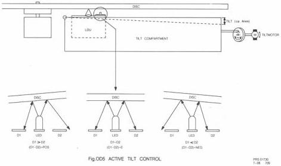

6

# Active Tilt Control (ATC)

- Principle (see Fig. OD4)

When a video disc is put on the turntable it will bend, caused by its own weight (umbrella shaped).

The LDU which is moving in a horizontal plane under the disc will have a different distance related to the surface of the disc when reading in the beginning of the disc or at the outer side of the disc. At the outer side, the optical axis of the LDU is not perpendicular to the disc surface anymore. In this area, the focussed laser spot is distorted, causing optical cross-talk between the tracks. Active Tilt Control means that the LDU is moved in angular direction to achieve that the LDU is always perpendicular to the disc surface, so that the cross-talk is minimal. Therefore the distance between LDU and disc has to be measured to detect a possible deviation.

- Measuring the distance

To measure the distance between the LDU and the disc surface, a LED is mounted on the LDU which emits infrared light.

The light that is reflected on the disc surface, hits receiving diodes D1 and D2 (see Fig. OD5). When the reflected light on D1 equals D2, the position of the LED (and of the LDU) related to the disc, is correct. If D1 differs from D2, a positive or negative error signal will be generated, which drives a DC motor. This so-called tilt motor corrects the position of the LDU, until D1 equals D2.

CS 7 880