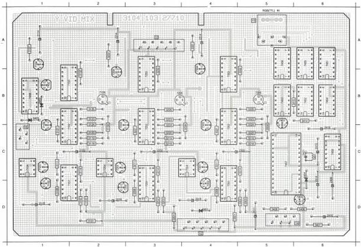
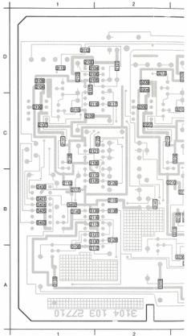

VID MIX MODULE ⑨

(MOD. LEVEL 4)

|  2102 C 2 | 2314 A 4 | 2419 C 6 | 3114 C 2 | 3132 B 2 | 3208 D 3 | 3224 C 3 | 3302 D 5 | 3320 C 5 | 3327 A 4 | 6402 B 1 | 7105 B 2 | 7203 B 2 | 7301 C 4 | 7353 B 4 | 7453 B 5  |
| --- | --- | --- | --- | --- | --- | --- | --- | --- | --- | --- | --- | --- | --- | --- | --- |
|  2114 A 1 | 2316 D 4 | 2401 C 6 | 3118 C 2 | 3134 C 2 | 3211 C 3 | 3227 C 3 | 3303 D 5 | 3323 B 5 | 3408 D 4 | 6403 B 1 | 7151 D 1 | 7204 B 2 | 7300 D 4 | 7354 C 4 | 7454 B 6  |
|  2118 D 1 | 2408 C 6 | 3101 D 2 | 3119 C 2 | 3135 B 2 | 3214 C 3 | 3232 B 3 | 3308 D 4 | 3324 B 5 | 3407 D 6 | 6404 C 6 | 7152 C 1 | 7305 B 3 | 7303 B 4 | 7401 B 5 | 7455 A 6  |
|  2202 C 3 | 2410 D 6 | 3102 D 2 | 3120 C 2 | 3137 A 1 | 3216 C 3 | 3234 C 4 | 3311 C 4 | 3327 C 4 | 3408 D 5 | 7101 C 1 | 7153 B 1 | 7251 D 3 | 7304 A 4 | 7402 B 1 | 7458 A 5  |
|  2214 A 2 | 2411 D 5 | 3102 D 2 | 3123 B 2 | 3201 C 3 | 3218 C 3 | 3335 B 3 | 3314 C 5 | 3332 B 5 | 3415 B 6 | 7102 D 1 | 7154 C 2 | 7252 C 3 | 7205 B 3 | 7403 C 4 | 7457 C 5  |
|  2218 D 2 | 2414 C 6 | 3108 D 1 | 3124 B 2 | 3202 D 3 | 3220 C 3 | 3237 A 2 | 3318 C 5 | 3334 C 5 | 3415 B 6 | 7103 B 1 | 7201 C 2 | 7253 B 3 | 7351 D 4 | 7451 A 6 | 7458 B 1  |
|  2302 C 5 | 2415 C 6 | 3111 C 1 | 3127 C 1 | 3203 D 3 | 3223 B 3 | 3301 D 4 | 3319 C 5 | 3335 B 5 | 6401 D 4 | 7104 A 1 | 7202 D 2 | 7254 C 2 | 7352 C 4 | 7452 B 6 | 7459 C 6  |

|  2101 D 2 | 2112 A 2 | 2207 C 2 | 2301 D 5 | 2312 A 4 | 2406 A 6 | 31  |
| --- | --- | --- | --- | --- | --- | --- |
|  2103 D 1 | 2115 B 2 | 2208 C 3 | 2303 D 4 | 2313 B 4 | 2407 A 5 | 31  |
|  2104 D 1 | 2118 B 2 | 2209 C 3 | 2304 D 4 | 2315 B 4 | 2408 B 1 | 31  |
|  2105 D 1 | 2118 B 2 | 2210 B 2 | 2305 D 4 | 2316 B 4 | 2412 C 5 | 31  |
|  2106 D 1 | 2117 A 2 | 2211 C 2 | 2306 D 4 | 2317 B 4 | 2413 D 5 | 31  |
|  2107 C 1 | 2201 D 3 | 2212 A 3 | 2307 C 4 | 2401 D 4 | 2416 C 6 | 31  |
|  2108 C 2 | 2202 D 3 | 2212 B 3 | 2308 C 4 | 2402 B 6 | 2417 C 6 | 31  |
|  2109 C 1 | 2204 D 3 | 2213 B 3 | 2309 C 4 | 2403 B 6 | 2418 C 5 | 31  |
|  2110 B 1 | 2206 D 3 | 2216 B 3 | 2310 B 4 | 2404 B 5 | 2420 C 5 | 31  |
|  2111 C 1 | 2208 C 2 | 2217 B 3 | 2311 C 4 | 2405 B 6 | 2404 D 2 | 31  |

LIST OF ELECTRICAL PARTS MODULE Y

|  Colts  |   |   |   |
| --- | --- | --- | --- |
|  5401 | 4822 156 21026 | 34 μH |   |
|  NFR25 Resistors  |   |   |   |
|  3406 | 4822 111 30483 | 1 Ω |   |
|  3407 | 4822 111 30483 | 1 Ω |   |
|  3408 | 4822 111 30483 | 1 Ω |   |

|  2101 | 4822 122 32425 | 2.2 pF |  | 2201 | 4822 122 32425 | 2.2 pF |   |
| --- | --- | --- | --- | --- | --- | --- | --- |
|  2102 | 4822 124 22027 | 47 μF | 25 V | 2202 | 4822 124 22027 | 47 μF | 25 V  |
|  2103 | 5322 122 32839 | 100 nF |  | 2203 | 5322 122 32839 | 100 nF |   |
|  2104 | 5322 122 32839 | 100 nF |  | 2204 | 5322 122 32839 | 100 nF |   |
|  2105 | 5322 122 32839 | 100 nF |  | 2205 | 5322 122 32839 | 100 nF |   |
|  2106 | 5322 122 32839 | 100 nF |  | 2206 | 5322 122 32839 | 100 nF |   |
|  2107 | 5322 122 32839 | 100 nF |  | 2207 | 5322 122 32839 | 100 nF |   |
|  2108 | 5322 122 32839 | 100 nF |  | 2208 | 5322 122 32839 | 100 nF |   |
|  2109 | 5322 122 32839 | 100 nF |  | 2209 | 5322 122 32839 | 100 nF |   |
|  2110 | 5322 122 32839 | 100 nF |  | 2210 | 5322 122 32839 | 100 nF |   |
|  2111 | 5322 122 32839 | 100 nF |  | 2211 | 5322 122 32839 | 100 nF |   |
|  2112 | 5322 122 32839 | 100 nF |  | 2212 | 5322 122 32839 | 100 nF |   |
|  2113 | 5322 122 32839 | 100 nF |  | 2213 | 5322 122 32839 | 100 nF |   |
|  2114 | 4822 124 22027 | 47 μF | 25 V | 2214 | 4822 124 22027 | 47 μF | 25 V  |
|  2115 | 5322 122 32839 | 100 nF |  | 2215 | 5322 122 32839 | 100 nF |   |
|  2116 | 5322 122 32839 | 100 nF |  | 2216 | 5322 122 32839 | 100 nF |   |
|  2117 | 5322 122 32839 | 100 nF |  | 2217 | 5322 122 32839 | 100 nF |   |
|  2118 | 4822 121 41719 | 1 μF | 10% 100 V | 2218 | 4822 121 41719 | 1 μF | 10% 100 V  |

|  2301 | 4822 122 32425 | 2.2 pF |  | 24  |
| --- | --- | --- | --- | --- |
|  2302 | 4822 124 22027 | 47 μF | 25 V | 24  |
|  2303 | 5322 122 32839 | 100 nF |  | 24  |
|  2304 | 5322 122 32839 | 100 nF |  | 24  |
|  2305 | 5322 122 32839 | 100 nF |  | 24  |
|  2306 | 5322 122 32839 | 100 nF |  | 24  |
|  2307 | 5322 122 32839 | 100 nF |  | 24  |
|  2308 | 5322 122 32839 | 100 nF |  | 24  |
|  2309 | 5322 122 32839 | 100 nF |  | 24  |
|  2310 | 5322 122 32839 | 100 nF |  | 24  |
|  2311 | 5322 122 32839 | 100 nF |  | 24  |
|  2312 | 5322 122 32839 | 100 nF |  | 24  |
|  2313 | 5322 122 32839 | 100 nF |  | 24  |
|  2314 | 4822 124 22027 | 47 μF | 25 V | 24  |
|  2315 | 5322 122 32839 | 100 nF |  | 24  |
|  2316 | 5322 122 32839 | 100 nF |  | 24  |
|  2317 | 5322 122 32839 | 100 nF |  | 24  |
|  2318 | 4822 121 41719 | 1 μF | 10% 100 V | 24  |