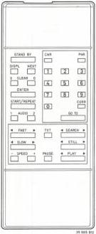
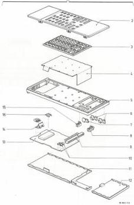
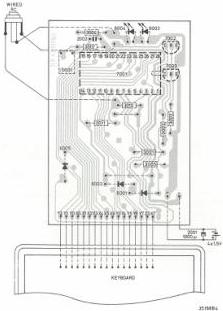
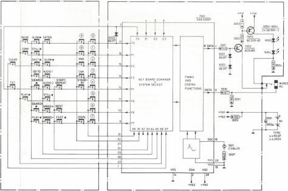

REMOTE CONTROL RCS3/VP410/VP415 TRANSMITTER

# ELECTRICAL PARTS

Batteries

4x R03P 1.5V

Crystals

1001 4822 242 71498 CSB429

Integrated circuits

7001 4822 209 81891 SAA3006P

Transistors

7002 4822 130 40937 BC548B
7003 4822 130 41715 BC328-40

LEDs

6003 4822 130 31332 CQY89A-2
6004 4822 130 31332 CQY89A-2

Diodes

6005 4822 130 30847 BA317

Capacitors

2001 4822 124 21341 1000 µF 8V

Resistors

3004 4822 110 73027 0.62 Ω

# MECHANICAL PARTS

1 4822 218 20607 Transmitter complete
2 4822 432 30284 Top cover
3 4822 410 25423 Knob assembly
4 4822 276 80313 Switch panel
5 4822 432 30283 Casing
6 4822 492 62879 Battery contact
7 4822 492 62881 Battery contact
8 4822 492 62883 Battery contact
9 4822 267 50418 Connector
10 4822 492 62904 Spring
11 4822 432 30282 Bottom
12 4822 432 30281 Battery lid
13 4822 214 50358 Printed board
14 4822 256 90506 LED holder
15 4822 492 62882 Battery contact
16 4822 267 50443 Connector

38.86L CQ

CS 7 862