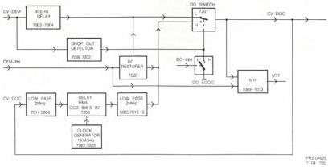

23

# MODULE L - VIDEO DROP-OUT CORRECTION

The circuit on this module takes care of drop-out compensation of the demodulated video signal and of generation of the MTF signal. See the block diagram in Fig.L1. The drop-out detector circuit measures a negative going drop-out and in case of a drop-out it will give a pulse to switch over the DO switch to have the delayed video as output signal. This will be the case as long as there is drop-out. The drop-out pulses can be blocked by the DO-INH signal. This is necessary to prevent drop-out correction during the data part of the video signal. Drop-out correction is only done with the luminance signal. The luminance signal is fed to the CCD memory part, which takes care of the 64µs delay (one linetime).

The DC RESTORER will take care of clamping of the dc level of the delayed video to the dc level of the direct video with the aid of the burst key pulses. The MTF signal is also created on this module. This MTF signal is a dc voltage which will vary in value depending on the read-out diameter of the disc. This voltage is used to adapt the frequency response of the hf signal on the HF PROC module (K).

# Circuit description

# Direct video

The demodulated video signal is obtained from the HF PROC MODULE and arrives, via plug 1L1, on the base of transistor 7001. Via the emitter of 7001 the signal goes via a delay line of 470ns (5001) to the amplifier stage 7002,7003. The signal goes via emitter follower 7004 to the drop-out switch IC 7201-2A. If there is no drop-out, the video signal will, via emitter follower 7005, be available at plug 1L2.

# Drop-out detection

Drop-out detection will be realised in the drop-out detector formed by IC 7202. The demodulated video goes via emitter follower 7006 to the pos.input of the opamp IC 7202, which is applied as comparator. Under normal conditions the output of the opamp is high (+12V). As soon as the pos. input will come under the switch level as a result of a drop-out, the output will become low (0V). If the video signal has no drop-out, the video level will be normal, the pos. input of the opamp will be high again. In that way a pulse is created which goes, via transistor 7007 in order to obtain the right amplitude (6V) and polarity, to pin 10 of switch IC 7201-2A.

The drop-out pulses can be blocked by the DO-INH signal. The DO-INH signal, generated on the genlock module, is present at plug 5L2. The signal is active high and will, via transistor 7008, give a low level on pin 10 of the DO switch IC 7201-2A. At that moment the switch cannot be controlled by the drop-out detector.

# Delayed video

Realisation of the delayed video is done in the following way. The drop-out corrected video signal (CV-DOC) is also fed to the base of transistor 7014. In the emitter circuit a lowpass filter (≤2MHz) is provided to separate the luminance signal. The luminance signal is fed to the CCD memory IC 7203, which takes care of the 64µs delay. The output signal will be made proper again with a lowpass filter (≤2MHz) in the collector circuit of transistor 7017 and will, via transistors 7018 and 7019, be available on the emitter of transistor 7021 as video in case of a drop-out. The CCD memory needs a clock signal, which is realised with the 13.4MHz clock generator circuit (7022,7023). The frequency can be adjusted with coil 5007 to have a delay of exactly 64µs.

The DC RESTORER mainly consists of switch FET 7020 which brings the dc decoupled delayed video from the base of transistor 7021 via filter 5006 at the dc level of the direct video. This is done during the DEM-BK pulses (burst key) that are connected with the gate of FET 7020.

# MTF circuit

The drop-out corrected video signal (CV-DOC) goes, via resistor 3043 and capacitor 2010, to the base of transistor 7009. In the collector circuit of this transistor a circuit (5003/2012) which is tuned to 4.43MHz is situated.

The 4.43MHz signal will, via emitter follower 7010, go to the source of FET 7011. The gate is driven by the burstkey pulses from the genlock module (G). Transistor 7011 is only conducting during the burstkey pulses, so on the drain of this FET only the colour burst is available. The burst signal will via capacitor 2014 go to the base of transistor 7012. The burst voltage is clamped to 0.7V by the base-emittor junction of transistor 7012, so in case of a small burst the average base emitter voltage is higher than with a large burst amplitude. Consequently a large burst causes less collector current. So the collector voltage will increase and the dc-voltage across capacitor 2016 is a measure for the amplitude of the burst signal. This voltage is via transistor 7013 available at plug 6L1, it will vary between 2V and about 10V and goes to the h.f. proc module (K). This circuit is incorporated in a closed loop thus causing continuous adaptation.

FIG.L1 VIDEO DO CORR MODULE

CS 7 895