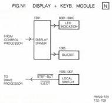
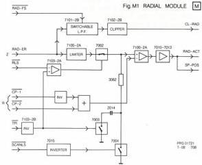

24

# MODULE M - RADIAL DRIVE

The function of the radial module is, to supply the required current to drive the radial mirror in such a way that the laser beam is kept on the required track, depending on the various play modes. See the block diagram in Fig. M1.

# Circuit description

In the normal play mode the radial error signal RAD-ER, originating from the deck electronics and proportional to the deviation of the laser beam relative to the track, is applied to the radial loop switch RLS transistor 7002 via a phase compensation network and a limiter IC 7100-2B. The radial loop switch, which is driven by a signal from the microprocessor 7201 on the drive processor module, is only closed when a track is followed. The radial error signal is then amplified in IC 7100-2A and via the output stage transistors 7010-7013 fed to the radial mirror. As the range of the deviation of the mirror is limited, the drive signal of the mirror is also applied via a level shifter IC 7101-2A to the drive processor. In this way too high a deviation will be compensated for by a displacement of the slide. The level shifter converts the signal, which may vary both to a positive and to a negative value, into a positive signal with the same variations.

In special play modes, the laserbeam jumps across one or more tracks. This is realised by giving the laser beam, with the aid of the radial mirror, a fast forward or reverse deviation. For this fast deviation use is made of the course pulse CP1 for a forward jump and CP2 for a reverse jump. The course pulses are also fed to the radial amplifier in IC 7100-2A. During a jump, the radial loop switch is opened by the RLS signal. The number of tracks that will be crossed in this way depends on the duration of CP1 and CP2 respectively. Both CP1 and CP2 are delivered by the drive processor module. As an indication of how many tracks are crossed, the RAD-ER signal is fed via a switchable lowpass filter in IC 7101-2B to a clipper circuit in IC 7102-2B and converted into a square wave clipped radial signal CL-RAD. The number of pulses of the CL-RAD signal, which indicates how many tracks are crossed, is fed as "count pulses" to the microprocessor on the drive processor module. In case of a jump across more than 15 tracks the radial mirror will get a high speed and about every 25 microseconds a track will be crossed. The CL-RAD signal has a frequency of about 40 kHz then with a small amplitude. In this case the switchable lowpass filter is switched to the maximum amplification of 40 kHz by the radial filter select signal RAD-FS, as a result of which sufficient signal is available again now.

During scan, a SCANLS scan loop switch "L" signal is fed to transistors 7015-7004. As a result scan loopswitch 7004 is closed and the amplification of the radial amplifier is reduced.

The TPI signal "L" on track causes switch 7003 to be closed when the beam is on track. The input voltage of the radial amplifier is present across capacitor 2014. When the beam loses track, the switch will be opened and the voltage remains on capacitor 2014. As soon as the beam is on track again, the initial input voltage for the radial amplifier is equal to the last voltage before the beam lost the track.

# MODULE N - DISPLAY AND KEYBOARD

The display and keyboard module is built around a 16 bit LED driver IC 7201, driving the indication LEDs and a buzzer. See the block diagram in Fig.N1. Two control buttons are fitted : STANDBY and EJECT.

# Circuit description

Input to IC 7201 takes place via the P-bus (SDAT, SCLT, DLEN) from control module S (IC 7211) as an 18 bit word, i.e. 0 + 16 data bits + terminating bit.

Outputs Q1 to Q10 are used to drive LEDs, Q11 provides an audio bleep via IC 7202 and transistor 7001.

If Q11 is "high", generator circuit IC 7202-4B, resistor 3012 and capacitor 2001 will be switched off via NAND IC 7202-4A. Pin 6 will remain "high" thus preventing transistor 7001 from starting to conduct. If Q11 is "low" and thus pin 3 of IC 7202-4A "high", IC 7202-4B will alternately give a high and a low level to output pin 6, dependent on the RC time (3012/2001).

The connections for the local switches are returned to the drive processor module (R).

CS 7 896