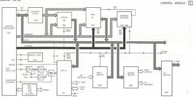
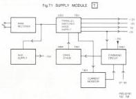

26

# MODULE S - CONTROL

The functions of the control module are :

a) To provide an RS232 interface between the player and an external computer.
b) To provide a local bus interface with the CPU board (UART).

Control module S is driven by processor 7201.

7201 is organised to access 64k of ROM and 64k of RAM although only 8k of RAM is fitted in the VP415/VP410.

IC 7202 is the ROM. IC 7203 is the RAM. The RAM is non volatile being supported by a 2.4V Ni-CAD battery 1002.

ROM and RAM overlay the same address field, however no conflict occurs as the control bus is fully decoded. Also the data bus pins of processor 7201 are shared with the low address byte. IC7204 functioning as an address latch under control of ALE (Address latch enable). The ROM is read enabled when PSEN (Program store enable) is low. The address bus is decoded in 3 to 8 line decoder 7205 to give 6 chip select lines (CS1 to CS8). CS1 enables RAM 7203.

The I/O ports are configured to use the top 8KBytes of memory space (E000h-FFFFh). CS8 is further decoded with A10, A11, WR, and RD to give RD1-3, RDEN, WR1, WR3 and WREN.

There are a number of I/O ports.

IC7209 - Output latch strobed by WR1 providing VP0-2. These signals are controls to the mixing board Y (via diagram Uc), in the VP415.

IC7207 - Bi-directional buffer from data bus to S-bus. Enabled by RDEN or WREN with the direction set by WREN.

IC7208 - Input buffer reading the dip switches DS1-8. Enabled by RD1.

IC7211 - A slave processor providing one RS232 I/O and two RC5 I/O's. It is addressed with A9 and WR3 or RD3 and behaves as a true slave signalling via OBF (Output buffer full) when data is ready.

IC7201 - This is the main processor which provides direct handshakes for the S-bus and a single RS232 port to service the external connector via line transmitter 7214 and line receiver 7213.

# Operation

Communication with the CPU board (Module W) in the VP415 is by F-codes at 9600 baud, 1/2 duplex 5 volt logic. Communications via the external RS232 are also by F-codes but the baud rate is selectable and normal RS232 levels are used. For more information on F-codes please refer to the separate section in the operating instructions.

The default condition of module S uses the external RS232 port. The use of the internal port is selected by the CPU board module W. In this condition all F-codes presented to the external connector are ignored with the exception of mode change commands.

Memory map

|  Address.  |   |   |
| --- | --- | --- |
|  ROM (PSEN) | 0000h - | FFFh  |
|  RAM (CS1) | 0000h - | 1FFFh  |
|  I/O ports (CS8) | E000h - | FFFFh  |
|  Address | IC. | Comment.  |
|  E000h | 7207 | Write to S-bus if WREN=0 else read.  |
|  E400h | 7211 | Slave read/write.  |
|  E600h | 7211 | Slave read/write.  |
|  E800h | not used. |   |
|  EC00h | 7208 | Read dip switches.  |
|  EC00h | 7209 | Write to mixer board.  |

# Watchdog

IC7210 is a watchdog circuit which provides power on reset and also gives a reset if the program hangs up or if the local standby key is pressed. In this latter case a software reset is performed.

It consists of a retriggerable monostable which when the processor is running is continuously retriggered. At power on or if the program crashes the circuit is no longer triggered and generates a reset.

CS 7 898

# MODULE T - SUPPLY

The supply module of which the block diagram is given in Fig. T1 has as function to feed the stabilized voltages +12V, -12V, -5V and +5V to the various circuits in the disc drive. These voltages are obtained in a parallel switched mode power supply. The supply circuit is protected against overload by a current monitor. An auxiliary supply is used to generate the starting voltage for the driver stage of the switched mode power supply and the supply voltage of the command circuit.

# Circuit description

The mains voltage is rectified by bridge rectifier V001. The output voltage of the bridge rectifier, which is not stabilized against mains variations, is used as supply voltage for the parallel switched mode circuit with transformer T901 and transistor V203. The switching pulses on the primary side of transformer T901 are transformed to the secondary windings 12-1, 11-2, 10-3, and x921-x922. The typical forward rectifier circuit (series and fre-wheel diode, coil and smoothing capacitor) is connected to the secondary windings and the stabilized supply voltages +12V, -12V, +5V and -5V are generated. The switching transistor V203 is controlled by the output pulses on point 5 of the command circuit D501, via a driver stage with transistor V303 and driver transformer T201. The supply voltage for the driver stage is obtained by rectifying pulses from winding 10-3 of transformer T901, by diode V301 and capacitor C301. As starting voltage for the driver stage, +15V is also generated by an auxiliary supply circuit with transistor V104 and transformer T101 (self oscillating flyback converter). This auxiliary supply voltage is also used as supply voltage for the command circuit (DS01). The command circuit generates a 50 kHz duty cycle controlled voltage, which is used as drive voltage for the driver stage. The command circuit uses the +5V input signal at pin 9 as a reference for the output voltages of the switched mode power supply. In the command circuit the voltage on pin 9 is compared with an internal reference voltage and the duty cycle of the pulses at pin 5 depends on the difference between the external voltage and the internal reference voltage. With potentiometer R503 the output voltages of the switched mode power supply can be adjusted.

# Overload protection

The current in the primary of transformer T901 is proportional to the total load current. The current through transistor V203 and the primary of transformer T901 flows also through the primary of T401. This causes a voltage on the secondary side of transformer T401, across resistor R401, which is also proportional to the total load current. With the input voltage on pin 1 of command circuit D501 the duty cycle is reduced and as a consequence the output power can be limited. The level by which the current limiter starts can be adjusted by potentiometer R402. A small part of the pulses on pin 1 of D501 is applied via a voltage divider consisting of zener diode D954 and resistors R917-R918 to the base of transistor V996. During the positive pulses capacitor C506 will be discharged and the voltage on pin 12 of D501 will decrease. By this voltage level the maximum duty cycle is adjusted. This circuit is used as fast current limiter (the current limiter via pin 1 of D501 is not fast enough for transient current variations during e.g. switching on the power supply).

# The auxiliary supply

This circuit with transistor V104 and transformer T101 consists of an oscillator and a rectifier circuit. The oscillator is of the blocking type. The current through transistor V104 is increasing until transformer T101 is saturated. From that moment on there is no voltage induced anymore in winding 1-8 and the transistor V104 will be cut off. At this moment the voltages across the windings reverse. After some time the base of transistor V104 becomes positive again and a new cycle starts. The oscillating frequency is about 30 kHz. The pulse voltage induced in secondary winding 4-5 of transformer T101 is rectified by diode V106 and capacitor C104 and forms the auxiliary supply voltage of +15V.

# Output circuits

All the outputs have a common zero.

- The output +5V: winding x921-x922 of T901, rectified by series and parallel diode V701, smoothed by L701, C703. This output is also protected by fuse F913.

- The output +12V: winding 1-12 of T901, rectified by series and parallel diode V705, smoothed by L701, C707.

- The output -12V (and -5V): winding 2-11 of T901, rectified by series and parallel diode V703, smoothed by L701, C704. An additional voltage of -5V is derived from the -12V by a series regulator N801.

